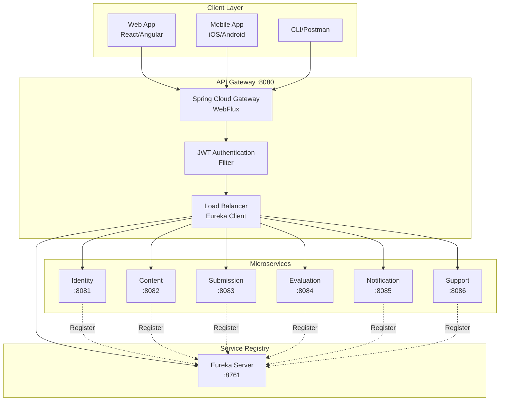
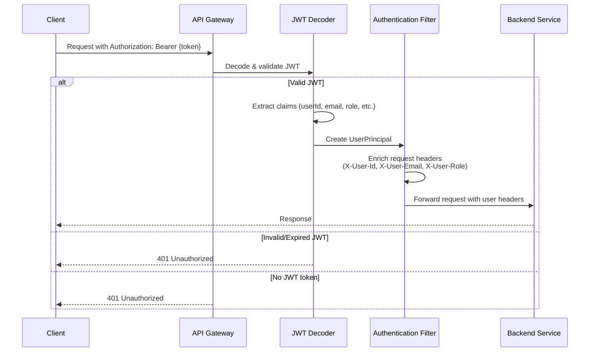

# API Gateway - Tài Liệu Chi Tiết

## 1. Tổng Quan

### 1.1. Mô Tả

API Gateway là **single entry point** cho tất cả client requests trong APSAS microservices. Sử dụng*
*Spring Cloud Gateway** (WebFlux-based), gateway thực hiện routing, JWT authentication, load
balancing, và API documentation aggregation.

**Vai trò:**

- ✅ **Routing**: Forward requests đến đúng microservice dựa trên path
- ✅ **Authentication**: Validate JWT tokens, extract user principal
- ✅ **Load Balancing**: Client-side load balancing qua Eureka
- ✅ **API Aggregation**: Tổng hợp Swagger docs từ tất cả services
- ✅ **WebSocket Support**: Proxy WebSocket connections (Support Service)
- ✅ **Security**: HTTP Basic cho actuator endpoints

### 1.2. Thông Tin Kỹ Thuật

- **Port**: 8080
- **Framework**: Spring Cloud Gateway 2025.0.0 (WebFlux, reactive)
- **Service Discovery**: Netflix Eureka Client
- **Security**: JWT (OAuth2 Resource Server) + HTTP Basic (Actuator)
- **Routes**: 7 routes (6 REST + 1 WebSocket)

### 1.3. Architecture Pattern



---

## 2. Routing Configuration

### 2.1. Route Definitions

**Config file**: `config/api-gateway.yaml`

```yaml
spring:
  cloud:
    gateway:
      routes:
        # Identity Service
        - id: identity-service
          uri: lb://identity-service
          predicates:
            - Path=/api/auth/**, /api/v1/users/**, /api-docs/identity-service
          filters:
            - RewritePath=/api-docs/(?<segment>.*), /api-docs

        # Content Service
        - id: content-service
          uri: lb://content-service
          predicates:
            - Path=/api/v1/assignments/**, /api/v1/tutorials/**, /api/v1/skills/**

        # Submission Service
        - id: submission-service
          uri: lb://submission-service
          predicates:
            - Path=/api/v1/submissions/**

        # Evaluation Service
        - id: evaluation-service
          uri: lb://evaluation-service
          predicates:
            - Path=/api/v1/runtimes/**

        # Support Service (REST)
        - id: support-service
          uri: lb://support-service
          predicates:
            - Path=/api/v1/support/**

        # Support Service (WebSocket)
        - id: support-service-websocket
          uri: lb:ws://support-service
          predicates:
            - Path=/ws/support/**

        # Notification Service
        - id: notification-service
          uri: lb://notification-service
          predicates:
            - Path=/api/v1/preferences/**, /api/v1/devices/**
```

### 2.2. Route Components

**URI Scheme**:

- `lb://service-name`: Load balanced via Eureka (HTTP)
- `lb:ws://service-name`: Load balanced WebSocket

**Predicates** (Route Matchers):

- `Path=/api/auth/**`: Match path patterns
- Multiple paths separated by comma

**Filters**:

- `RewritePath`: Transform request path before forwarding
- Example: `/api-docs/identity-service` → `/api-docs` (target service)

### 2.3. Load Balancing

**Strategy**: Round-robin client-side load balancing

**Config**:

```yaml
spring:
  cloud:
    loadbalancer:
      cache:
        ttl: 15s  # Cache service instances for 15 seconds
```

**How it works**:

1. Gateway queries Eureka for service instances
2. Caches instances list for 15s
3. Distributes requests round-robin across instances
4. Automatic failover if instance unhealthy

---

## 3. Security Configuration

### 3.1. JWT Authentication Flow



### 3.2. SecurityConfig.java

#### JWT Decoder Configuration

```java

@Bean
public ReactiveJwtDecoder jwtDecoder() {
  SecretKeySpec secretKey = new SecretKeySpec(jwtSecret.getBytes(), "HmacSHA256");
  return NimbusReactiveJwtDecoder.withSecretKey(secretKey).build();
}
```

**JWT Claims**:

- `userId`: UUID của user
- `email`: Email address
- `firstName`, `lastName`: Full name components
- `role`: User role (STUDENT, INSTRUCTOR, ADMIN)
- `isActive`: Account status

#### Security Filter Chain

```java

@Bean
@Order(2)
public SecurityWebFilterChain securityWebFilterChain(
    ServerHttpSecurity http,
    JwtToAuthenticationTokenConverter jwtConverter
) {
  return http
      .authorizeExchange(exchanges -> exchanges
          .pathMatchers("/api/auth/**").permitAll()  // Login/Register
          .pathMatchers("/api-docs/**", "/swagger-ui/**").permitAll()  // Swagger
          .anyExchange().authenticated()  // All other routes require auth
      )
      .oauth2ResourceServer(oauth2 ->
          oauth2.jwt(jwt -> jwt.jwtAuthenticationConverter(jwtConverter))
      )
      .csrf(CsrfSpec::disable)
      .httpBasic(HttpBasicSpec::disable)
      .formLogin(FormLoginSpec::disable)
      .build();
}
```

**Public Endpoints** (No JWT required):

- `/api/auth/**` - Login, register, password reset
- `/api-docs/**`, `/swagger-ui/**` - API documentation

**Protected Endpoints**:

- All other paths require valid JWT token

#### JWT to UserPrincipal Converter

```java

@Component
public static class JwtToAuthenticationTokenConverter
    implements Converter<Jwt, Mono<? extends AbstractAuthenticationToken>> {

  @Override
  public Mono<? extends AbstractAuthenticationToken> convert(Jwt jwt) {
    return Mono.just(jwt)
        .map(token -> {
          var userId = token.getClaimAsString(JwtClaims.USER_ID);
          var email = token.getClaimAsString(JwtClaims.EMAIL);
          var firstName = token.getClaimAsString(JwtClaims.FIRST_NAME);
          var lastName = token.getClaimAsString(JwtClaims.LAST_NAME);
          var isActive = token.getClaimAsBoolean(JwtClaims.IS_ACTIVE);
          var role = token.getClaimAsString(JwtClaims.ROLE);

          return new UserPrincipal(
              UUID.fromString(userId), email, firstName, lastName, role, isActive
          );
        })
        .map(HeaderAuthenticationToken::new);
  }
}
```

### 3.3. AuthenticationFilter (GlobalFilter)

**Purpose**: Enrich forwarded requests với user info headers

```java

@Component
public class AuthenticationFilter implements GlobalFilter, Ordered {

  @Override
  public Mono<Void> filter(ServerWebExchange exchange, GatewayFilterChain chain) {
    return ReactiveSecurityContextHolder.getContext()
        .map(SecurityContext::getAuthentication)
        .filter(auth -> auth != null && auth.isAuthenticated())
        .map(auth -> {
          UserPrincipal principal = (UserPrincipal) auth.getPrincipal();

          // Add user info to request headers
          return UserPrincipals.enrichRequestWithUserInfo(
              exchange.getRequest().mutate(),
              principal
          );
        })
        .flatMap(newRequest ->
            chain.filter(exchange.mutate().request(newRequest.build()).build())
        )
        .switchIfEmpty(chain.filter(exchange));
  }

  @Override
  public int getOrder() {
    return Ordered.LOWEST_PRECEDENCE - 10;
  }
}
```

**Injected Headers** (Backend services có thể đọc):

- `X-User-Id`: UUID của user
- `X-User-Email`: Email
- `X-User-First-Name`: First name
- `X-User-Last-Name`: Last name
- `X-User-Role`: Role (STUDENT, INSTRUCTOR, ADMIN)
- `X-User-Is-Active`: Active status (true/false)

**Backend services sử dụng**:

```java

@RestController
public class SomeController {

  @GetMapping("/api/v1/resource")
  public ResponseEntity<?> getResource(
      @RequestHeader("X-User-Id")
      UUID userId,
      @RequestHeader("X-User-Role")
      String role
  ) {
    // Use userId and role for authorization
  }
}
```

### 3.4. Actuator Security (HTTP Basic)

```java

@Bean
@Order(1)  // Higher priority than JWT filter
public SecurityWebFilterChain actuatorSecurityWebFilterChain(ServerHttpSecurity http) {
  return http
      .securityMatcher(new PathPatternParserServerWebExchangeMatcher("/actuator/**"))
      .authorizeExchange(exchanges -> exchanges
          .anyExchange().hasRole("ADMIN")
      )
      .httpBasic(Customizer.withDefaults())
      .csrf(CsrfSpec::disable)
      .build();
}

@Bean
public ReactiveUserDetailsService reactiveUserDetailsService() {
  var user = User.withUsername(securityProperties.getUser().getName())
      .password("{noop}" + securityProperties.getUser().getPassword())
      .roles("ADMIN")
      .build();
  return new MapReactiveUserDetailsService(user);
}
```

**Access**:

```bash
curl -u admin:password http://localhost:8080/actuator/health
```

**Credentials**: Configured via environment variables

```yaml
spring:
  security:
    user:
      name: ${ADMIN_USERNAME}
      password: ${ADMIN_PASSWORD}
```

---

## 4. API Documentation Aggregation

### 4.1. Swagger UI Configuration

Gateway tổng hợp OpenAPI docs từ tất cả services vào single Swagger UI.

**Config** (`config/api-gateway.yaml`):

```yaml
springdoc:
  swagger-ui:
    urls:
      - name: Identity Service
        url: /api-docs/identity-service

      - name: Content Service
        url: /api-docs/content-service

      - name: Submission Service
        url: /api-docs/submission-service

      - name: Evaluation Service
        url: /api-docs/evaluation-service

      - name: Support Service
        url: /api-docs/support-service

      - name: Notification Service
        url: /api-docs/notification-service
```

### 4.2. RewritePath Filter

Gateway rewrites API docs paths khi forward request:

**Route config**:

```yaml
- id: identity-service
  uri: lb://identity-service
  predicates:
    - Path=/api-docs/identity-service
  filters:
    - RewritePath=/api-docs/(?<segment>.*), /api-docs
```

**Flow**:

1. Client requests: `GET http://localhost:8080/api-docs/identity-service`
2. Gateway rewrites to: `GET http://identity-service:8081/api-docs`
3. Identity Service returns OpenAPI JSON
4. Gateway forwards response to client

### 4.3. Accessing Swagger UI

**URL**: http://localhost:8080/swagger-ui.html

**Features**:

- Dropdown selector cho từng service
- Try-it-out functionality với JWT authentication
- Automatic Bearer token injection

---

## 5. WebSocket Proxying

### 5.1. WebSocket Route

```yaml
- id: support-service-websocket
  uri: lb:ws://support-service
  predicates:
    - Path=/ws/support/**
```

**URI Scheme**: `lb:ws://` indicates load-balanced WebSocket

### 5.2. Client Connection

**JavaScript/SockJS**:

```javascript
const socket = new SockJS('http://localhost:8080/ws/support');
const stompClient = Stomp.over(socket);

stompClient.connect(
    {
      'Authorization': 'Bearer ' + jwtToken  // JWT auth
    },
    (frame) => {
      console.log('Connected:', frame);
    }
);
```

**Flow**:

1. Client connects to Gateway: `ws://localhost:8080/ws/support`
2. Gateway upgrades to WebSocket protocol
3. Gateway forwards connection to Support Service: `ws://support-service:8086/ws/support`
4. Bi-directional communication established

---

## 6. Error Handling

### 6.1. Common Error Responses

**401 Unauthorized** - No or invalid JWT:

```json
{
  "timestamp": "2024-01-15T10:30:00",
  "path": "/api/v1/submissions",
  "status": 401,
  "error": "Unauthorized",
  "message": "Full authentication is required"
}
```

**503 Service Unavailable** - Backend service down:

```json
{
  "timestamp": "2024-01-15T10:30:00",
  "path": "/api/v1/assignments",
  "status": 503,
  "error": "Service Unavailable",
  "message": "Unable to find instance for content-service"
}
```

**504 Gateway Timeout** - Backend service timeout:

```json
{
  "timestamp": "2024-01-15T10:30:00",
  "path": "/api/v1/submissions",
  "status": 504,
  "error": "Gateway Timeout"
}
```

### 6.2. Timeout Configuration

```yaml
spring:
  cloud:
    gateway:
      httpclient:
        connect-timeout: 5000  # 5 seconds
        response-timeout: 30s  # 30 seconds
```

---

## 7. Configuration

### 7.1. Environment Variables

```bash
# JWT Secret (must match Identity Service)
JWT_SECRET=your-secret-key-min-256-bits

# Admin credentials for actuator
ADMIN_USERNAME=admin
ADMIN_PASSWORD=secure-password

# Eureka Server
EUREKA_CLIENT_SERVICEURL_DEFAULTZONE=http://localhost:8761/eureka/
```

### 7.2. CORS Configuration (if needed)

```java

@Bean
public CorsWebFilter corsWebFilter() {
  CorsConfiguration config = new CorsConfiguration();
  config.setAllowedOrigins(Arrays.asList("http://localhost:3000"));
  config.setAllowedMethods(Arrays.asList("GET", "POST", "PUT", "DELETE", "OPTIONS"));
  config.setAllowedHeaders(Arrays.asList("*"));
  config.setAllowCredentials(true);

  UrlBasedCorsConfigurationSource source = new UrlBasedCorsConfigurationSource();
  source.registerCorsConfiguration("/**", config);

  return new CorsWebFilter(source);
}
```

---

## 8. Monitoring & Observability

### 8.1. Actuator Endpoints

**Available endpoints** (HTTP Basic auth required):

- `GET /actuator/health` - Health status
- `GET /actuator/metrics` - Metrics
- `GET /actuator/gateway/routes` - Active routes
- `GET /actuator/gateway/globalfilters` - Global filters

**Example**:

```bash
curl -u admin:password http://localhost:8080/actuator/gateway/routes | jq
```

**Response**:

```json
[
  {
    "route_id": "identity-service",
    "uri": "lb://identity-service",
    "predicates": [
      "Path: [/api/auth/**, /api/v1/users/**]"
    ],
    "filters": [
      "RewritePath"
    ]
  }
]
```

### 8.2. Key Metrics

**Gateway-specific metrics**:

- `spring.cloud.gateway.requests` - Request count per route
- `http.server.requests` - Request duration
- `gateway.requests` - Success/failure rate

**Access**:

```bash
curl -u admin:password http://localhost:8080/actuator/metrics/spring.cloud.gateway.requests
```

---

## 9. Testing

### 9.1. Integration Test Example

```java

@SpringBootTest(webEnvironment = SpringBootTest.WebEnvironment.RANDOM_PORT)
@TestPropertySource(
    properties = {
        "spring.cloud.discovery.enabled=false",
        "spring.cloud.gateway.routes[0].id=identity-service",
        "spring.cloud.gateway.routes[0].uri=http://localhost:8081",
        "spring.cloud.gateway.routes[0].predicates[0]=Path=/api/auth/**"
    }
)
class ApiGatewayIntegrationTest {

  @LocalServerPort
  private int port;

  @Test
  void routingToIdentityService_Success() {
    RestTemplate restTemplate = new RestTemplate();

    ResponseEntity<String> response = restTemplate.getForEntity(
        "http://localhost:" + port + "/api/auth/health",
        String.class
    );

    assertThat(response.getStatusCode()).isEqualTo(HttpStatus.OK);
  }
}
```

### 9.2. JWT Authentication Test

```java

@Test
void protectedEndpoint_WithValidJWT_Success() {
  String jwt = generateTestJwt();  // Helper method

  HttpHeaders headers = new HttpHeaders();
  headers.setBearerAuth(jwt);
  HttpEntity<String> entity = new HttpEntity<>(headers);

  ResponseEntity<String> response = restTemplate.exchange(
      "http://localhost:" + port + "/api/v1/submissions",
      HttpMethod.GET,
      entity,
      String.class
  );

  assertThat(response.getStatusCode()).isEqualTo(HttpStatus.OK);
}

@Test
void protectedEndpoint_WithoutJWT_Unauthorized() {
  ResponseEntity<String> response = restTemplate.getForEntity(
      "http://localhost:" + port + "/api/v1/submissions",
      String.class
  );

  assertThat(response.getStatusCode()).isEqualTo(HttpStatus.UNAUTHORIZED);
}
```

---

## 10. Deployment

### 10.1. Docker Deployment

**Dockerfile**:

```dockerfile
FROM eclipse-temurin:21-jre-alpine
WORKDIR /app
COPY target/gateway.jar app.jar

EXPOSE 8080
ENTRYPOINT ["java", "-jar", "app.jar"]
```

### 10.2. Environment Configuration

**Production** (`config/api-gateway.yaml`):

```yaml
spring:
  cloud:
    gateway:
      httpclient:
        ssl:
          use-insecure-trust-manager: false

eureka:
  instance:
    prefer-ip-address: true
    lease-renewal-interval-in-seconds: 10
```

### 10.3. Kubernetes Deployment

```yaml
apiVersion: apps/v1
kind: Deployment
metadata:
  name: api-gateway
spec:
  replicas: 2
  template:
    spec:
      containers:
        - name: gateway
          image: apsas/api-gateway:latest
          ports:
            - containerPort: 8080
          env:
            - name: JWT_SECRET
              valueFrom:
                secretKeyRef:
                  name: jwt-secret
                  key: secret
            - name: EUREKA_CLIENT_SERVICEURL_DEFAULTZONE
              value: http://eureka-service:8761/eureka/
          livenessProbe:
            httpGet:
              path: /actuator/health/liveness
              port: 8080
            initialDelaySeconds: 60
          readinessProbe:
            httpGet:
              path: /actuator/health/readiness
              port: 8080
            initialDelaySeconds: 30
---
apiVersion: v1
kind: Service
metadata:
  name: api-gateway
spec:
  type: LoadBalancer
  ports:
    - port: 80
      targetPort: 8080
  selector:
    app: api-gateway
```

---

## 11. Troubleshooting

### 11.1. Route Not Found (404)

- ✅ Check route predicates trong `api-gateway.yaml`
- ✅ Verify service registered trong Eureka: http://localhost:8761
- ✅ Check actuator: `GET /actuator/gateway/routes`

### 11.2. JWT Authentication Fails

- ✅ Verify `JWT_SECRET` matches Identity Service
- ✅ Check JWT expiration time
- ✅ Confirm Bearer token format: `Authorization: Bearer {token}`
- ✅ Check logs: `logging.level.org.springframework.security=DEBUG`

### 11.3. Load Balancing Issues

- ✅ Verify multiple instances registered trong Eureka
- ✅ Check load balancer cache TTL (default 15s)
- ✅ Confirm URI scheme: `lb://service-name`

### 11.4. WebSocket Connection Failed

- ✅ Verify URI scheme: `lb:ws://service-name`
- ✅ Check WebSocket upgrade headers
- ✅ Confirm backend service supports WebSocket

---

## 12. Best Practices

1. **JWT Secret Management**: Store JWT secret trong secrets manager, không hardcode
2. **Timeout Configuration**: Set reasonable timeouts để avoid cascading failures
3. **Circuit Breaker**: Consider adding Resilience4j circuit breaker
4. **Rate Limiting**: Implement rate limiting filter cho public endpoints
5. **Logging**: Enable request/response logging cho debugging:
   ```yaml
   logging:
     level:
       org.springframework.cloud.gateway: DEBUG
       reactor.netty: DEBUG
   ```
6. **Metrics**: Monitor gateway metrics via Prometheus/Grafana
7. **Security Headers**: Add security headers filter (HSTS, X-Frame-Options, etc.)
