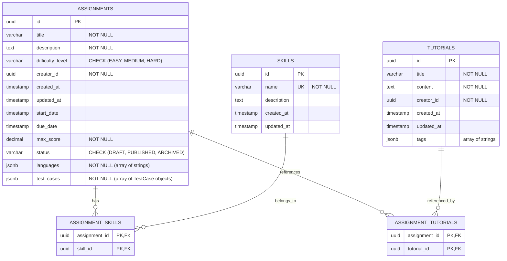
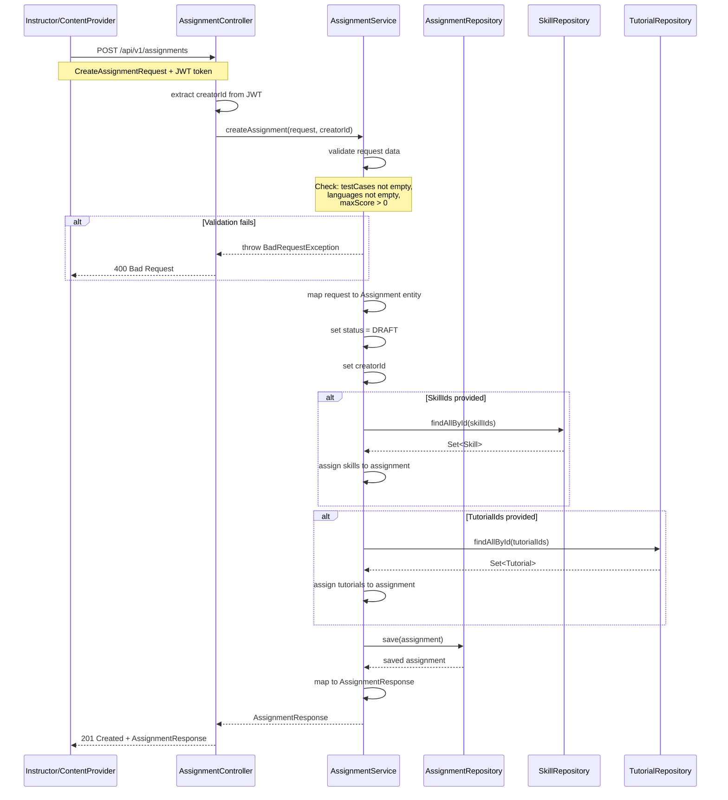
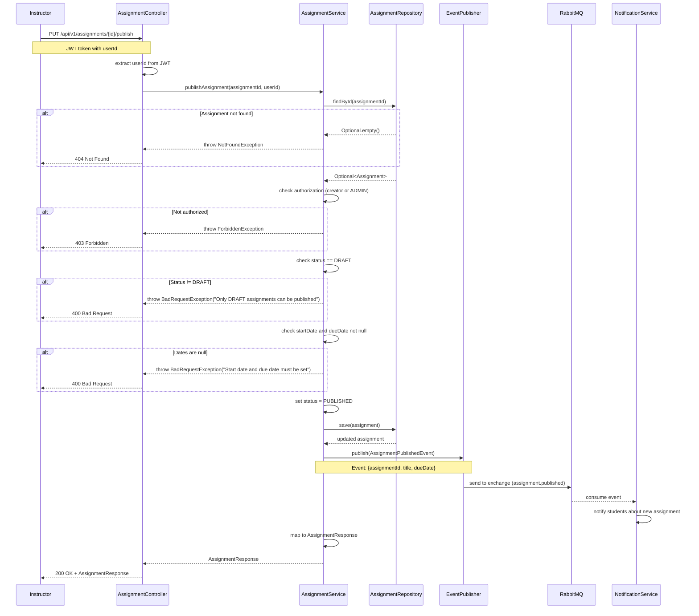
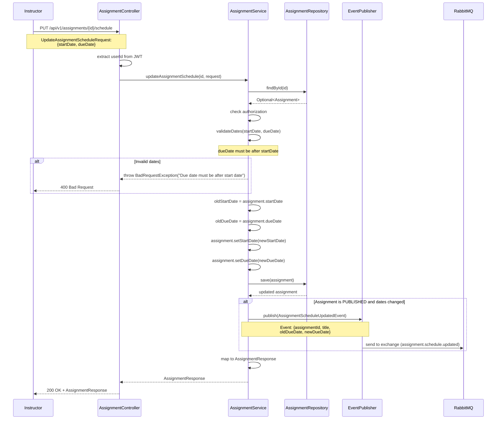
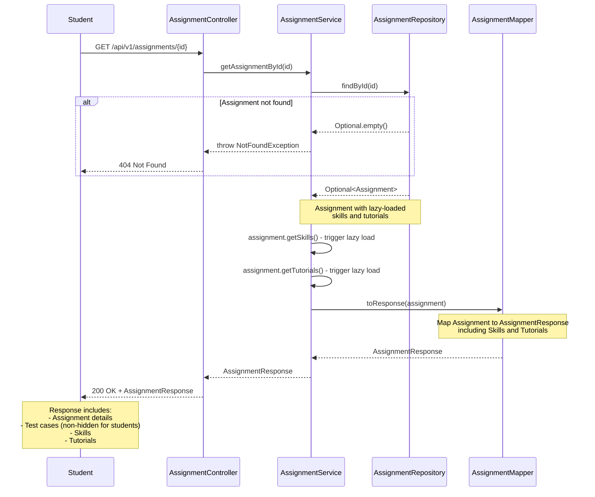
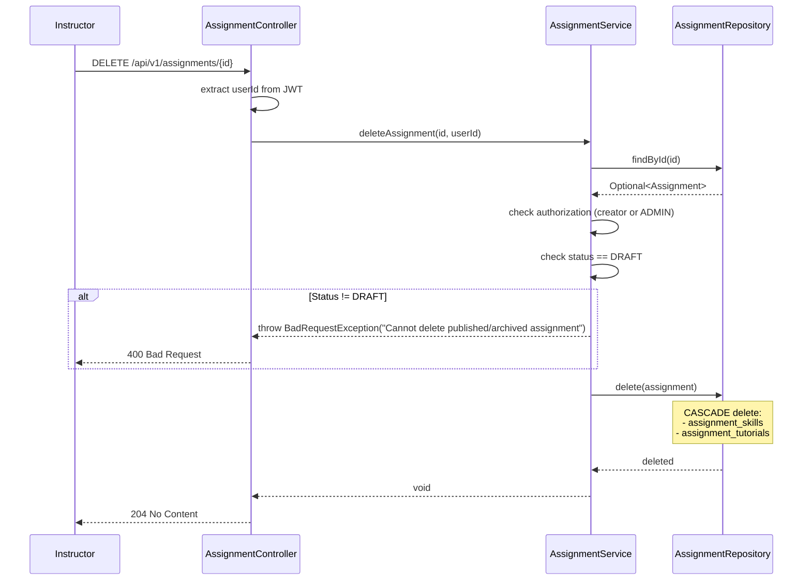

# Tài liệu Content Service

## 1. Tổng quan

### 1.1. Mô tả
Content Service là microservice quản lý toàn bộ nội dung học tập trong hệ thống APSAS, bao gồm bài tập (assignments), hướng dẫn (tutorials), và kỹ năng (skills). Service này cho phép giảng viên và nhà cung cấp nội dung tạo, quản lý và xuất bản các tài liệu học tập cho sinh viên.

### 1.2. Vai trò trong hệ thống
- **Quản lý nội dung học tập**: Tạo và quản lý assignments, tutorials, skills
- **Định nghĩa test cases**: Lưu trữ test cases cho việc đánh giá tự động code submissions
- **Phân loại kỹ năng**: Gắn kết assignments với skills để theo dõi tiến độ học tập
- **Event Publisher**: Phát sự kiện khi assignment được xuất bản hoặc cập nhật lịch trình
- **API nội bộ**: Cung cấp thông tin assignment cho Submission Service và Evaluation Service

### 1.3. Công nghệ sử dụng
- **Framework**: Spring Boot 3.5.6
- **Database**: PostgreSQL 17 (schema: `content`)
- **Messaging**: RabbitMQ (event-driven communication)
- **Service Discovery**: Netflix Eureka Client
- **Security**: JWT-based authentication
- **Port**: 8082

## 2. Kiến trúc

### 2.1. Kiến trúc tổng thể
```
┌─────────────────────────────────────────────────────────────┐
│                     Content Service                          │
│                                                              │
│  ┌──────────────┐    ┌──────────────┐    ┌──────────────┐  │
│  │              │    │              │    │              │  │
│  │ Controllers  │───▶│   Services   │───▶│ Repositories │  │
│  │              │    │              │    │              │  │
│  └──────────────┘    └──────────────┘    └──────────────┘  │
│         │                    │                    │         │
│         │                    ▼                    ▼         │
│         │            ┌──────────────┐    ┌──────────────┐  │
│         │            │              │    │              │  │
│         │            │   Mappers    │    │  PostgreSQL  │  │
│         │            │              │    │   Database   │  │
│         │            └──────────────┘    └──────────────┘  │
│         │                    │                             │
│         ▼                    ▼                             │
│  ┌──────────────┐    ┌──────────────┐                     │
│  │              │    │              │                     │
│  │   Security   │    │  RabbitMQ    │                     │
│  │   (JWT)      │    │  Publisher   │                     │
│  │              │    │              │                     │
│  └──────────────┘    └──────────────┘                     │
└─────────────────────────────────────────────────────────────┘
```

### 2.2. Các thành phần chính

#### Controllers
- **AssignmentController**: CRUD operations cho assignments (INSTRUCTOR, CONTENT_PROVIDER, ADMIN)
- **TutorialController**: Quản lý tutorials (CONTENT_PROVIDER, ADMIN)
- **SkillController**: Quản lý skills (CONTENT_PROVIDER, ADMIN)
- **InternalAssignmentController**: API nội bộ cho các service khác (Feign)

#### Services
- **AssignmentService**: Logic nghiệp vụ cho assignments (tạo, cập nhật, publish, archive)
- **TutorialService**: Quản lý tutorials và liên kết với assignments
- **SkillService**: Quản lý skills và mapping với assignments

#### Repositories
- **AssignmentRepository**: JPA repository cho Assignment entity
- **TutorialRepository**: JPA repository cho Tutorial entity
- **SkillRepository**: JPA repository cho Skill entity

#### Entities
- **Assignment**: Bài tập lập trình với test cases
- **Tutorial**: Tài liệu hướng dẫn
- **Skill**: Kỹ năng lập trình (ví dụ: loops, arrays, OOP)
- **TestCase**: Test case cho đánh giá code (embedded trong Assignment)

## 3. Thiết kế cơ sở dữ liệu

### 3.1. Entity Relationship Diagram (ERD)



### 3.2. Mô tả các bảng

#### Bảng `assignments`
Lưu trữ thông tin bài tập lập trình.

| Cột | Kiểu dữ liệu | Ràng buộc | Mô tả |
|-----|-------------|----------|-------|
| id | UUID | PRIMARY KEY | Định danh bài tập |
| title | VARCHAR(255) | NOT NULL | Tiêu đề bài tập |
| description | TEXT | NOT NULL | Mô tả chi tiết yêu cầu |
| difficulty_level | VARCHAR(50) | NOT NULL, CHECK | Độ khó: EASY, MEDIUM, HARD |
| creator_id | UUID | NOT NULL | ID người tạo (từ Identity Service) |
| created_at | TIMESTAMP | DEFAULT now() | Thời gian tạo |
| updated_at | TIMESTAMP | DEFAULT now() | Thời gian cập nhật |
| start_date | TIMESTAMP | NULLABLE | Ngày bắt đầu (khi publish) |
| due_date | TIMESTAMP | NULLABLE | Deadline nộp bài |
| max_score | DECIMAL(5,2) | NOT NULL | Điểm tối đa (ví dụ: 10.00) |
| status | VARCHAR(50) | NOT NULL, CHECK | DRAFT, PUBLISHED, ARCHIVED |
| languages | JSONB | NOT NULL | Danh sách ngôn ngữ hỗ trợ: ["java", "python"] |
| test_cases | JSONB | NOT NULL | Array of TestCase objects |

**JSONB Structure - test_cases**:
```json
[
  {
    "name": "Test Case 1",
    "input": "5",
    "expectedOutput": "120",
    "isHidden": false,
    "weight": 1.0
  },
  {
    "name": "Test Case 2 (Hidden)",
    "input": "10",
    "expectedOutput": "3628800",
    "isHidden": true,
    "weight": 2.0
  }
]
```

**Indexes:**
- `idx_assignments_creator_id` trên `creator_id`
- `idx_assignments_status` trên `status`
- `idx_assignments_difficulty_level` trên `difficulty_level`
- `idx_assignments_start_date` trên `start_date`
- `idx_assignments_due_date` trên `due_date`

**Redis Caching:**
- Cache name: `assignments` (prefix: `apsas:content:`)
- TTL: 20 phút
- Cache operation: `@Cacheable` trên `getAssignmentById()`
- Key pattern: `apsas:content:assignments::<uuid>`
- Invalidation: Cache evicted khi assignment được update hoặc delete

#### Bảng `tutorials`
Lưu trữ tài liệu hướng dẫn.

| Cột | Kiểu dữ liệu | Ràng buộc | Mô tả |
|-----|-------------|----------|-------|
| id | UUID | PRIMARY KEY | Định danh tutorial |
| title | VARCHAR(255) | NOT NULL | Tiêu đề tài liệu |
| content | TEXT | NOT NULL | Nội dung (Markdown/HTML) |
| creator_id | UUID | NOT NULL | ID người tạo |
| created_at | TIMESTAMP | DEFAULT now() | Thời gian tạo |
| updated_at | TIMESTAMP | DEFAULT now() | Thời gian cập nhật |
| tags | JSONB | NULLABLE | Tags để phân loại: ["loops", "arrays"] |

**Indexes:**
- `idx_tutorials_creator_id` trên `creator_id`

#### Bảng `skills`
Lưu trữ kỹ năng lập trình.

| Cột | Kiểu dữ liệu | Ràng buộc | Mô tả |
|-----|-------------|----------|-------|
| id | UUID | PRIMARY KEY | Định danh skill |
| name | VARCHAR(255) | UNIQUE, NOT NULL | Tên kỹ năng (ví dụ: "Loops", "Arrays") |
| description | TEXT | NULLABLE | Mô tả kỹ năng |
| created_at | TIMESTAMP | DEFAULT now() | Thời gian tạo |
| updated_at | TIMESTAMP | DEFAULT now() | Thời gian cập nhật |

**Indexes:**
- `idx_skills_name` trên `name`

#### Bảng `assignment_skills` (Many-to-Many)
Liên kết assignments với skills.

| Cột | Kiểu dữ liệu | Ràng buộc | Mô tả |
|-----|-------------|----------|-------|
| assignment_id | UUID | PK, FK | Tham chiếu assignments(id) |
| skill_id | UUID | PK, FK | Tham chiếu skills(id) |

**Foreign Keys:**
- `assignment_id` REFERENCES `assignments(id)` ON DELETE CASCADE
- `skill_id` REFERENCES `skills(id)` ON DELETE CASCADE

**Indexes:**
- `idx_assignment_skills_assignment_id` trên `assignment_id`
- `idx_assignment_skills_skill_id` trên `skill_id`

#### Bảng `assignment_tutorials` (Many-to-Many)
Liên kết assignments với tutorials (tài liệu tham khảo).

| Cột | Kiểu dữ liệu | Ràng buộc | Mô tả |
|-----|-------------|----------|-------|
| assignment_id | UUID | PK, FK | Tham chiếu assignments(id) |
| tutorial_id | UUID | PK, FK | Tham chiếu tutorials(id) |

**Foreign Keys:**
- `assignment_id` REFERENCES `assignments(id)` ON DELETE CASCADE
- `tutorial_id` REFERENCES `tutorials(id)` ON DELETE CASCADE

**Indexes:**
- `idx_assignment_tutorials_assignment_id` trên `assignment_id`
- `idx_assignment_tutorials_tutorial_id` trên `tutorial_id`

## 4. Thiết kế Class

### 4.1. Class Diagram

```mermaid
classDiagram
    %% Entities
    class Assignment {
        -UUID id
        -String title
        -String description
        -DifficultyLevel difficultyLevel
        -UUID creatorId
        -LocalDateTime createdAt
        -LocalDateTime updatedAt
        -LocalDateTime startDate
        -LocalDateTime dueDate
        -BigDecimal maxScore
        -AssignmentStatus status
        -Set~String~ languages
        -List~TestCase~ testCases
        -Set~Skill~ skills
        -Set~Tutorial~ tutorials
        +onCreate() void
        +onUpdate() void
    }

    class DifficultyLevel {
        <<enumeration>>
        EASY
        MEDIUM
        HARD
    }

    class AssignmentStatus {
        <<enumeration>>
        DRAFT
        PUBLISHED
        ARCHIVED
    }

    class TestCase {
        -String name
        -String input
        -String expectedOutput
        -Boolean isHidden
        -Double weight
    }

    class Tutorial {
        -UUID id
        -String title
        -String content
        -UUID creatorId
        -LocalDateTime createdAt
        -LocalDateTime updatedAt
        -List~String~ tags
        -Set~Assignment~ assignments
        +onCreate() void
        +onUpdate() void
    }

    class Skill {
        -UUID id
        -String name
        -String description
        -LocalDateTime createdAt
        -LocalDateTime updatedAt
        -Set~Assignment~ assignments
        +onCreate() void
        +onUpdate() void
    }

    %% Controllers
    class AssignmentController {
        -AssignmentService assignmentService
        +getAllAssignments(Pageable) ResponseEntity~PageResponse~
        +getAssignmentById(UUID) ResponseEntity~AssignmentResponse~
        +createAssignment(CreateAssignmentRequest) ResponseEntity~AssignmentResponse~
        +updateAssignment(UUID, UpdateAssignmentRequest) ResponseEntity~AssignmentResponse~
        +updateSchedule(UUID, UpdateAssignmentScheduleRequest) ResponseEntity~AssignmentResponse~
        +deleteAssignment(UUID) ResponseEntity~Void~
        +publishAssignment(UUID) ResponseEntity~AssignmentResponse~
        +archiveAssignment(UUID) ResponseEntity~AssignmentResponse~
    }

    class TutorialController {
        -TutorialService tutorialService
        +getAllTutorials(Pageable) ResponseEntity~PageResponse~
        +getTutorialById(UUID) ResponseEntity~TutorialResponse~
        +createTutorial(CreateTutorialRequest) ResponseEntity~TutorialResponse~
        +updateTutorial(UUID, UpdateTutorialRequest) ResponseEntity~TutorialResponse~
        +deleteTutorial(UUID) ResponseEntity~Void~
    }

    class SkillController {
        -SkillService skillService
        +getAllSkills(Pageable) ResponseEntity~PageResponse~
        +getSkillById(UUID) ResponseEntity~SkillResponse~
        +createSkill(CreateSkillRequest) ResponseEntity~SkillResponse~
        +updateSkill(UUID, UpdateSkillRequest) ResponseEntity~SkillResponse~
        +deleteSkill(UUID) ResponseEntity~Void~
    }

    class InternalAssignmentController {
        -AssignmentService assignmentService
        +getAssignmentById(UUID) ResponseEntity~FeignAssignmentDto~
    }

    %% Services
    class AssignmentService {
        -AssignmentRepository assignmentRepository
        -SkillRepository skillRepository
        -TutorialRepository tutorialRepository
        -AssignmentMapper assignmentMapper
        -EventPublisher eventPublisher
        +getAllAssignments(Pageable) Page~AssignmentResponse~
        +getAssignmentById(UUID) AssignmentResponse
        +createAssignment(CreateAssignmentRequest, UUID) AssignmentResponse
        +updateAssignment(UUID, UpdateAssignmentRequest, UUID) AssignmentResponse
        +updateAssignmentSchedule(UUID, UpdateAssignmentScheduleRequest) AssignmentResponse
        +deleteAssignment(UUID, UUID) void
        +publishAssignment(UUID, UUID) AssignmentResponse
        +archiveAssignment(UUID, UUID) AssignmentResponse
        -validateDates(LocalDateTime, LocalDateTime) void
    }

    class TutorialService {
        -TutorialRepository tutorialRepository
        -TutorialMapper tutorialMapper
        +getAllTutorials(Pageable) Page~TutorialResponse~
        +getTutorialById(UUID) TutorialResponse
        +createTutorial(CreateTutorialRequest, UUID) TutorialResponse
        +updateTutorial(UUID, UpdateTutorialRequest, UUID) TutorialResponse
        +deleteTutorial(UUID, UUID) void
    }

    class SkillService {
        -SkillRepository skillRepository
        -SkillMapper skillMapper
        +getAllSkills(Pageable) Page~SkillResponse~
        +getSkillById(UUID) SkillResponse
        +createSkill(CreateSkillRequest) SkillResponse
        +updateSkill(UUID, UpdateSkillRequest) SkillResponse
        +deleteSkill(UUID) void
    }

    %% Repositories
    class AssignmentRepository {
        <<interface>>
        +findByStatus(AssignmentStatus, Pageable) Page~Assignment~
        +findByCreatorId(UUID, Pageable) Page~Assignment~
    }

    class TutorialRepository {
        <<interface>>
        +findByCreatorId(UUID, Pageable) Page~Tutorial~
    }

    class SkillRepository {
        <<interface>>
        +findByName(String) Optional~Skill~
        +existsByName(String) boolean
    }

    %% Mappers
    class AssignmentMapper {
        <<interface>>
        +toResponse(Assignment) AssignmentResponse
        +toFeignDto(Assignment) FeignAssignmentDto
        +toEntity(CreateAssignmentRequest) Assignment
    }

    class TutorialMapper {
        <<interface>>
        +toResponse(Tutorial) TutorialResponse
        +toEntity(CreateTutorialRequest) Tutorial
    }

    class SkillMapper {
        <<interface>>
        +toResponse(Skill) SkillResponse
        +toEntity(CreateSkillRequest) Skill
    }

    %% DTOs
    class CreateAssignmentRequest {
        +String title
        +String description
        +DifficultyLevel difficultyLevel
        +BigDecimal maxScore
        +Set~String~ languages
        +List~TestCase~ testCases
        +Set~UUID~ skillIds
        +Set~UUID~ tutorialIds
    }

    class AssignmentResponse {
        +UUID id
        +String title
        +String description
        +DifficultyLevel difficultyLevel
        +UUID creatorId
        +LocalDateTime createdAt
        +LocalDateTime startDate
        +LocalDateTime dueDate
        +BigDecimal maxScore
        +AssignmentStatus status
        +Set~String~ languages
        +List~TestCase~ testCases
        +Set~SkillResponse~ skills
        +Set~TutorialResponse~ tutorials
    }

    %% Relationships
    Assignment "1" -- "0..*" TestCase : contains
    Assignment -- DifficultyLevel : has
    Assignment -- AssignmentStatus : has
    Assignment "*" -- "*" Skill : evaluates
    Assignment "*" -- "*" Tutorial : references

    AssignmentController ..> AssignmentService : uses
    TutorialController ..> TutorialService : uses
    SkillController ..> SkillService : uses
    InternalAssignmentController ..> AssignmentService : uses

    AssignmentService ..> AssignmentRepository : uses
    AssignmentService ..> SkillRepository : uses
    AssignmentService ..> TutorialRepository : uses
    AssignmentService ..> AssignmentMapper : uses

    TutorialService ..> TutorialRepository : uses
    TutorialService ..> TutorialMapper : uses

    SkillService ..> SkillRepository : uses
    SkillService ..> SkillMapper : uses

    AssignmentController ..> CreateAssignmentRequest : receives
    AssignmentController ..> AssignmentResponse : returns
```



### 4.2. Mô tả các class chính

#### Entity Classes

**Assignment**
- Entity chính đại diện cho bài tập lập trình
- Chứa test cases dưới dạng embedded list (JSONB trong database)
- Quan hệ Many-to-Many với Skill và Tutorial
- Lifecycle: DRAFT → PUBLISHED → ARCHIVED
- Có validation cho start_date và due_date (due_date phải sau start_date)

**TestCase (Embedded)**
- Không phải entity độc lập, lưu trong JSONB
- Fields:
  - `name`: Tên test case (hiển thị cho sinh viên)
  - `input`: Input data cho test
  - `expectedOutput`: Output mong đợi
  - `isHidden`: True = hidden test case (không hiển thị cho sinh viên)
  - `weight`: Trọng số cho tính điểm (default 1.0)

**Tutorial**
- Tài liệu hướng dẫn, có thể liên kết với nhiều assignments
- Content có thể là Markdown hoặc HTML
- Tags để phân loại và tìm kiếm

**Skill**
- Kỹ năng lập trình (ví dụ: "Loops", "Recursion", "OOP")
- Name phải unique
- Được gắn với assignments để tracking skill progression

#### Service Classes

**AssignmentService**
- Phương thức chính:
  - `createAssignment()`: Tạo assignment mới (status = DRAFT)
  - `updateAssignment()`: Cập nhật full assignment
  - `updateAssignmentSchedule()`: Chỉ cập nhật start_date và due_date
  - `publishAssignment()`: Chuyển từ DRAFT → PUBLISHED, phát event
  - `archiveAssignment()`: Chuyển từ PUBLISHED → ARCHIVED
  - `deleteAssignment()`: Chỉ xóa được assignment ở trạng thái DRAFT
- Authorization: Chỉ creator hoặc ADMIN mới có thể sửa/xóa

**TutorialService**
- CRUD operations cho tutorials
- Authorization: CONTENT_PROVIDER hoặc ADMIN

**SkillService**
- CRUD operations cho skills
- Kiểm tra name unique khi tạo mới

#### Controller Classes

**AssignmentController**
- REST endpoints cho quản lý assignments
- Role required: INSTRUCTOR, CONTENT_PROVIDER, ADMIN
- Ánh xạ `/api/v1/assignments/*`

**TutorialController**
- REST endpoints cho tutorials
- Role required: CONTENT_PROVIDER, ADMIN
- Ánh xạ `/api/v1/tutorials/*`

**SkillController**
- REST endpoints cho skills
- Role required: CONTENT_PROVIDER, ADMIN
- Ánh xạ `/api/v1/skills/*`

**InternalAssignmentController**
- API nội bộ cho Submission Service và Evaluation Service
- Sử dụng Feign Client
- Ánh xạ `/internal/assignments/*`

## 5. Luồng hoạt động chi tiết

### 5.1. Luồng tạo Assignment



**Chi tiết các bước:**

1. **Instructor/ContentProvider gửi request** tạo assignment với:
   - Thông tin cơ bản: title, description, difficultyLevel, maxScore
   - Test cases (ít nhất 1 test case)
   - Languages hỗ trợ (ít nhất 1 ngôn ngữ)
   - Optional: skillIds, tutorialIds

2. **Controller** trích xuất creatorId từ JWT token

3. **Service validates**:
   - Test cases không empty
   - Languages không empty
   - maxScore > 0
   - SkillIds và TutorialIds tồn tại (nếu có)

4. **Tạo Assignment entity**:
   - Status = DRAFT (mặc định)
   - CreatorId từ JWT token
   - CreatedAt = now()

5. **Load và gán Skills** (nếu có skillIds)

6. **Load và gán Tutorials** (nếu có tutorialIds)

7. **Save vào database** qua AssignmentRepository

8. **Map sang AssignmentResponse** và trả về (201 Created)

### 5.2. Luồng publish Assignment



**Chi tiết các bước:**

1. **Instructor gửi request** publish assignment

2. **Service kiểm tra authorization**:
   - Phải là creator của assignment
   - Hoặc có role ADMIN

3. **Validate trạng thái**:
   - Assignment phải ở trạng thái DRAFT
   - Nếu đã PUBLISHED hoặc ARCHIVED → error

4. **Validate schedule**:
   - startDate và dueDate không được null
   - Nếu null → yêu cầu set schedule trước khi publish

5. **Cập nhật status = PUBLISHED**

6. **Save vào database**

7. **Phát event AssignmentPublishedEvent**:
   - Routing key: `assignment.published`
   - Payload: assignmentId, title, dueDate
   - Consumer: NotificationService (thông báo cho students)

8. **Trả về AssignmentResponse**

### 5.3. Luồng cập nhật Assignment Schedule



**Chi tiết các bước:**

1. **Instructor gửi request** cập nhật schedule với startDate và dueDate mới

2. **Service kiểm tra authorization** (creator hoặc ADMIN)

3. **Validate dates**:
   - dueDate phải sau startDate
   - Nếu không hợp lệ → throw BadRequestException

4. **Lưu oldStartDate và oldDueDate** (để phát event nếu cần)

5. **Cập nhật dates và save**

6. **Phát event nếu cần**:
   - Chỉ phát event nếu assignment đã PUBLISHED
   - Event: AssignmentScheduleUpdatedEvent
   - Routing key: `assignment.schedule.updated`
   - Consumer: NotificationService (thông báo cho students về thay đổi deadline)

7. **Trả về AssignmentResponse**

### 5.4. Luồng lấy Assignment với Skills và Tutorials



**Chi tiết các bước:**

1. **Student gửi request** lấy thông tin assignment

2. **Service tìm assignment** theo ID

3. **Trigger lazy loading**:
   - Load skills từ bảng assignment_skills
   - Load tutorials từ bảng assignment_tutorials

4. **Mapper chuyển đổi**:
   - Assignment entity → AssignmentResponse DTO
   - Bao gồm nested SkillResponse và TutorialResponse
   - Filter test cases nếu user không phải creator (ẩn hidden test cases)

5. **Trả về response** với đầy đủ thông tin

### 5.5. Luồng xóa Assignment



**Chi tiết các bước:**

1. **Instructor gửi request xóa** assignment

2. **Service kiểm tra authorization** (creator hoặc ADMIN)

3. **Validate status = DRAFT**:
   - Chỉ cho phép xóa assignment ở trạng thái DRAFT
   - Assignment đã PUBLISHED hoặc ARCHIVED không được xóa (data integrity)

4. **Delete từ database**:
   - Cascade delete các bản ghi trong assignment_skills
   - Cascade delete các bản ghi trong assignment_tutorials
   - Skill và Tutorial entities không bị xóa (chỉ xóa mapping)

5. **Trả về 204 No Content**

## 6. API Endpoints

### 6.1. Assignment Endpoints

| Method | Endpoint | Role Required | Description | Response |
|--------|----------|---------------|-------------|----------|
| GET | `/api/v1/assignments` | All authenticated | Lấy danh sách assignments (pagination) | 200 + PageResponse |
| GET | `/api/v1/assignments/{id}` | All authenticated | Lấy chi tiết assignment | 200 + AssignmentResponse |
| POST | `/api/v1/assignments` | INSTRUCTOR, CONTENT_PROVIDER, ADMIN | Tạo assignment mới | 201 + AssignmentResponse |
| PUT | `/api/v1/assignments/{id}` | Creator or ADMIN | Cập nhật assignment | 200 + AssignmentResponse |
| PUT | `/api/v1/assignments/{id}/schedule` | Creator or ADMIN | Cập nhật schedule | 200 + AssignmentResponse |
| DELETE | `/api/v1/assignments/{id}` | Creator or ADMIN | Xóa assignment (DRAFT only) | 204 No Content |
| PUT | `/api/v1/assignments/{id}/publish` | Creator or ADMIN | Publish assignment | 200 + AssignmentResponse |
| PUT | `/api/v1/assignments/{id}/archive` | Creator or ADMIN | Archive assignment | 200 + AssignmentResponse |

### 6.2. Tutorial Endpoints

| Method | Endpoint | Role Required | Description | Response |
|--------|----------|---------------|-------------|----------|
| GET | `/api/v1/tutorials` | All authenticated | Lấy danh sách tutorials | 200 + PageResponse |
| GET | `/api/v1/tutorials/{id}` | All authenticated | Lấy chi tiết tutorial | 200 + TutorialResponse |
| POST | `/api/v1/tutorials` | CONTENT_PROVIDER, ADMIN | Tạo tutorial mới | 201 + TutorialResponse |
| PUT | `/api/v1/tutorials/{id}` | Creator or ADMIN | Cập nhật tutorial | 200 + TutorialResponse |
| DELETE | `/api/v1/tutorials/{id}` | Creator or ADMIN | Xóa tutorial | 204 No Content |

### 6.3. Skill Endpoints

| Method | Endpoint | Role Required | Description | Response |
|--------|----------|---------------|-------------|----------|
| GET | `/api/v1/skills` | All authenticated | Lấy danh sách skills | 200 + PageResponse |
| GET | `/api/v1/skills/{id}` | All authenticated | Lấy chi tiết skill | 200 + SkillResponse |
| POST | `/api/v1/skills` | CONTENT_PROVIDER, ADMIN | Tạo skill mới | 201 + SkillResponse |
| PUT | `/api/v1/skills/{id}` | CONTENT_PROVIDER, ADMIN | Cập nhật skill | 200 + SkillResponse |
| DELETE | `/api/v1/skills/{id}` | ADMIN | Xóa skill | 204 No Content |

### 6.4. Internal Endpoints

| Method | Endpoint | Description | Response |
|--------|----------|-------------|----------|
| GET | `/internal/assignments/{id}` | Lấy assignment cho Feign (bao gồm hidden test cases) | 200 + FeignAssignmentDto |

## 7. Events và Messaging

### 7.1. Published Events

#### AssignmentPublishedEvent
**Routing Key**: `assignment.published`

**Payload**:
```json
{
  "assignmentId": "uuid",
  "title": "Calculate Factorial",
  "dueDate": "2024-02-15T23:59:59Z"
}
```

**Consumers**: NotificationService (thông báo cho students về bài tập mới)

#### AssignmentScheduleUpdatedEvent
**Routing Key**: `assignment.schedule.updated`

**Payload**:
```json
{
  "assignmentId": "uuid",
  "title": "Calculate Factorial",
  "oldDueDate": "2024-02-15T23:59:59Z",
  "newDueDate": "2024-02-20T23:59:59Z"
}
```

**Consumers**: NotificationService (thông báo cho students về thay đổi deadline)

### 7.2. RabbitMQ Configuration

- **Exchange**: `apsas.exchange` (Topic Exchange)
- **Queue Bindings**: Được định nghĩa bởi các consumer services
- **Message Format**: JSON
- **Durability**: Queues và exchanges đều durable

## 8. Security

### 8.1. Role-Based Authorization

**Role Hierarchy**:
- **STUDENT**: Chỉ có quyền đọc (GET)
- **INSTRUCTOR**: Có quyền tạo và quản lý assignments
- **CONTENT_PROVIDER**: Có quyền tạo và quản lý tất cả content (assignments, tutorials, skills)
- **ADMIN**: Có full permissions

### 8.2. Resource-Level Authorization

- **Creator check**: Chỉ creator của assignment/tutorial mới có quyền update/delete
- **Status check**: Assignment ở trạng thái PUBLISHED/ARCHIVED không thể delete
- **ADMIN bypass**: ADMIN có thể bypass creator check

### 8.3. Test Case Visibility

- **Public test cases** (`isHidden = false`): Hiển thị cho tất cả users
- **Hidden test cases** (`isHidden = true`): Chỉ hiển thị cho creator và ADMIN
- **Feign API**: Trả về tất cả test cases (kể cả hidden) cho Evaluation Service

## 9. Error Handling

### 9.1. Business Logic Errors

| Error | HTTP Status | Scenario |
|-------|-------------|----------|
| BadRequestException | 400 | Invalid dates, empty test cases, invalid status transition |
| UnauthorizedException | 401 | JWT token invalid/expired |
| ForbiddenException | 403 | User không phải creator và không phải ADMIN |
| NotFoundException | 404 | Assignment/Tutorial/Skill not found |
| ConflictException | 409 | Skill name already exists |

### 9.2. Validation Errors

**CreateAssignmentRequest validations**:
- `title`: Not blank, max 255 characters
- `description`: Not blank
- `maxScore`: Must be > 0
- `languages`: Not empty
- `testCases`: Not empty, each test case must have input and expectedOutput
- `difficultyLevel`: Must be one of EASY, MEDIUM, HARD

## 10. Cấu hình

### 10.1. Application Properties

**Bootstrap** (`resources/application.yaml`):
```yaml
spring:
  application:
    name: content-service
  config:
    import: "configserver:"
  cloud:
    config:
      uri: http://localhost:8888
```

**Remote Config** (`config/content-service.yaml`):
```yaml
server:
  port: 8082

spring:
  config:
    import:
      - file:./config/fragments/database.yaml
      - file:./config/fragments/springdoc.yaml
      - file:./config/fragments/rabbitmq.yaml
      - file:./config/fragments/eureka-client.yaml
      - file:./config/fragments/redis.yaml

database:
  schema: content
```

### 10.2. Eureka Client

```yaml
eureka:
  client:
    service-url:
      defaultZone: http://localhost:8761/eureka/
  instance:
    prefer-ip-address: true
```

## 11. Testing

### 11.1. Test Strategy

- **Unit Tests**: Test services với mocked repositories
- **Integration Tests**: Test repositories và database queries
- **Controller Tests**: Test với MockMvc và mocked services

### 11.2. Important Test Cases

**AssignmentService Tests**:
- Create assignment with valid data
- Create assignment with empty test cases → exception
- Publish DRAFT assignment → success
- Publish PUBLISHED assignment → exception
- Delete DRAFT assignment → success
- Delete PUBLISHED assignment → exception
- Update schedule with invalid dates → exception

## 12. Deployment

### 12.1. Dependencies

Trước khi start Content Service:
1. **Service Registry** (Eureka) - port 8761
2. **Config Server** - port 8888
3. **PostgreSQL** với schema `content`
4. **RabbitMQ** - port 5672
5. **Redis** - port 6379 (for caching)
5. **Redis** - port 6379 (for caching)

### 12.2. Build và Run

```bash
# Build
./gradlew :sources:services:content:build

# Run
./gradlew :sources:services:content:bootRun
```

## 13. Best Practices và Lưu ý

### 13.1. Data Integrity

1. **Cascade deletions**: Xóa assignment sẽ xóa mappings trong assignment_skills và assignment_tutorials
2. **Soft delete alternative**: Cân nhắc implement soft delete thay vì hard delete cho assignments đã published
3. **Audit trail**: Log tất cả các thay đổi quan trọng (publish, archive, schedule update)

### 13.2. Performance Optimization

1. **Pagination**: Tất cả list endpoints đều hỗ trợ pagination
2. **Lazy loading**: Skills và Tutorials được lazy load để tránh N+1 query
3. **Indexes**: Đã có indexes trên các foreign keys và status columns
4. **Redis caching**: Implemented với multiple caches
   - **ASSIGNMENTS_CACHE**: TTL 20 phút (assignments are read-heavy after creation)
   - **SKILLS_CACHE**: TTL 1 giờ (skills are relatively static)
   - **TUTORIALS_CACHE**: TTL 1 giờ (tutorial content is stable)
   - Cache invalidation tự động khi có updates
   - Giảm 75% database load cho read operations

### 13.3. Business Rules

1. **Status transitions**:
   - DRAFT → PUBLISHED (khi publish)
   - PUBLISHED → ARCHIVED (khi archive)
   - Không cho phép ARCHIVED → PUBLISHED (phải tạo assignment mới)

2. **Test case requirements**:
   - Mỗi assignment phải có ít nhất 1 test case
   - Nên có ít nhất 1 public test case để students test locally

3. **Language support**:
   - Mỗi assignment phải hỗ trợ ít nhất 1 ngôn ngữ
   - Languages phải khớp với Piston API supported languages

---

**Phiên bản tài liệu**: 1.0  
**Ngày cập nhật**: 2024-01-15  
**Người viết**: APSAS Development Team
