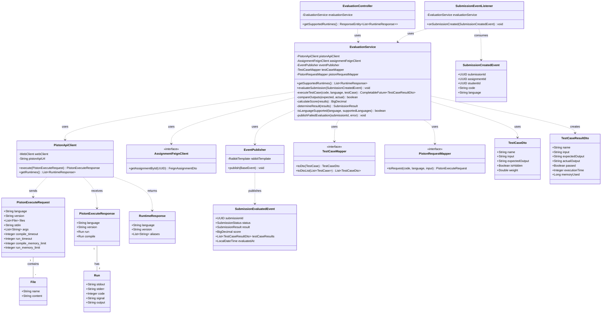
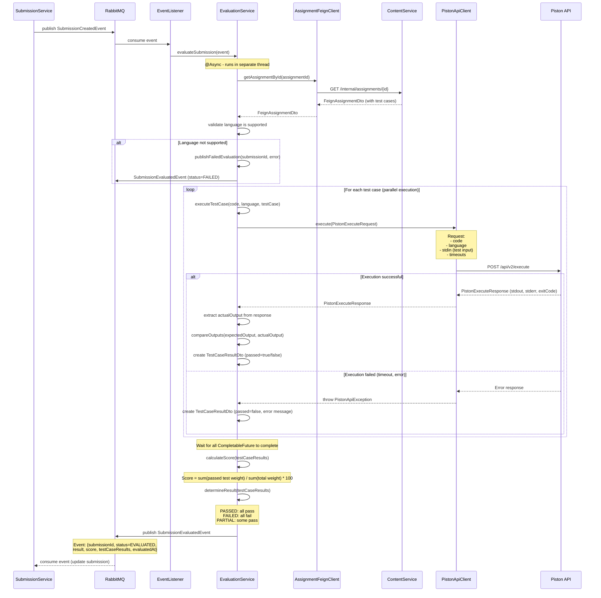
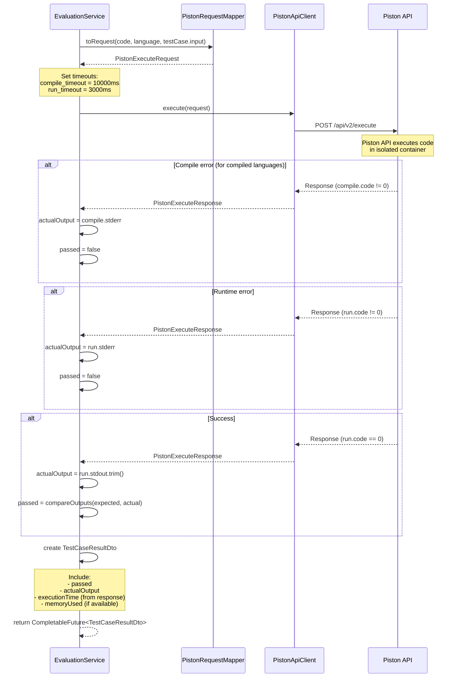
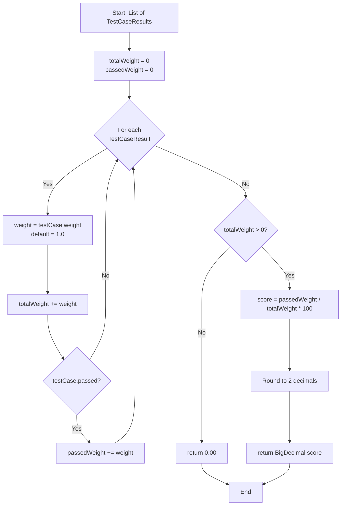
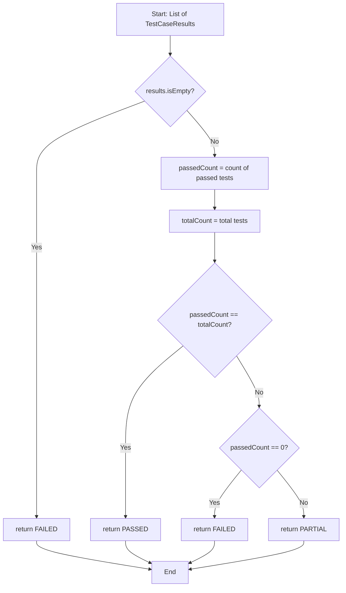
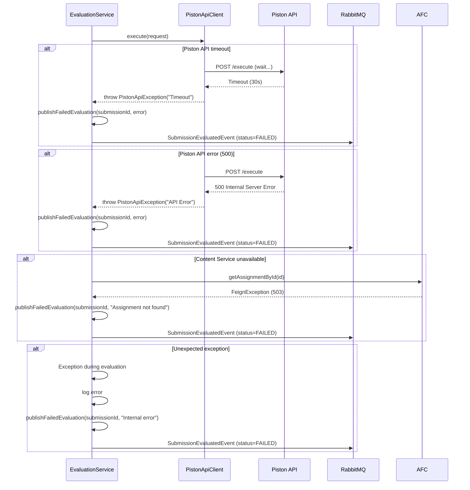

# Tài liệu Evaluation Service

## 1. Tổng quan

### 1.1. Mô tả
Evaluation Service là microservice chịu trách nhiệm đánh giá tự động code submissions của sinh viên bằng cách sử dụng **Piston API** - một code execution engine hỗ trợ nhiều ngôn ngữ lập trình. Service này không lưu trữ dữ liệu trong database, hoạt động hoàn toàn event-driven và stateless.

### 1.2. Vai trò trong hệ thống
- **Code Execution**: Thực thi code của sinh viên trong môi trường cách ly (sandbox)
- **Test Case Evaluation**: Chạy code với từng test case và so sánh output
- **Event Consumer**: Lắng nghe SubmissionCreatedEvent từ Submission Service
- **Event Producer**: Phát SubmissionEvaluatedEvent với kết quả đánh giá
- **Runtime Information**: Cung cấp danh sách ngôn ngữ lập trình được hỗ trợ

### 1.3. Công nghệ sử dụng
- **Framework**: Spring Boot 3.5.6
- **External API**: Piston API v2 (https://github.com/engineer-man/piston)
- **Messaging**: RabbitMQ (event-driven communication)
- **Service Discovery**: Netflix Eureka Client
- **HTTP Client**: Spring WebClient (for Piston API calls)
- **Async Processing**: Spring @Async với ThreadPoolTaskExecutor
- **Port**: 8085

## 2. Kiến trúc

### 2.1. Kiến trúc tổng thể
```
┌─────────────────────────────────────────────────────────────┐
│                  Evaluation Service                          │
│                                                              │
│  ┌──────────────┐    ┌──────────────┐    ┌──────────────┐  │
│  │              │    │              │    │              │  │
│  │ Event        │───▶│  Evaluation  │───▶│  Piston API  │  │
│  │ Listener     │    │  Service     │    │  Client      │  │
│  │              │    │              │    │              │  │
│  └──────────────┘    └──────────────┘    └──────────────┘  │
│         │                    │                    │         │
│         │                    │                    ▼         │
│         │                    │            ┌──────────────┐  │
│         │                    │            │              │  │
│         │                    │            │ Piston API   │  │
│         │                    │            │ (External)   │  │
│         │                    │            │              │  │
│         │                    │            └──────────────┘  │
│         │                    ▼                              │
│         │            ┌──────────────┐                       │
│         │            │              │                       │
│         │            │   Mappers    │                       │
│         │            │              │                       │
│         │            └──────────────┘                       │
│         │                    │                              │
│         ▼                    ▼                              │
│  ┌──────────────┐    ┌──────────────┐                      │
│  │              │    │              │                      │
│  │  RabbitMQ    │    │  RabbitMQ    │                      │
│  │  Consumer    │    │  Publisher   │                      │
│  │              │    │              │                      │
│  └──────────────┘    └──────────────┘                      │
│         │                    │                              │
│         ▼                    ▼                              │
│  ┌──────────────┐    ┌──────────────┐                      │
│  │              │    │              │                      │
│  │ Submission   │    │ Submission   │                      │
│  │ Service      │    │ Service      │                      │
│  │              │    │              │                      │
│  └──────────────┘    └──────────────┘                      │
│                                                              │
│  ┌──────────────┐    ┌──────────────┐                      │
│  │              │    │              │                      │
│  │ Controller   │───▶│  Feign       │                      │
│  │ (Runtimes)   │    │  Client      │                      │
│  │              │    │ (Content API)│                      │
│  └──────────────┘    └──────────────┘                      │
└─────────────────────────────────────────────────────────────┘
```

### 2.2. Các thành phần chính

#### Event Components
- **SubmissionEventListener**: Lắng nghe SubmissionCreatedEvent từ RabbitMQ
- **EventPublisher**: Phát SubmissionEvaluatedEvent với kết quả

#### Services
- **EvaluationService**: Logic chính cho đánh giá code
  - Lấy thông tin assignment (test cases)
  - Thực thi code với từng test case qua Piston API
  - Tính toán score và determine result
  - Phát event kết quả

#### External Clients
- **PistonApiClient**: HTTP client để gọi Piston API
  - Execute code
  - Get supported runtimes

#### Feign Clients
- **AssignmentFeignClient**: Gọi Content Service để lấy assignment details (test cases)

#### Controllers
- **EvaluationController**: REST endpoint để lấy supported runtimes (for UI)

#### Mappers
- **TestCaseMapper**: Map TestCase từ assignment sang DTO
- **PistonRequestMapper**: Map code và input sang PistonExecuteRequest

## 3. Thiết kế cơ sở dữ liệu

### 3.1. Không có Database

Evaluation Service là **stateless service**, không lưu trữ dữ liệu trong database. Tất cả thông tin cần thiết được lấy từ:
- **Content Service** (via Feign): Assignment details và test cases
- **Piston API**: Code execution results

**Lý do:**
- Service chỉ xử lý logic đánh giá tạm thời
- Kết quả được lưu bởi Submission Service (owner of submission data)
- Đảm bảo separation of concerns
- Dễ dàng scale horizontally (không có shared state)

## 4. Thiết kế Class

### 4.1. Class Diagram



### 4.2. Mô tả các class chính

#### Service Classes

**EvaluationService**
- Service chính chứa toàn bộ logic đánh giá
- Methods quan trọng:
  - `evaluateSubmission()`: Entry point, orchestrate toàn bộ quá trình đánh giá
  - `executeTestCase()`: Thực thi 1 test case qua Piston API (async)
  - `compareOutputs()`: So sánh expected vs actual output (trim, ignore trailing whitespace)
  - `calculateScore()`: Tính điểm dựa trên test case weights
  - `determineResult()`: Xác định PASSED/FAILED/PARTIAL
  - `publishFailedEvaluation()`: Phát event khi evaluation fails

**Async Processing:**
- Sử dụng `@Async` và `CompletableFuture` để chạy test cases parallel
- Config ThreadPoolTaskExecutor trong AsyncConfig

#### External Client Classes

**PistonApiClient**
- HTTP client sử dụng WebClient
- Methods:
  - `execute()`: POST /api/v2/execute - Thực thi code
  - `getRuntimes()`: GET /api/v2/runtimes - Lấy danh sách ngôn ngữ hỗ trợ
- Error handling: Throw PistonApiException khi API fails
- Timeout configuration: 30s cho compile + run

#### Event Classes

**SubmissionEventListener**
- Annotated với `@RabbitListener`
- Queue: `submission.created.queue`
- Gọi `EvaluationService.evaluateSubmission()` khi nhận event

**EventPublisher**
- Shared component để phát events
- Exchange: `apsas.exchange`
- Routing key: `submission.evaluated`

#### Feign Client

**AssignmentFeignClient**
- Interface để gọi Content Service
- Endpoint: `GET /internal/assignments/{id}`
- Fallback: Throw exception nếu Content Service không available

#### DTOs

**PistonExecuteRequest**
- Request body gửi đến Piston API
- Structure:
  ```json
  {
    "language": "java",
    "version": "15.0.2",
    "files": [
      {
        "name": "Main.java",
        "content": "public class Main { ... }"
      }
    ],
    "stdin": "5\n",
    "compile_timeout": 10000,
    "run_timeout": 3000
  }
  ```

**PistonExecuteResponse**
- Response từ Piston API
- Chứa:
  - `run.stdout`: Standard output
  - `run.stderr`: Standard error
  - `run.code`: Exit code (0 = success)
  - `compile`: Compile information (for compiled languages)

**TestCaseResultDto**
- DTO chứa kết quả đánh giá 1 test case
- Được gửi trong SubmissionEvaluatedEvent

## 5. Luồng hoạt động chi tiết

### 5.1. Luồng đánh giá submission (Main Flow)



**Chi tiết các bước:**

1. **Nhận event** SubmissionCreatedEvent từ RabbitMQ

2. **Lấy assignment details** từ Content Service:
   - Gọi qua Feign Client
   - Lấy test cases và supported languages

3. **Validate language**:
   - Kiểm tra language có trong assignment.languages không
   - Nếu không → publish failed event

4. **Thực thi test cases (parallel)**:
   - Mỗi test case được execute trong separate thread pool
   - Sử dụng CompletableFuture để async

5. **Cho mỗi test case**:
   - Map code + input sang PistonExecuteRequest
   - Gọi Piston API
   - Parse response, extract stdout
   - So sánh với expectedOutput
   - Tạo TestCaseResultDto

6. **Tính toán kết quả**:
   - `calculateScore()`: Dựa trên weights của test cases
   - `determineResult()`: PASSED/FAILED/PARTIAL

7. **Phát event** SubmissionEvaluatedEvent với kết quả

### 5.2. Luồng thực thi 1 test case (executeTestCase)



**Chi tiết xử lý output:**

**Compile Error** (for Java, C++, etc.):
- Check `compile.code != 0`
- actualOutput = compile.stderr
- passed = false

**Runtime Error**:
- Check `run.code != 0`
- actualOutput = run.stderr hoặc run.stdout (nếu có)
- passed = false

**Success**:
- Check `run.code == 0`
- actualOutput = run.stdout
- Trim whitespace
- Compare với expectedOutput

**Output Comparison**:
```java
private boolean compareOutputs(String expected, String actual) {
    String normalizedExpected = expected.trim().replaceAll("\\s+", " ");
    String normalizedActual = actual.trim().replaceAll("\\s+", " ");
    return normalizedExpected.equals(normalizedActual);
}
```

### 5.3. Luồng tính điểm (calculateScore)



**Example:**
- Test Case 1: weight = 1.0, passed = true
- Test Case 2: weight = 2.0, passed = true
- Test Case 3: weight = 1.0, passed = false

Calculation:
- totalWeight = 1.0 + 2.0 + 1.0 = 4.0
- passedWeight = 1.0 + 2.0 = 3.0
- score = (3.0 / 4.0) * 100 = **75.00**

### 5.4. Luồng determine result



**Logic:**
- **PASSED**: Tất cả test cases đều pass
- **FAILED**: Không có test case nào pass (hoặc empty)
- **PARTIAL**: Một số test cases pass

### 5.5. Luồng error handling



**Error Handling Strategy:**

1. **Always publish event**: Dù có lỗi gì, luôn publish SubmissionEvaluatedEvent với status=FAILED
2. **Detailed error messages**: Include error details trong event (để Submission Service lưu vào feedback)
3. **Logging**: Log tất cả errors với stack trace
4. **No retry**: Không retry failed evaluations tự động (có thể implement manual retry sau)

## 6. API Endpoints

### 6.1. Public Endpoints

| Method | Endpoint | Role Required | Description | Response |
|--------|----------|---------------|-------------|----------|
| GET | `/api/v1/evaluation/runtimes` | All authenticated | Lấy danh sách ngôn ngữ và versions được hỗ trợ | 200 + List<RuntimeResponse> |

**GET /runtimes Response Example:**
```json
[
  {
    "language": "java",
    "version": "15.0.2",
    "aliases": ["java"]
  },
  {
    "language": "python",
    "version": "3.10.0",
    "aliases": ["py", "python3"]
  },
  {
    "language": "cpp",
    "version": "10.2.0",
    "aliases": ["c++", "g++"]
  }
]
```

## 7. Events và Messaging

### 7.1. Consumed Events

#### SubmissionCreatedEvent
**Routing Key**: `submission.created`

**Payload**:
```json
{
  "submissionId": "uuid",
  "assignmentId": "uuid",
  "studentId": "uuid",
  "code": "public class Main { ... }",
  "language": "java"
}
```

**Producer**: Submission Service  
**Handler**: SubmissionEventListener.onSubmissionCreated()

**Queue Configuration**:
```java
@Bean
public Queue submissionCreatedQueue() {
    return new Queue("submission.created.queue", true); // durable
}

@Bean
public Binding submissionCreatedBinding(Queue queue, TopicExchange exchange) {
    return BindingBuilder.bind(queue)
            .to(exchange)
            .with("submission.created");
}
```

### 7.2. Published Events

#### SubmissionEvaluatedEvent
**Routing Key**: `submission.evaluated`

**Payload (Success)**:
```json
{
  "submissionId": "uuid",
  "status": "EVALUATED",
  "result": "PASSED",
  "score": 95.50,
  "testCaseResults": [
    {
      "name": "Test Case 1",
      "input": "5",
      "expectedOutput": "120",
      "actualOutput": "120",
      "passed": true,
      "executionTime": 45,
      "memoryUsed": 2048
    },
    {
      "name": "Test Case 2",
      "input": "10",
      "expectedOutput": "3628800",
      "actualOutput": "3628800",
      "passed": true,
      "executionTime": 52,
      "memoryUsed": 2560
    }
  ],
  "evaluatedAt": "2024-01-15T10:30:00Z"
}
```

**Payload (Failed)**:
```json
{
  "submissionId": "uuid",
  "status": "FAILED",
  "result": null,
  "score": null,
  "testCaseResults": [],
  "evaluatedAt": "2024-01-15T10:30:00Z",
  "errorMessage": "Piston API timeout"
}
```

**Consumers**: 
- Submission Service (cập nhật submission)
- Notification Service (thông báo cho student)

## 8. Integration với Piston API

### 8.1. Piston API Overview

**Repository**: https://github.com/engineer-man/piston  
**Docker Image**: `ghcr.io/engineer-man/piston`

**Supported Languages**: 50+ languages including:
- Java, Python, C++, C, JavaScript, TypeScript
- Go, Rust, Ruby, PHP, Swift, Kotlin
- And many more...

### 8.2. Piston API Endpoints

#### POST /api/v2/execute
Thực thi code.

**Request**:
```json
{
  "language": "java",
  "version": "15.0.2",
  "files": [
    {
      "name": "Main.java",
      "content": "public class Main { public static void main(String[] args) { System.out.println(\"Hello\"); } }"
    }
  ],
  "stdin": "",
  "args": [],
  "compile_timeout": 10000,
  "run_timeout": 3000,
  "compile_memory_limit": -1,
  "run_memory_limit": -1
}
```

**Response**:
```json
{
  "language": "java",
  "version": "15.0.2",
  "run": {
    "stdout": "Hello\n",
    "stderr": "",
    "code": 0,
    "signal": null,
    "output": "Hello\n"
  },
  "compile": {
    "stdout": "",
    "stderr": "",
    "code": 0,
    "signal": null,
    "output": ""
  }
}
```

#### GET /api/v2/runtimes
Lấy danh sách runtimes.

**Response**:
```json
[
  {
    "language": "java",
    "version": "15.0.2",
    "aliases": ["java"],
    "runtime": "openjdk"
  },
  ...
]
```

### 8.3. Timeout Configuration

**Compile Timeout**: 10000ms (10 seconds)
- Cho ngôn ngữ compiled (Java, C++, etc.)
- Đủ thời gian để compile code phức tạp

**Run Timeout**: 3000ms (3 seconds)
- Timeout cho việc thực thi code
- Tránh infinite loops
- Balance giữa performance và fairness

**Memory Limits**: -1 (unlimited trong development)
- Production nên set limits (ví dụ: 256MB)

### 8.4. Error Scenarios

**Compile Error (Java example)**:
```json
{
  "compile": {
    "stdout": "",
    "stderr": "Main.java:1: error: ';' expected\npublic class Main { public static void main(String[] args) { System.out.println(\"Hello\") } }\n                                                                                       ^\n1 error\n",
    "code": 1,
    "output": "..."
  },
  "run": {
    "stdout": "",
    "stderr": "",
    "code": 0,
    "output": ""
  }
}
```

**Runtime Error**:
```json
{
  "run": {
    "stdout": "",
    "stderr": "Exception in thread \"main\" java.lang.ArrayIndexOutOfBoundsException: Index 5 out of bounds for length 5\n",
    "code": 1,
    "output": "..."
  }
}
```

**Timeout**:
- Piston API sẽ kill process sau timeout
- code != 0
- stderr có thể chứa "Killed" hoặc timeout message

## 9. Cấu hình

### 9.1. Application Properties

**Bootstrap** (`resources/application.yaml`):
```yaml
spring:
  application:
    name: evaluation-service
  config:
    import: "configserver:"
  cloud:
    config:
      uri: http://localhost:8888
```

**Remote Config** (`config/evaluation-service.yaml`):
```yaml
server:
  port: 8085

spring:
  config:
    import:
      - file:./config/fragments/springdoc.yaml
      - file:./config/fragments/rabbitmq.yaml
      - file:./config/fragments/eureka-client.yaml

piston:
  api:
    url: http://localhost:2000  # Piston API base URL
    timeout: 30000              # 30 seconds

async:
  executor:
    core-pool-size: 5
    max-pool-size: 10
    queue-capacity: 100
    thread-name-prefix: evaluation-
```

### 9.2. Async Configuration

```java
@Configuration
@EnableAsync
public class AsyncConfig implements AsyncConfigurer {
    
    @Override
    public Executor getAsyncExecutor() {
        ThreadPoolTaskExecutor executor = new ThreadPoolTaskExecutor();
        executor.setCorePoolSize(5);
        executor.setMaxPoolSize(10);
        executor.setQueueCapacity(100);
        executor.setThreadNamePrefix("evaluation-");
        executor.initialize();
        return executor;
    }
}
```

**Lý do sử dụng async:**
- Test cases được chạy parallel → giảm thời gian đánh giá tổng thể
- Nếu có 5 test cases, thay vì 15 seconds (5 x 3s), chỉ mất ~3 seconds

### 9.3. RabbitMQ Configuration

```java
@Configuration
public class MessagingConfig {
    
    @Bean
    public Queue submissionCreatedQueue() {
        return new Queue("submission.created.queue", true);
    }
    
    @Bean
    public Binding submissionCreatedBinding(
            Queue submissionCreatedQueue, 
            TopicExchange exchange) {
        return BindingBuilder
                .bind(submissionCreatedQueue)
                .to(exchange)
                .with("submission.created");
    }
}
```

## 10. Testing

### 10.1. Test Strategy

**Unit Tests**:
- EvaluationService methods với mocked PistonApiClient và Feign clients
- Test score calculation logic
- Test result determination logic
- Test output comparison

**Integration Tests**:
- Test với real Piston API (using testcontainers)
- Test event publishing và consuming

**Example Test Cases**:

```java
@Test
void testCalculateScore_allPassed() {
    // Given
    List<TestCaseResultDto> results = List.of(
        new TestCaseResultDto("TC1", true, 1.0),
        new TestCaseResultDto("TC2", true, 1.0)
    );
    
    // When
    BigDecimal score = evaluationService.calculateScore(results);
    
    // Then
    assertEquals(new BigDecimal("100.00"), score);
}

@Test
void testDetermineResult_partial() {
    // Given
    List<TestCaseResultDto> results = List.of(
        new TestCaseResultDto("TC1", true, 1.0),
        new TestCaseResultDto("TC2", false, 1.0)
    );
    
    // When
    SubmissionResult result = evaluationService.determineResult(results);
    
    // Then
    assertEquals(SubmissionResult.PARTIAL, result);
}
```

### 10.2. Testing với Piston API

**Option 1: Testcontainers** (recommended)
```java
@Container
static GenericContainer<?> pistonContainer = new GenericContainer<>("ghcr.io/engineer-man/piston")
        .withExposedPorts(2000);
```

**Option 2: Mock PistonApiClient**
```java
@MockBean
private PistonApiClient pistonApiClient;

@Test
void testEvaluateSubmission() {
    // Given
    PistonExecuteResponse mockResponse = new PistonExecuteResponse();
    mockResponse.setRun(new Run("120\n", "", 0));
    when(pistonApiClient.execute(any())).thenReturn(mockResponse);
    
    // When & Then
    // ...
}
```

## 11. Deployment

### 11.1. Dependencies

Trước khi start Evaluation Service:
1. **Service Registry** (Eureka) - port 8761
2. **Config Server** - port 8888
3. **RabbitMQ** - port 5672
4. **Piston API** - port 2000
5. **Content Service** - port 8082 (for Feign calls)

**Note**: Service runs on port **8085** (not 8084 as in Submission Service)

### 11.2. Piston API Deployment

**Development (Docker Compose)**:
```yaml
services:
  piston:
    image: ghcr.io/engineer-man/piston
    container_name: piston
    ports:
      - "2000:2000"
    volumes:
      - piston_packages:/piston/packages
    privileged: true
```

**Production**:
- Deploy Piston API as separate service
- Use multiple instances for high availability
- Configure proper resource limits

### 11.3. Build và Run

```bash
# Build
./gradlew :sources:services:evaluation:build

# Run
./gradlew :sources:services:evaluation:bootRun
```

## 12. Monitoring và Performance

### 12.1. Key Metrics

**Evaluation Metrics**:
- Average evaluation time per submission
- Test case execution time distribution
- Piston API response time
- Async thread pool usage

**Error Metrics**:
- Piston API timeout rate
- Piston API error rate
- Evaluation failure rate

### 12.2. Logging

**Important Log Points**:
```java
log.info("Starting evaluation for submission: {}", submissionId);
log.info("Assignment {} has {} test cases", assignmentId, testCases.size());
log.debug("Executing test case: {} with input: {}", testCase.getName(), testCase.getInput());
log.info("Evaluation completed for submission: {} with result: {} and score: {}", 
         submissionId, result, score);
log.error("Evaluation failed for submission: {}", submissionId, exception);
```

## 13. Best Practices và Lưu ý

### 13.1. Performance Optimization

1. **Parallel execution**: Chạy test cases parallel để giảm thời gian
2. **Timeout tuning**: Adjust timeouts dựa trên complexity của assignments
3. **Connection pooling**: WebClient sử dụng connection pool cho Piston API calls
4. **Async processing**: Event listener chạy async để không block message consumption

### 13.2. Security Considerations

1. **Code isolation**: Piston API chạy code trong isolated containers
2. **Resource limits**: Set memory và CPU limits trong production
3. **Timeout protection**: Prevent infinite loops với run_timeout
4. **Input validation**: Validate test case inputs trước khi gửi đến Piston

### 13.3. Scalability

1. **Stateless**: Service hoàn toàn stateless, dễ scale horizontally
2. **Queue-based**: RabbitMQ queue giúp distribute load across instances
3. **No database**: Không có database bottleneck
4. **Async processing**: Có thể handle nhiều submissions đồng thời

### 13.4. Error Resilience

1. **Always publish event**: Dù fail vẫn phải notify Submission Service
2. **Retry mechanism**: RabbitMQ có built-in retry (có thể config)
3. **Dead letter queue**: Config DLQ cho messages fail quá nhiều lần
4. **Circuit breaker**: Consider Resilience4j cho Piston API calls (future enhancement)

---

**Phiên bản tài liệu**: 1.0  
**Ngày cập nhật**: 2024-01-15  
**Người viết**: APSAS Development Team
