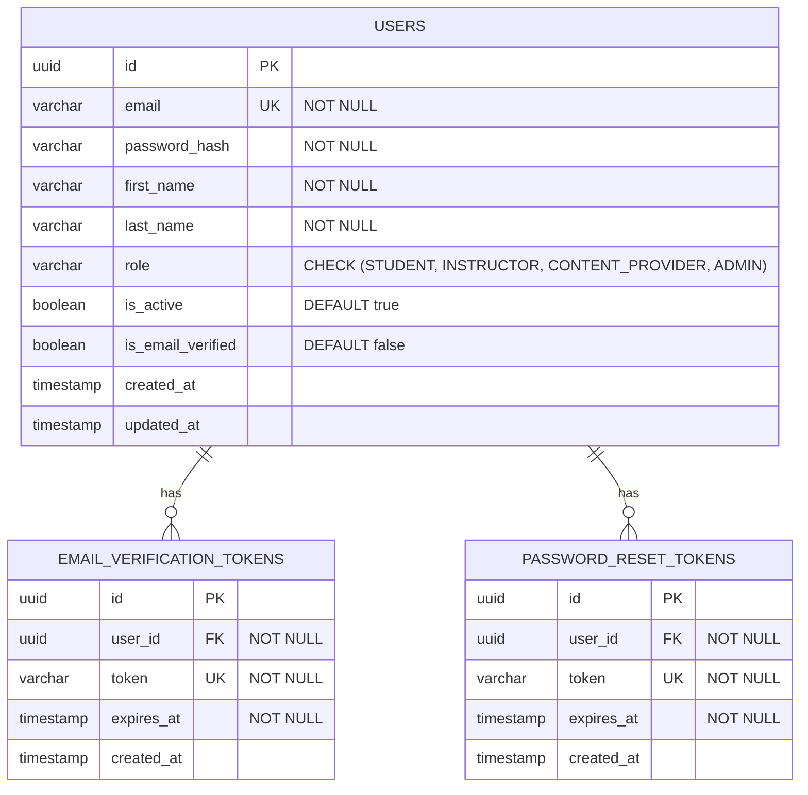
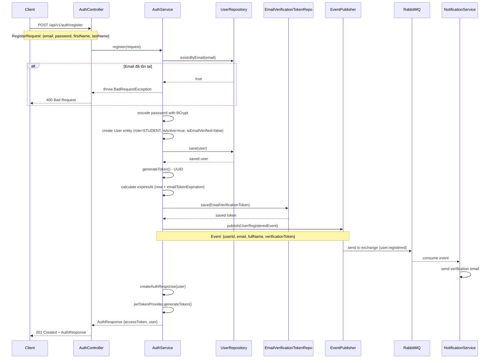
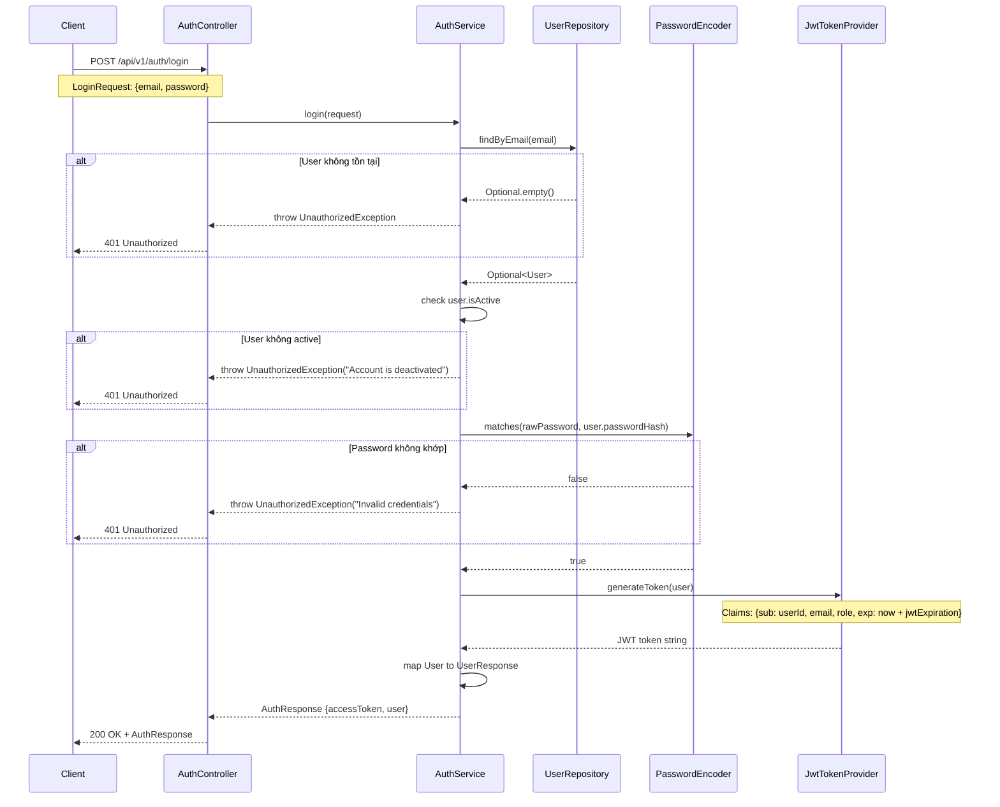
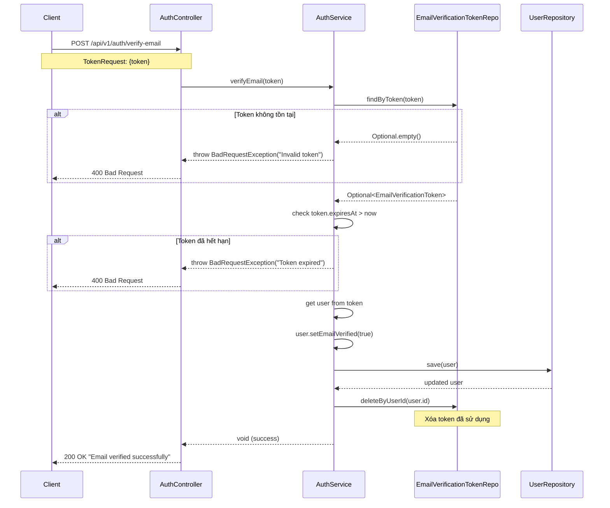
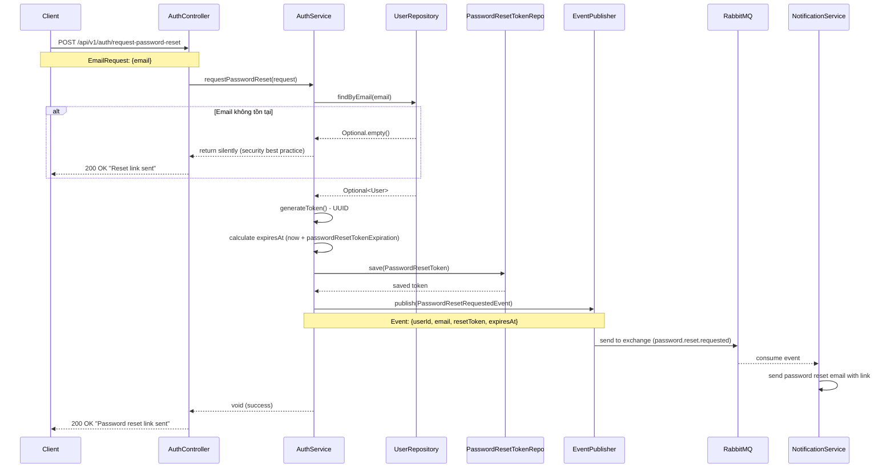
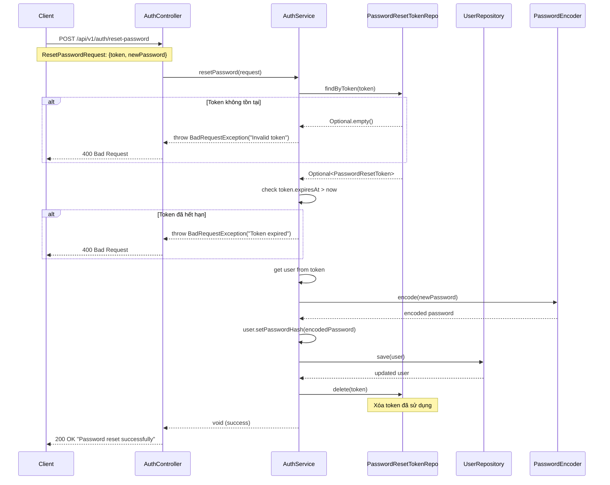
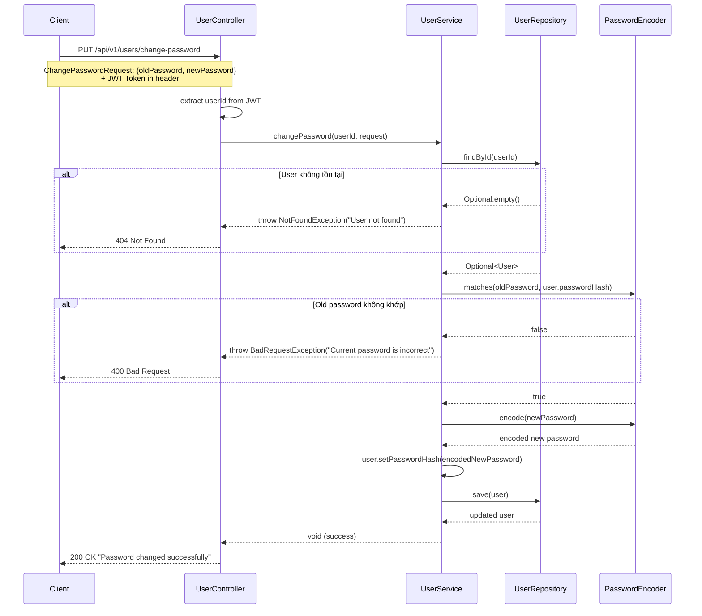

# Tài liệu Identity Service

## 1. Tổng quan

### 1.1. Mô tả
Identity Service là microservice chịu trách nhiệm quản lý xác thực (authentication) và phân quyền (authorization) trong hệ thống APSAS. Service này xử lý các chức năng liên quan đến người dùng như đăng ký, đăng nhập, xác thực email, đặt lại mật khẩu và quản lý JWT tokens.

### 1.2. Vai trò trong hệ thống
- **Cổng xác thực trung tâm**: Tất cả các yêu cầu xác thực đều đi qua service này
- **Quản lý người dùng**: Lưu trữ và quản lý thông tin người dùng (users)
- **Tích hợp với các service khác**: Cung cấp API nội bộ để các service khác xác minh thông tin người dùng
- **Event Publisher**: Phát sự kiện khi có người dùng mới đăng ký hoặc yêu cầu đặt lại mật khẩu

### 1.3. Công nghệ sử dụng
- **Framework**: Spring Boot 3.5.6
- **Security**: Spring Security 6.x với JWT
- **Database**: PostgreSQL 17 (schema: `identity`)
- **Cache**: Redis (distributed caching for users)
- **Messaging**: RabbitMQ (event-driven communication)
- **Service Discovery**: Netflix Eureka Client
- **Port**: 8081

## 2. Kiến trúc

### 2.1. Kiến trúc tổng thể
```
┌─────────────────────────────────────────────────────────────┐
│                     Identity Service                         │
│                                                              │
│  ┌──────────────┐    ┌──────────────┐    ┌──────────────┐  │
│  │              │    │              │    │              │  │
│  │ Controllers  │───▶│   Services   │───▶│ Repositories │  │
│  │              │    │              │    │              │  │
│  └──────────────┘    └──────────────┘    └──────────────┘  │
│         │                    │                    │         │
│         │                    ▼                    ▼         │
│         │            ┌──────────────┐    ┌──────────────┐  │
│         │            │              │    │              │  │
│         │            │   Mappers    │    │  PostgreSQL  │  │
│         │            │              │    │   Database   │  │
│         │            └──────────────┘    └──────────────┘  │
│         │                    │                             │
│         ▼                    ▼                             │
│  ┌──────────────┐    ┌──────────────┐                     │
│  │              │    │              │                     │
│  │   Security   │    │  RabbitMQ    │                     │
│  │   (JWT)      │    │  Publisher   │                     │
│  │              │    │              │                     │
│  └──────────────┘    └──────────────┘                     │
└─────────────────────────────────────────────────────────────┘
```

### 2.2. Các thành phần chính

#### Controllers
- **AuthController**: Xử lý các endpoint xác thực (đăng ký, đăng nhập, xác thực email, reset password)
- **UserController**: Quản lý thông tin người dùng (cập nhật profile, đổi mật khẩu)
- **InternalUserController**: API nội bộ cho các service khác

#### Services
- **AuthService**: Business logic cho xác thực và quản lý tokens
- **UserService**: Logic quản lý thông tin người dùng

#### Security
- **JwtTokenProvider**: Tạo và validate JWT tokens
- **CustomUserDetailsService**: Load thông tin người dùng cho Spring Security
- **SecurityConfig**: Cấu hình Spring Security

#### Repositories
- **UserRepository**: JPA repository cho entity User
- **EmailVerificationTokenRepository**: Quản lý tokens xác thực email
- **PasswordResetTokenRepository**: Quản lý tokens đặt lại mật khẩu

## 3. Thiết kế cơ sở dữ liệu

### 3.1. Entity Relationship Diagram (ERD)



### 3.2. Mô tả các bảng

#### Bảng `users`
Lưu trữ thông tin người dùng trong hệ thống.

| Cột | Kiểu dữ liệu | Ràng buộc | Mô tả |
|-----|-------------|----------|-------|
| id | UUID | PRIMARY KEY | Định danh duy nhất của người dùng |
| email | VARCHAR(255) | UNIQUE, NOT NULL | Email đăng nhập |
| password_hash | VARCHAR(255) | NOT NULL | Mật khẩu đã được mã hóa (BCrypt) |
| first_name | VARCHAR(100) | NOT NULL | Tên |
| last_name | VARCHAR(100) | NOT NULL | Họ |
| role | VARCHAR(50) | NOT NULL, CHECK | Vai trò: STUDENT, INSTRUCTOR, CONTENT_PROVIDER, ADMIN |
| is_active | BOOLEAN | DEFAULT true | Trạng thái hoạt động |
| is_email_verified | BOOLEAN | DEFAULT false | Email đã được xác thực chưa |
| created_at | TIMESTAMP | DEFAULT now() | Thời gian tạo |
| updated_at | TIMESTAMP | DEFAULT now() | Thời gian cập nhật |

**Indexes:**
- `idx_users_email` trên `email`
- `idx_users_role` trên `role`

#### Bảng `email_verification_tokens`
Lưu trữ tokens để xác thực email khi đăng ký.

| Cột | Kiểu dữ liệu | Ràng buộc | Mô tả |
|-----|-------------|----------|-------|
| id | UUID | PRIMARY KEY | Định danh token |
| user_id | UUID | FOREIGN KEY, NOT NULL | Tham chiếu đến users.id |
| token | VARCHAR(255) | UNIQUE, NOT NULL | Token xác thực (UUID) |
| expires_at | TIMESTAMP | NOT NULL | Thời gian hết hạn |
| created_at | TIMESTAMP | DEFAULT now() | Thời gian tạo |

**Foreign Keys:**
- `user_id` REFERENCES `users(id)` ON DELETE CASCADE

**Indexes:**
- `idx_email_verification_tokens_user_id` trên `user_id`
- `idx_email_verification_tokens_token` trên `token`

#### Bảng `password_reset_tokens`
Lưu trữ tokens để đặt lại mật khẩu.

| Cột | Kiểu dữ liệu | Ràng buộc | Mô tả |
|-----|-------------|----------|-------|
| id | UUID | PRIMARY KEY | Định danh token |
| user_id | UUID | FOREIGN KEY, NOT NULL | Tham chiếu đến users.id |
| token | VARCHAR(255) | UNIQUE, NOT NULL | Token reset password (UUID) |
| expires_at | TIMESTAMP | NOT NULL | Thời gian hết hạn |
| created_at | TIMESTAMP | DEFAULT now() | Thời gian tạo |

**Foreign Keys:**
- `user_id` REFERENCES `users(id)` ON DELETE CASCADE

**Indexes:**
- `idx_password_reset_tokens_user_id` trên `user_id`
- `idx_password_reset_tokens_token` trên `token`

## 4. Thiết kế Class

### 4.1. Class Diagram

```mermaid
classDiagram
    %% Entities
    class User {
        -UUID id
        -String email
        -String passwordHash
        -String firstName
        -String lastName
        -UserRole role
        -Boolean isActive
        -Boolean isEmailVerified
        -LocalDateTime createdAt
        -LocalDateTime updatedAt
        +onCreate() void
        +onUpdate() void
    }

    class UserRole {
        <<enumeration>>
        STUDENT
        INSTRUCTOR
        CONTENT_PROVIDER
        ADMIN
    }

    class EmailVerificationToken {
        -UUID id
        -User user
        -String token
        -LocalDateTime expiresAt
        -LocalDateTime createdAt
    }

    class PasswordResetToken {
        -UUID id
        -User user
        -String token
        -LocalDateTime expiresAt
        -LocalDateTime createdAt
    }

    %% Controllers
    class AuthController {
        -AuthService authService
        +register(RegisterRequest) ResponseEntity~AuthResponse~
        +login(LoginRequest) ResponseEntity~AuthResponse~
        +verifyEmail(TokenRequest) ResponseEntity~String~
        +resendVerificationEmail(EmailRequest) ResponseEntity~String~
        +requestPasswordReset(EmailRequest) ResponseEntity~String~
        +resetPassword(ResetPasswordRequest) ResponseEntity~String~
    }

    class UserController {
        -UserService userService
        +getProfile() ResponseEntity~UserResponse~
        +updateProfile(UpdateProfileRequest) ResponseEntity~UserResponse~
        +changePassword(ChangePasswordRequest) ResponseEntity~String~
    }

    class InternalUserController {
        -UserService userService
        +getUserById(UUID) ResponseEntity~FeignUserDto~
        +getUsersByIds(List~UUID~) ResponseEntity~List~FeignUserDto~~
    }

    %% Services
    class AuthService {
        -UserRepository userRepository
        -EmailVerificationTokenRepository emailVerificationTokenRepository
        -PasswordResetTokenRepository passwordResetTokenRepository
        -PasswordEncoder passwordEncoder
        -JwtTokenProvider jwtTokenProvider
        -EventPublisher eventPublisher
        -UserMapper userMapper
        +register(RegisterRequest) AuthResponse
        +login(LoginRequest) AuthResponse
        +verifyEmail(String) void
        +resendVerificationEmail(EmailRequest) void
        +requestPasswordReset(EmailRequest) void
        +resetPassword(ResetPasswordRequest) void
        -createAndSaveEmailVerificationToken(User) String
        -createAndSavePasswordResetToken(User) String
        -publishUserRegisteredEvent(User, String) void
        -publishPasswordResetEvent(User, String) void
    }

    class UserService {
        -UserRepository userRepository
        -PasswordEncoder passwordEncoder
        -UserMapper userMapper
        +getProfile(UUID) UserResponse
        +updateProfile(UUID, UpdateProfileRequest) UserResponse
        +changePassword(UUID, ChangePasswordRequest) void
        +getUserById(UUID) User
        +createUser(CreateUserRequest) UserResponse
        +deleteUser(UUID) void
    }

    %% Security
    class JwtTokenProvider {
        -String jwtSecret
        -long jwtExpiration
        +generateToken(Authentication) String
        +getUserIdFromToken(String) UUID
        +validateToken(String) boolean
    }

    class CustomUserDetailsService {
        -UserRepository userRepository
        +loadUserByUsername(String) UserDetails
    }

    class SecurityConfig {
        -JwtTokenProvider jwtTokenProvider
        -CustomUserDetailsService userDetailsService
        +securityFilterChain(HttpSecurity) SecurityFilterChain
        +passwordEncoder() PasswordEncoder
    }

    %% Repositories
    class UserRepository {
        <<interface>>
        +findByEmail(String) Optional~User~
        +existsByEmail(String) boolean
    }

    class EmailVerificationTokenRepository {
        <<interface>>
        +findByToken(String) Optional~EmailVerificationToken~
        +deleteByUserId(UUID) void
    }

    class PasswordResetTokenRepository {
        <<interface>>
        +findByToken(String) Optional~PasswordResetToken~
    }

    %% Mappers
    class UserMapper {
        <<interface>>
        +toResponse(User) UserResponse
        +toFeignDto(User) FeignUserDto
    }

    %% DTOs
    class RegisterRequest {
        +String email
        +String password
        +String firstName
        +String lastName
    }

    class LoginRequest {
        +String email
        +String password
    }

    class AuthResponse {
        +String accessToken
        +UserResponse user
    }

    class UserResponse {
        +UUID id
        +String email
        +String firstName
        +String lastName
        +UserRole role
        +Boolean isEmailVerified
    }

    %% Relationships
    User "1" -- "0..*" EmailVerificationToken : has
    User "1" -- "0..*" PasswordResetToken : has
    User -- UserRole : has

    AuthController ..> AuthService : uses
    UserController ..> UserService : uses
    InternalUserController ..> UserService : uses

    AuthService ..> UserRepository : uses
    AuthService ..> EmailVerificationTokenRepository : uses
    AuthService ..> PasswordResetTokenRepository : uses
    AuthService ..> JwtTokenProvider : uses
    AuthService ..> UserMapper : uses

    UserService ..> UserRepository : uses
    UserService ..> UserMapper : uses

    SecurityConfig ..> JwtTokenProvider : uses
    SecurityConfig ..> CustomUserDetailsService : uses
    CustomUserDetailsService ..> UserRepository : uses

    AuthController ..> RegisterRequest : receives
    AuthController ..> LoginRequest : receives
    AuthController ..> AuthResponse : returns
    UserController ..> UserResponse : returns
```



### 4.2. Mô tả các class chính

#### Entity Classes

**User**
- Entity chính đại diện cho người dùng trong hệ thống
- Sử dụng JPA annotations (@Entity, @Table, @Id)
- Có lifecycle callbacks (@PrePersist, @PreUpdate) để tự động cập nhật timestamps
- Quan hệ One-to-Many với EmailVerificationToken và PasswordResetToken

**UserRole (Enum)**
- Định nghĩa các vai trò trong hệ thống: STUDENT, INSTRUCTOR, CONTENT_PROVIDER, ADMIN

**EmailVerificationToken & PasswordResetToken**
- Entities lưu trữ tokens tạm thời để xác thực email và reset password
- Có quan hệ Many-to-One với User
- Cascade DELETE khi user bị xóa

#### Service Classes

**AuthService**
- Xử lý toàn bộ logic nghiệp vụ liên quan đến authentication
- Phương thức chính:
  - `register()`: Đăng ký người dùng mới, tạo token xác thực, phát event
  - `login()`: Xác thực thông tin đăng nhập, tạo JWT token
  - `verifyEmail()`: Xác thực email bằng token
  - `requestPasswordReset()`: Tạo token reset password, phát event
  - `resetPassword()`: Đặt lại mật khẩu bằng token

**UserService**
- Quản lý thông tin người dùng
- Phương thức chính:
  - `getProfile()`: Lấy thông tin profile người dùng
  - `updateProfile()`: Cập nhật thông tin cá nhân
  - `changePassword()`: Đổi mật khẩu (yêu cầu mật khẩu cũ)

#### Controller Classes

**AuthController**
- REST endpoints cho xác thực (public endpoints)
- Không yêu cầu authentication cho hầu hết các endpoints
- Ánh xạ `/api/v1/auth/*`

**UserController**
- REST endpoints cho quản lý profile người dùng
- Yêu cầu authentication (JWT token)
- Ánh xạ `/api/v1/users/*`

**InternalUserController**
- API nội bộ cho các microservices khác
- Sử dụng Feign Client để gọi
- Ánh xạ `/internal/users/*`

#### Security Classes

**JwtTokenProvider**
- Tạo và validate JWT tokens
- Trích xuất thông tin user từ token
- Cấu hình secret key và expiration time

**CustomUserDetailsService**
- Implement UserDetailsService của Spring Security
- Load thông tin user từ database theo email

**SecurityConfig**
- Cấu hình Spring Security
- Định nghĩa public và protected endpoints
- Cấu hình JWT filter chain

## 5. Luồng hoạt động chi tiết

### 5.1. Luồng đăng ký người dùng



**Chi tiết các bước:**

1. **Client gửi request đăng ký** với thông tin: email, password, firstName, lastName
2. **AuthController** nhận request và gọi `AuthService.register()`
3. **AuthService** kiểm tra email đã tồn tại chưa:
   - Nếu tồn tại → throw `BadRequestException`
   - Nếu chưa → tiếp tục
4. **Mã hóa mật khẩu** bằng BCrypt (strength = 10)
5. **Tạo User entity** với:
   - role = STUDENT (default)
   - isActive = true
   - isEmailVerified = false
6. **Lưu user vào database** qua UserRepository
7. **Tạo email verification token**:
   - Generate UUID random
   - Tính expiresAt = now + 24 hours (configurable)
   - Lưu vào database qua EmailVerificationTokenRepository
8. **Phát event UserRegisteredEvent** qua RabbitMQ:
   - Exchange: `apsas.exchange`
   - Routing key: `user.registered`
   - Payload: userId, email, fullName, verificationToken
9. **NotificationService** nhận event và gửi email xác thực
10. **Tạo JWT token** để user có thể login ngay (optional)
11. **Trả về AuthResponse** với accessToken và thông tin user

### 5.2. Luồng đăng nhập



**Chi tiết các bước:**

1. **Client gửi request login** với email và password
2. **AuthController** nhận request và gọi `AuthService.login()`
3. **Tìm user theo email** qua UserRepository:
   - Không tồn tại → throw `UnauthorizedException("Invalid credentials")`
4. **Kiểm tra user.isActive**:
   - Nếu false → throw `UnauthorizedException("Account is deactivated")`
5. **So sánh password** bằng PasswordEncoder:
   - Sử dụng BCrypt để compare
   - Không khớp → throw `UnauthorizedException("Invalid credentials")`
6. **Tạo JWT token** với JwtTokenProvider:
   - Claims: subject (userId), email, role
   - Expiration: configurable (default 24 hours)
   - Sign với secret key
7. **Map User sang UserResponse** (không trả về passwordHash)
8. **Trả về AuthResponse** với accessToken và user info

### 5.3. Luồng xác thực email



**Chi tiết các bước:**

1. **Client gửi token** nhận được từ email
2. **AuthController** nhận request và gọi `AuthService.verifyEmail()`
3. **Tìm token trong database**:
   - Không tồn tại → throw `BadRequestException("Invalid verification token")`
4. **Kiểm tra token chưa hết hạn**:
   - expiresAt < now → throw `BadRequestException("Verification token has expired")`
5. **Lấy user từ token** và cập nhật:
   - Set `isEmailVerified = true`
   - Save vào database
6. **Xóa token đã sử dụng** khỏi database (cleanup)
7. **Trả về success message**

### 5.4. Luồng đặt lại mật khẩu

#### Bước 1: Yêu cầu reset password



#### Bước 2: Đặt lại mật khẩu với token



**Chi tiết các bước:**

**Yêu cầu reset:**
1. **Client gửi email** để reset password
2. **Tìm user theo email**:
   - Không tồn tại → vẫn trả về success (tránh enumeration attack)
3. **Tạo reset token**:
   - Generate UUID
   - Expiration: 1 hour (configurable)
   - Lưu vào database
4. **Phát event** PasswordResetRequestedEvent
5. **NotificationService** gửi email với link reset (chứa token)
6. **Trả về success message**

**Reset password:**
1. **Client gửi token và mật khẩu mới**
2. **Validate token**:
   - Tồn tại và chưa hết hạn
3. **Encode mật khẩu mới** bằng BCrypt
4. **Cập nhật passwordHash** của user
5. **Xóa token** đã sử dụng
6. **Trả về success message**

### 5.5. Luồng đổi mật khẩu (authenticated user)



**Chi tiết các bước:**

1. **Client gửi request** với JWT token trong header và oldPassword, newPassword trong body
2. **UserController** trích xuất userId từ JWT token (đã được Spring Security validate)
3. **UserService** tìm user theo userId
4. **Verify old password** bằng PasswordEncoder:
   - Không khớp → throw `BadRequestException("Current password is incorrect")`
5. **Encode new password** bằng BCrypt
6. **Cập nhật passwordHash** và save
7. **Trả về success message**

## 6. API Endpoints

### 6.1. Public Endpoints (AuthController)

| Method | Endpoint | Description | Request Body | Response |
|--------|----------|-------------|--------------|----------|
| POST | `/api/v1/auth/register` | Đăng ký người dùng mới | RegisterRequest | 201 + AuthResponse |
| POST | `/api/v1/auth/login` | Đăng nhập | LoginRequest | 200 + AuthResponse |
| POST | `/api/v1/auth/verify-email` | Xác thực email | TokenRequest | 200 + Message |
| POST | `/api/v1/auth/resend-verification-email` | Gửi lại email xác thực | EmailRequest | 200 + Message |
| POST | `/api/v1/auth/request-password-reset` | Yêu cầu reset password | EmailRequest | 200 + Message |
| POST | `/api/v1/auth/reset-password` | Reset password bằng token | ResetPasswordRequest | 200 + Message |

### 6.2. Protected Endpoints (UserController)

| Method | Endpoint | Description | Request Body | Response |
|--------|----------|-------------|--------------|----------|
| GET | `/api/v1/users/profile` | Lấy thông tin profile | - | 200 + UserResponse |
| PUT | `/api/v1/users/profile` | Cập nhật profile | UpdateProfileRequest | 200 + UserResponse |
| PUT | `/api/v1/users/change-password` | Đổi mật khẩu | ChangePasswordRequest | 200 + Message |

### 6.3. Internal Endpoints (InternalUserController)

| Method | Endpoint | Description | Request Body | Response |
|--------|----------|-------------|--------------|----------|
| GET | `/internal/users/{id}` | Lấy user theo ID (Feign) | - | 200 + FeignUserDto |
| POST | `/internal/users/batch` | Lấy nhiều users theo IDs | List<UUID> | 200 + List<FeignUserDto> |

## 7. Events và Messaging

### 7.1. Published Events

#### UserRegisteredEvent
**Routing Key**: `user.registered`

**Payload**:
```json
{
  "userId": "uuid",
  "email": "user@example.com",
  "fullName": "Nguyen Van A",
  "verificationToken": "uuid-token"
}
```

**Consumers**: NotificationService (gửi email xác thực)

#### PasswordResetRequestedEvent
**Routing Key**: `password.reset.requested`

**Payload**:
```json
{
  "userId": "uuid",
  "email": "user@example.com",
  "resetToken": "uuid-token",
  "expiresAt": "2024-01-15T10:30:00Z"
}
```

**Consumers**: NotificationService (gửi email reset password)

### 7.2. RabbitMQ Configuration

- **Exchange**: `apsas.exchange` (Topic Exchange)
- **Queue Bindings**: Được định nghĩa bởi các consumer services
- **Message Format**: JSON
- **Durability**: Queues và exchanges đều durable

## 8. Security

### 8.1. JWT Token

**Structure**:
```
Header: {
  "alg": "HS512",
  "typ": "JWT"
}

Payload: {
  "sub": "user-uuid",
  "email": "user@example.com",
  "role": "STUDENT",
  "iat": 1234567890,
  "exp": 1234654290
}
```

**Configuration**:
- Secret Key: Lưu trong config server (`jwt.secret`)
- Expiration: 24 hours (configurable)
- Algorithm: HS512 (HMAC with SHA-512)

### 8.2. Password Security

- **Encoding**: BCrypt với strength = 10
- **Validation**:
  - Minimum length: 8 characters (validated ở DTO layer)
  - Không lưu plain text password
- **Storage**: Chỉ lưu passwordHash trong database

### 8.3. Token Security

- **Email Verification Token**:
  - Format: UUID v4
  - Expiration: 24 hours
  - Single use (xóa sau khi verify)
  
- **Password Reset Token**:
  - Format: UUID v4
  - Expiration: 1 hour
  - Single use (xóa sau khi reset)

## 9. Error Handling

### 9.1. Custom Exceptions

| Exception | HTTP Status | Use Case |
|-----------|-------------|----------|
| BadRequestException | 400 | Invalid input, token expired |
| UnauthorizedException | 401 | Invalid credentials, inactive account |
| NotFoundException | 404 | User not found |
| ConflictException | 409 | Email already exists |

### 9.2. Error Response Format

```json
{
  "type": "about:blank",
  "title": "Bad Request",
  "status": 400,
  "detail": "Email already registered",
  "instance": "/api/v1/auth/register",
  "timestamp": "2024-01-15T10:30:00Z"
}
```

Sử dụng RFC 9457 Problem Details format thông qua `GlobalExceptionHandler` trong shared module.

## 10. Cấu hình

### 10.1. Application Properties

**Bootstrap** (`resources/application.yaml`):
```yaml
spring:
  application:
    name: identity-service
  config:
    import: "configserver:"
  cloud:
    config:
      uri: http://localhost:8888
```

**Remote Config** (`config/identity-service.yaml`):
```yaml
server:
  port: 8081

spring:
  datasource:
    url: jdbc:postgresql://localhost:5432/apsas?currentSchema=identity
  jpa:
    hibernate:
      ddl-auto: none
    properties:
      hibernate:
        default_schema: identity

jwt:
  secret: ${JWT_SECRET}
  expiration: 86400000  # 24 hours in milliseconds

email:
  verification:
    token-expiration: 86400  # 24 hours in seconds
  password-reset:
    token-expiration: 3600   # 1 hour in seconds
```

### 10.2. Eureka Client

Service tự động đăng ký với Eureka Server:
```yaml
eureka:
  client:
    service-url:
      defaultZone: http://localhost:8761/eureka/
  instance:
    prefer-ip-address: true
```

## 11. Testing

### 11.1. Test Strategy

- **Unit Tests**: Test các service methods với mocked dependencies
- **Integration Tests**: Test repositories với testcontainers PostgreSQL
- **Controller Tests**: Test với MockMvc và mocked services

### 11.2. Test Coverage Goals

- Service layer: > 80%
- Controller layer: > 70%
- Repository layer: > 60% (mainly integration tests)

## 12. Deployment

### 12.1. Dependencies

Trước khi start Identity Service, cần đảm bảo:
1. **Service Registry** (Eureka) đang chạy (port 8761)
2. **Config Server** đang chạy (port 8888)
3. **PostgreSQL** đã có database `apsas` và schema `identity`
4. **RabbitMQ** đang chạy (port 5672)
5. **Redis** đang chạy (port 6379) - for caching

### 12.2. Environment Variables

```bash
JWT_SECRET=your-secret-key-here
SPRING_PROFILES_ACTIVE=dev
```

### 12.3. Build và Run

```bash
# Build
./gradlew :sources:services:identity:build

# Run
./gradlew :sources:services:identity:bootRun
```

## 13. Monitoring và Logging

### 13.1. Logging

- **Framework**: SLF4J + Logback
- **Log Levels**:
  - INFO: User registration, login, email verification
  - WARN: Failed login attempts, expired tokens
  - ERROR: Unexpected exceptions, database errors

### 13.2. Health Check

- **Endpoint**: `/actuator/health`
- **Checks**:
  - Database connectivity
  - Eureka registration status
  - RabbitMQ connection

## 14. Best Practices và Lưu ý

### 14.1. Security Best Practices

1. **Không trả về thông tin nhạy cảm**: Không bao giờ trả về passwordHash trong response
2. **Rate limiting**: Cân nhắc implement rate limiting cho login và registration endpoints
3. **Enumeration protection**: Không tiết lộ liệu email có tồn tại hay không trong request-password-reset
4. **Token rotation**: Consider implementing refresh tokens cho long-lived sessions

### 14.2. Performance Optimization

1. **Database indexes**: Đã có indexes trên email, role, và foreign keys
2. **Redis caching**: Cache được cấu hình trong shared CacheConfig
   - `USERS_CACHE`: TTL 30 phút (users don't change frequently)
   - `USERS_BY_ROLE_CACHE`: TTL 15 phút (role assignments may change)
   - Key pattern: `apsas:identity:users::<uuid>`
3. **Connection pooling**: Sử dụng HikariCP (default của Spring Boot)

### 14.3. Scalability

- Service là stateless, có thể scale horizontally
- JWT tokens không yêu cầu shared session storage
- Database connection pool cần điều chỉnh khi scale

---

**Phiên bản tài liệu**: 1.0  
**Ngày cập nhật**: 2024-01-15  
**Người viết**: APSAS Development Team
