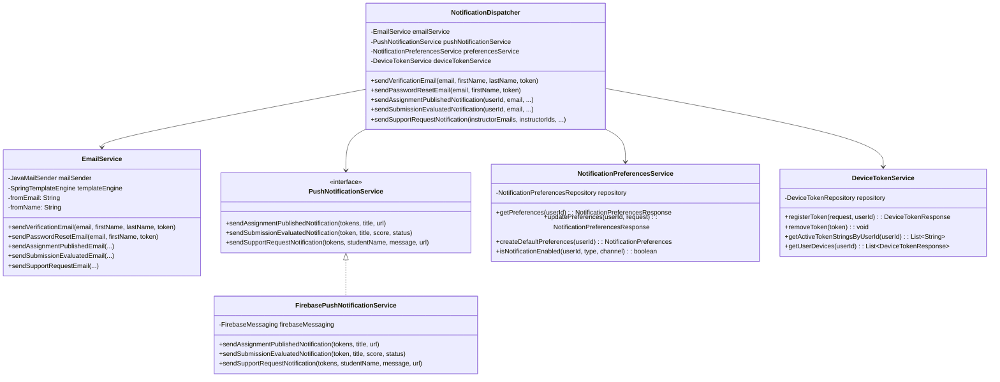
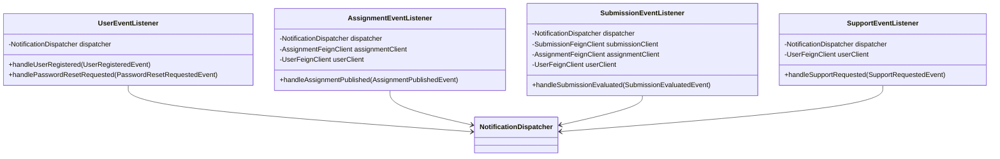
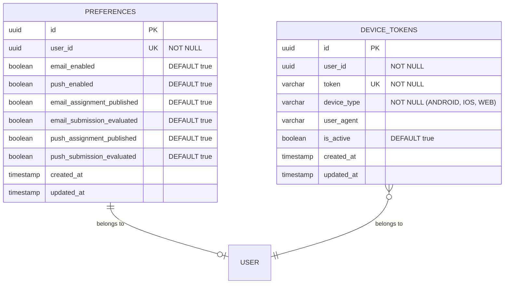
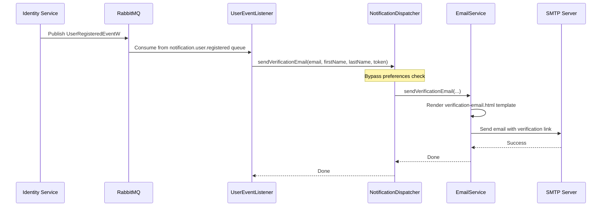
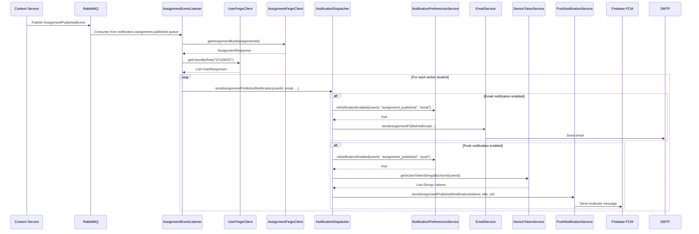
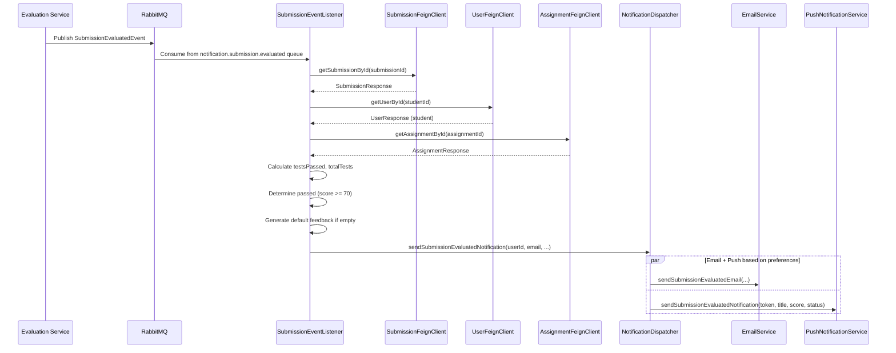
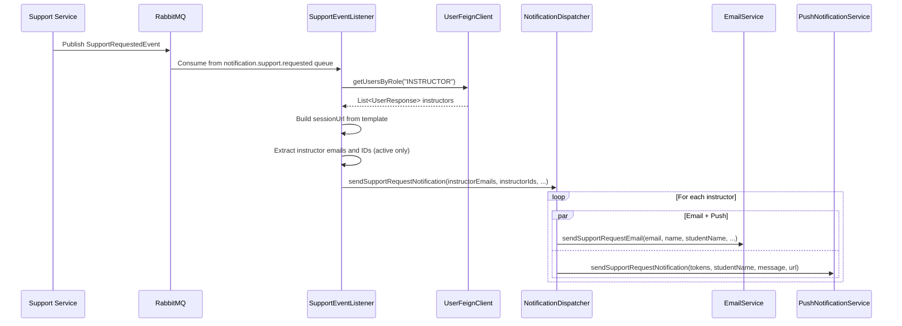

# Notification Service - Tài Liệu Chi Tiết

## 1. Tổng Quan

### 1.1. Mô Tả
Notification Service quản lý hệ thống thông báo đa kênh (email + push) trong APSAS. Service sử dụng **Dispatcher Pattern** với kiến trúc **event-driven**, lắng nghe 6 loại events từ RabbitMQ và gửi thông báo dựa trên user preferences.

**Đặc điểm kiến trúc:**
- **NotificationDispatcher**: Orchestrator chính, điều phối email và push notifications
- **4 Event Listeners**: Xử lý events riêng biệt (User, Assignment, Submission, Support)
- **Feign Clients**: Gọi 3 services để lấy thông tin bổ sung (User, Assignment, Submission)
- **Preferences-based**: Kiểm tra preferences trước khi gửi (trừ verification/reset password)

### 1.2. Thông Tin Kỹ Thuật
- **Port**: 8085
- **Database Schema**: `notification` (2 tables: `preferences`, `device_tokens`)
- **RabbitMQ Queues**: 6 queues (consume only, không publish)
- **Email Templates**: 5 Thymeleaf HTML templates
- **External Services**: SMTP/Mailpit (email), Firebase FCM (push)

### 1.3. Event Flow
```
Identity Service → user.registered → UserEventListener → Dispatcher → Email (verification)
Identity Service → password.reset → UserEventListener → Dispatcher → Email (reset)
Content Service → assignment.published → AssignmentEventListener → Feign Clients → Dispatcher → Email + Push
Evaluation Service → submission.evaluated → SubmissionEventListener → Feign Clients → Dispatcher → Email + Push
Support Service → support.requested → SupportEventListener → Feign Client → Dispatcher → Email + Push (all instructors)
```

---

## 2. Kiến Trúc Chi Tiết

### 2.1. Class Diagram - Core Components



### 2.2. Event Listeners Architecture



---

## 3. Database Schema

### 3.1. ERD



### 3.2. Table Descriptions

**`notification.preferences`**: Lưu preferences của user cho từng loại notification
- Global switches: `email_enabled`, `push_enabled`
- Per-type switches: `email_assignment_published`, `push_submission_evaluated`, etc.
- Auto-created với defaults khi user đăng ký (via `UserEventListener`)

**`notification.device_tokens`**: Quản lý FCM device tokens
- Mỗi user có thể có nhiều devices
- `token` là unique (FCM registration token)
- `is_active`: Track token validity, deactivate khi gửi FCM thất bại

---

## 4. Luồng Xử Lý Chi Tiết

### 4.1. User Registration → Email Verification



**Đặc điểm:**
- **Bypass preferences**: Verification email luôn được gửi bất kể preferences
- Template: `verification-email.html`
- Link format: `${verification.url.template}?token={verificationToken}`

### 4.2. Assignment Published → Multi-channel Notification



**Đặc điểm:**
- Gọi Feign Clients để lấy đầy đủ thông tin (assignment title, student info)
- Gửi cho **tất cả students** có `isActive = true`
- Kiểm tra preferences cho từng user + từng channel
- Email template: `assignment-published.html`
- FCM payload: `{ title, body, data: { type: "assignment", assignmentId, url } }`

### 4.3. Submission Evaluated → Result Notification



**Business Logic trong Listener:**
```java
int testsPassed = event.getTestCaseResults().stream()
    .filter(tc -> Boolean.TRUE.equals(tc.getPassed()))
    .count();

boolean passed = event.getScore() != null && event.getScore().intValue() >= 70;

String feedback = submission.getFeedback();
if (feedback == null || feedback.isEmpty()) {
    feedback = passed 
        ? "Chúc mừng! Bạn đã hoàn thành bài tập thành công."
        : "Hãy xem lại kết quả các test case và thử lại.";
}
```

### 4.4. Support Request → Notify All Instructors



**Đặc điểm:**
- Gửi cho **tất cả instructors** có `isActive = true`
- **Không check preferences** (support requests quan trọng)
- Email bao gồm: Student name, email, initial message, link đến session
- Template: `support-request.html`

---

## 5. REST API Endpoints

### 5.1. Notification Preferences

#### GET `/api/preferences`
Lấy preferences của user hiện tại.

**Authentication**: Required (JWT)

**Response**: 200 OK
```json
{
  "id": "uuid",
  "userId": "uuid",
  "emailEnabled": true,
  "pushEnabled": true,
  "emailAssignmentPublished": true,
  "emailSubmissionEvaluated": true,
  "pushAssignmentPublished": true,
  "pushSubmissionEvaluated": false
}
```

#### PUT `/api/preferences`
Cập nhật preferences.

**Request Body**:
```json
{
  "emailEnabled": true,
  "pushEnabled": true,
  "emailAssignmentPublished": true,
  "emailSubmissionEvaluated": true,
  "pushAssignmentPublished": true,
  "pushSubmissionEvaluated": false
}
```

**Response**: 200 OK (same as GET)

### 5.2. Device Token Management

#### POST `/api/devices`
Đăng ký FCM device token.

**Request Body**:
```json
{
  "token": "fcm_registration_token_here",
  "deviceType": "ANDROID",
  "userAgent": "Mozilla/5.0..."
}
```

**Response**: 201 Created
```json
{
  "id": "uuid",
  "userId": "uuid",
  "token": "fcm_registration_token_here",
  "deviceType": "ANDROID",
  "isActive": true,
  "createdAt": "2024-01-15T10:30:00"
}
```

#### DELETE `/api/devices/{token}`
Xóa device token (khi user logout hoặc revoke).

**Response**: 204 No Content

#### GET `/api/devices`
Lấy danh sách devices của user.

**Response**: 200 OK
```json
[
  {
    "id": "uuid",
    "token": "token1",
    "deviceType": "ANDROID",
    "isActive": true,
    "createdAt": "2024-01-15T10:30:00"
  }
]
```

---

## 6. Email Templates (Thymeleaf)

### 6.1. Template Structure
```
resources/templates/email/
├── verification-email.html          # User registration
├── password-reset-email.html        # Password reset
├── assignment-published.html        # New assignment
├── submission-evaluated.html        # Submission result
└── support-request.html             # Support request (instructors)
```

### 6.2. Template Variables

**verification-email.html**:
```java
Map.of(
    "firstName", firstName,
    "lastName", lastName,
    "verificationUrl", verificationUrlTemplate.replace("%token%", verificationToken)
)
```

**submission-evaluated.html**:
```java
Map.of(
    "firstName", firstName,
    "assignmentTitle", assignmentTitle,
    "score", score,
    "passed", passed,
    "testsPassed", testsPassed,
    "totalTests", totalTests,
    "executionTime", executionTime,
    "feedback", feedback,
    "submissionUrl", submissionUrl
)
```

---

## 7. Firebase Cloud Messaging Integration

### 7.1. Configuration

**FirebaseConfig.java**:
```java
@Bean
public FirebaseMessaging firebaseMessaging(FirebaseApp firebaseApp) {
    return FirebaseMessaging.getInstance(firebaseApp);
}

@Bean
public FirebaseApp firebaseApp(@Value("${firebase.config.path}") String configPath) {
    GoogleCredentials credentials = GoogleCredentials.fromStream(
        new FileInputStream(configPath)
    );
    return FirebaseApp.initializeApp(
        FirebaseOptions.builder()
            .setCredentials(credentials)
            .build()
    );
}
```

**application.yaml**:
```yaml
firebase:
  config:
    path: ${FIREBASE_CONFIG_PATH:/path/to/firebase-adminsdk.json}
  enabled: true  # Set false để dùng NoopPushNotificationService
```

### 7.2. Message Payloads

**Assignment Published**:
```java
MulticastMessage.builder()
    .addAllTokens(tokens)
    .setNotification(Notification.builder()
        .setTitle("Bài tập mới: " + title)
        .setBody("Một bài tập mới đã được phát hành")
        .build())
    .putData("type", "assignment")
    .putData("assignmentId", assignmentId)
    .putData("url", url)
    .build();
```

**Submission Evaluated**:
```java
Message.builder()
    .setToken(token)
    .setNotification(Notification.builder()
        .setTitle(title)
        .setBody("Điểm: " + score + " - " + status)
        .build())
    .putData("type", "submission")
    .putData("score", String.valueOf(score))
    .putData("status", status)
    .build();
```

### 7.3. Error Handling
```java
try {
    BatchResponse response = firebaseMessaging.sendEachForMulticast(message);
    
    // Log failures
    if (response.getFailureCount() > 0) {
        List<SendResponse> responses = response.getResponses();
        for (int i = 0; i < responses.size(); i++) {
            if (!responses.get(i).isSuccessful()) {
                String token = tokens.get(i);
                // Deactivate invalid tokens
                deviceTokenService.removeToken(token);
            }
        }
    }
} catch (FirebaseMessagingException e) {
    log.error("Failed to send FCM notification", e);
}
```

---

## 8. RabbitMQ Configuration

### 8.1. Queue Bindings

**MessagingConfig.java**:
```java
@Bean
public Declarables notificationQueues() {
    return new Declarables(
        // User events
        new Queue(RabbitMqConfig.NOTIFICATION_USER_REGISTERED_QUEUE, true),
        new Binding(RabbitMqConfig.NOTIFICATION_USER_REGISTERED_QUEUE,
            BindingType.TOPIC, RabbitMqConfig.EXCHANGE,
            RabbitMqConfig.USER_REGISTERED_ROUTING_KEY, null),
        
        new Queue(RabbitMqConfig.NOTIFICATION_PASSWORD_RESET_QUEUE, true),
        new Binding(RabbitMqConfig.NOTIFICATION_PASSWORD_RESET_QUEUE,
            BindingType.TOPIC, RabbitMqConfig.EXCHANGE,
            RabbitMqConfig.PASSWORD_RESET_ROUTING_KEY, null),
        
        // Assignment events
        new Queue(RabbitMqConfig.NOTIFICATION_ASSIGNMENT_PUBLISHED_QUEUE, true),
        new Binding(RabbitMqConfig.NOTIFICATION_ASSIGNMENT_PUBLISHED_QUEUE,
            BindingType.TOPIC, RabbitMqConfig.EXCHANGE,
            RabbitMqConfig.ASSIGNMENT_PUBLISHED_ROUTING_KEY, null),
        
        // Submission events
        new Queue(RabbitMqConfig.NOTIFICATION_SUBMISSION_EVALUATED_QUEUE, true),
        new Binding(RabbitMqConfig.NOTIFICATION_SUBMISSION_EVALUATED_QUEUE,
            BindingType.TOPIC, RabbitMqConfig.EXCHANGE,
            RabbitMqConfig.SUBMISSION_EVALUATED_ROUTING_KEY, null),
        
        // Support events
        new Queue(RabbitMqConfig.NOTIFICATION_SUPPORT_REQUESTED_QUEUE, true),
        new Binding(RabbitMqConfig.NOTIFICATION_SUPPORT_REQUESTED_QUEUE,
            BindingType.TOPIC, RabbitMqConfig.EXCHANGE,
            RabbitMqConfig.SUPPORT_REQUESTED_ROUTING_KEY, null)
    );
}
```

### 8.2. Event Models (từ `shared/messaging`)
- `UserRegisteredEvent(userId, email, firstName, lastName, verificationToken)`
- `PasswordResetRequestedEvent(userId, email, firstName, resetToken, expiresAt)`
- `AssignmentPublishedEvent(assignmentId, creatorId)`
- `SubmissionEvaluatedEvent(submissionId, score, testCaseResults, evaluatedAt)`
- `SupportRequestedEvent(sessionId, studentId, studentEmail, studentName, initialMessage)`

---

## 9. Testing

### 9.1. Integration Test Example

```java
@SpringBootTest
@AutoConfigureMockMvc
class NotificationPreferencesControllerTest {
    
    @MockBean
    private NotificationPreferencesService service;
    
    @Test
    void updatePreferences_Success() {
        // Given
        NotificationPreferencesRequest request = new NotificationPreferencesRequest();
        request.setEmailEnabled(true);
        request.setPushEnabled(false);
        
        // When & Then
        mockMvc.perform(put("/api/preferences")
                .contentType(MediaType.APPLICATION_JSON)
                .content(objectMapper.writeValueAsString(request)))
            .andExpect(status().isOk())
            .andExpect(jsonPath("$.emailEnabled").value(true))
            .andExpect(jsonPath("$.pushEnabled").value(false));
    }
}
```

### 9.2. Event Listener Test

```java
@ExtendWith(MockitoExtension.class)
class UserEventListenerTest {
    
    @Mock
    private NotificationDispatcher dispatcher;
    
    @InjectMocks
    private UserEventListener listener;
    
    @Test
    void handleUserRegistered_CallsDispatcher() {
        // Given
        UserRegisteredEvent event = new UserRegisteredEvent(
            UUID.randomUUID(), "test@example.com", "John", "Doe", "token123"
        );
        
        // When
        listener.handleUserRegistered(event);
        
        // Then
        verify(dispatcher).sendVerificationEmail(
            "test@example.com", "John", "Doe", "token123"
        );
    }
}
```

---

## 10. Configuration

### 10.1. application.yaml (Dev Profile)

```yaml
spring:
  application:
    name: notification-service
  mail:
    host: localhost
    port: 1025
    username: ""
    password: ""
    properties:
      mail.smtp.auth: false
      mail.smtp.starttls.enable: false

notification:
  from:
    email: noreply@apsas.dev
    name: APSAS System
  url:
    verification: http://localhost:3000/verify-email?token=%token%
    reset-password: http://localhost:3000/reset-password?token=%token%
    assignment: http://localhost:3000/assignments/%id%
    submission: http://localhost:3000/submissions/%id%
    support-session: http://localhost:3000/support/%id%

firebase:
  enabled: false  # Dev mode: dùng NoopPushNotificationService
  config:
    path: ${FIREBASE_CONFIG_PATH}
```

### 10.2. Production Configuration

```yaml
spring:
  mail:
    host: smtp.gmail.com
    port: 587
    username: ${SMTP_USERNAME}
    password: ${SMTP_PASSWORD}
    properties:
      mail.smtp.auth: true
      mail.smtp.starttls.enable: true

firebase:
  enabled: true
  config:
    path: /secrets/firebase-adminsdk.json
```

---

## 11. Best Practices

### 11.1. Error Handling
- **Graceful degradation**: Log errors nhưng không throw exception để không làm fail message consumption
- **Retry strategy**: RabbitMQ auto-retry với exponential backoff
- **Dead Letter Queue**: Move failed messages sau N retries

### 11.2. Performance
- **Async processing**: Email sending không block message listener
- **Batch FCM**: Sử dụng `sendEachForMulticast` cho multiple tokens
- **Feign client timeout**: Set reasonable timeouts (5s connect, 10s read)

### 11.3. Security
- **JWT validation**: Tất cả REST endpoints require authentication
- **Token ownership**: Users chỉ có thể quản lý devices của mình
- **Email template sanitization**: Escape user input trong templates

### 11.4. Monitoring
- **Metrics cần track**:
  - Email sent/failed count per type
  - FCM sent/failed count
  - Feign client latency
  - Queue message lag
- **Alerts**:
  - Email sending failure rate > 5%
  - FCM failure rate > 10%
  - Feign client timeout rate > 3%

---

## 12. Deployment

### 12.1. Environment Variables

```bash
# Database
SPRING_DATASOURCE_URL=jdbc:postgresql://postgres:5432/apsas?currentSchema=notification
SPRING_DATASOURCE_USERNAME=apsas_user
SPRING_DATASOURCE_PASSWORD=secret

# RabbitMQ
SPRING_RABBITMQ_HOST=rabbitmq
SPRING_RABBITMQ_PORT=5672
SPRING_RABBITMQ_USERNAME=guest
SPRING_RABBITMQ_PASSWORD=guest

# SMTP
SPRING_MAIL_HOST=smtp.gmail.com
SPRING_MAIL_USERNAME=noreply@apsas.com
SPRING_MAIL_PASSWORD=app_specific_password

# Firebase
FIREBASE_ENABLED=true
FIREBASE_CONFIG_PATH=/app/config/firebase-adminsdk.json

# Eureka
EUREKA_CLIENT_SERVICEURL_DEFAULTZONE=http://service-registry:8761/eureka/
```

### 12.2. Docker Deployment

```dockerfile
FROM eclipse-temurin:21-jre-alpine
WORKDIR /app
COPY target/notification-service.jar app.jar
COPY firebase-adminsdk.json /app/config/

EXPOSE 8085
ENTRYPOINT ["java", "-jar", "app.jar"]
```

### 12.3. Health Checks
```yaml
# Kubernetes liveness & readiness probes
livenessProbe:
  httpGet:
    path: /actuator/health/liveness
    port: 8085
  initialDelaySeconds: 60
  periodSeconds: 10

readinessProbe:
  httpGet:
    path: /actuator/health/readiness
    port: 8085
  initialDelaySeconds: 30
  periodSeconds: 5
```

---

## 13. Troubleshooting

### 13.1. Email Không Được Gửi
- ✅ Check SMTP connection: `telnet smtp.host 587`
- ✅ Verify credentials trong application.yaml
- ✅ Check logs cho JavaMailSender exceptions
- ✅ Mailpit (dev): Access http://localhost:8025 để xem emails

### 13.2. Push Notification Không Nhận
- ✅ Verify Firebase config file path
- ✅ Check device token đã được register: `GET /api/devices`
- ✅ Verify FCM project settings trong Firebase Console
- ✅ Check `firebase.enabled=true` trong production

### 13.3. Feign Client Timeouts
- ✅ Verify target service đang chạy trong Eureka
- ✅ Check network connectivity giữa services
- ✅ Increase timeout nếu cần: `feign.client.config.default.connectTimeout=5000`

### 13.4. RabbitMQ Messages Stuck
- ✅ Check queue bindings: `rabbitmqctl list_bindings`
- ✅ Verify listener annotations (`@RabbitListener`) 
- ✅ Check service logs cho listener exceptions
- ✅ Purge queue nếu cần: `rabbitmqctl purge_queue notification.user.registered`
