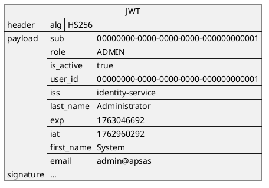

# 📝 Tài Liệu Thiết Kế Phần Mềm (SDD) - APSAS

**Automated Programming Skills Assessment System**

## 1. Giới Thiệu

### 1.1. Mục đích Tài liệu

Mô tả chi tiết kiến trúc microservices, thiết kế cơ sở dữ liệu, và các thành phần chính của hệ thống
APSAS - nền tảng đánh giá kỹ năng lập trình tự động cho sinh viên.

### 1.2. Phạm vi Hệ thống

**APSAS** cung cấp:

- Tự động đánh giá code submissions qua Piston API
- Quản lý bài tập, tài liệu học tập
- Hệ thống xác thực và phân quyền
- Thông báo real-time (email, push, WebSocket)
- Hỗ trợ trực tuyến qua chat

### 1.3. Thuật ngữ và Viết tắt

| Thuật ngữ        | Định nghĩa                                     |
| ---------------- | ---------------------------------------------- |
| **APSAS**        | Automated Programming Skills Assessment System |
| **Microservice** | Kiến trúc phân tán với các dịch vụ độc lập     |
| **API Gateway**  | Single entry point cho tất cả client requests  |
| **JWT**          | JSON Web Token - token-based authentication    |
| **RabbitMQ**     | Message broker cho event-driven communication  |
| **Piston API**   | Code execution engine hỗ trợ 50+ ngôn ngữ      |
| **Eureka**       | Service discovery và registry                  |
| **Redis**        | Distributed cache cho performance optimization |

## 2. Thiết Kế Kiến Trúc Hệ Thống

### 2.1. Kiến trúc Tổng thể

```plantuml
@startuml
!include ./diagrams/2-architecture/overall-architecture.puml
@enduml
```

### 2.2. Microservices Overview

| Service                  | Port | Trách nhiệm                             | Tech Stack                    |
| ------------------------ | ---- | --------------------------------------- | ----------------------------- |
| **API Gateway**          | 8080 | Routing, JWT validation, Load balancing | Spring Cloud Gateway, WebFlux |
| **Service Registry**     | 8761 | Service discovery                       | Netflix Eureka                |
| **Config Server**        | 8888 | Centralized configuration               | Spring Cloud Config           |
| **Identity Service**     | 8081 | Authentication, User management         | Spring Boot, JWT, Redis       |
| **Content Service**      | 8082 | Assignments, Tutorials, Skills          | Spring Boot, Redis            |
| **Submission Service**   | 8084 | Code submissions, Results               | Spring Boot, Redis            |
| **Evaluation Service**   | 8085 | Code execution via Piston               | Spring Boot, WebClient        |
| **Notification Service** | 8086 | Email, Push, In-app notifications       | Spring Boot, Firebase FCM     |
| **Support Service**      | 8087 | WebSocket chat support                  | Spring Boot, STOMP            |
| **Admin Portal**         | 9090 | Admin management UI                     | Spring MVC, Thymeleaf         |

### 2.3. Technology Stack

#### Core Framework

- **Java 21** với Virtual Threads
- **Spring Boot 3.5.6** - Microservices framework
- **Spring Cloud 2025.0.0** - Cloud-native patterns

#### Data Layer

- **PostgreSQL 17** - Primary database với schema-per-service (mô phỏng database-per-service)
- **Redis** - Distributed cache (TTL: 10m-1h)
- **Spring Data JPA** - ORM layer

#### Communication

- **RabbitMQ 4.1** - Event-driven messaging với Topic Exchange
- **Spring Cloud OpenFeign** - Synchronous inter-service calls
- **WebSocket (STOMP)** - Real-time chat

#### Infrastructure

- **Netflix Eureka** - Service discovery
- **Spring Cloud Gateway** - API Gateway với WebFlux
- **Spring Cloud Config** - Configuration management
- **Docker** - Containerization

#### External Services

- **Piston API** - Code execution (50+ languages)
- **Firebase FCM** - Push notifications
- **Mailpit** (dev) / SMTP - Email delivery

#### Build & Deploy

- **Gradle** - Build automation
- **Docker Compose** - Local development & production staging

## 3. Thiết Kế Dữ Liệu

### 3.1. Kiến trúc CSDL

**Chiến lược**: Sử dụng schema-per-service trong một database PostgreSQL duy nhất để đơn giản hóa
quản lý và triển khai.
Mô hình này mô phỏng database-per-service trong khi vẫn giữ được sự tách biệt logic giữa các dịch
vụ.

```
apsas (database)
├── identity (schema)      → Identity Service
├── content (schema)       → Content Service
├── submission (schema)    → Submission Service
├── notification (schema)  → Notification Service
└── support (schema)       → Support Service
```

### 3.2 ERD

```plantuml
@startuml
!include diagrams/3-data-design/identity-erd.puml
@enduml
```

```plantuml
@startuml
!include diagrams/3-data-design/content-erd.puml
@enduml
```

```plantuml
@startuml
!include diagrams/3-data-design/submission-erd.puml
@enduml
```

```plantuml
@startuml
!include diagrams/3-data-design/notification-erd.puml
@enduml
```

```plantuml
@startuml
!include diagrams/3-data-design/notification-erd.puml
@enduml
```

### 3.4. Chiến lược Caching với Redis

| Cache Name    | TTL | Service    | Purpose                              |
| ------------- | --- | ---------- | ------------------------------------ |
| `users`       | 30m | Identity   | Hồ sơ người dùng                     |
| `usersByRole` | 15m | Identity   | Truy vấn theo vai trò                |
| `assignments` | 20m | Content    | Chi tiết bài tập                     |
| `skills`      | 1h  | Content    | Dữ liệu tham khảo kỹ năng            |
| `tutorials`   | 1h  | Content    | Nội dung hướng dẫn                   |
| `submissions` | 10m | Submission | Kết quả nộp bài                      |
| `runtimes`    | 1h  | Evaluation | Danh sách ngôn ngữ hỗ trợ của Piston |

**Key Pattern**: `apsas:<service>:<cache_name>::<id>`  
**Ví dụ**: `apsas:submission:submissions::a1b2c3d4-e5f6-7890-abcd-ef1234567890`

## 4. Thiết Kế Các Thành Phần Chính

### 4.1. Identity Service

```plantuml
@startuml
!include ./diagrams/4-component-design/1-identity-service/identity-class-diagram.puml
@enduml
```

```plantuml
@startuml
!include ./diagrams/4-component-design/1-identity-service/registration-flow.puml
@enduml
```

### 4.2. Content Service

```plantuml
@startuml
!include ./diagrams/4-component-design/2-content-service/content-class-diagram.puml
@enduml
```

```plantuml
@startuml
!include ./diagrams/4-component-design/2-content-service/assignment-management-flow.puml
@enduml
```

### 4.3. Submission & Evaluation Services

```plantuml
@startuml
!include ./diagrams/4-component-design/3-submission-and-evaluation-services/submission-class-diagram.puml
@enduml
```

```plantuml
@startuml
!include ./diagrams/4-component-design/3-submission-and-evaluation-services/evaluation-class-diagram.puml
@enduml
```

```plantuml
@startuml
!include ./diagrams/4-component-design/3-submission-and-evaluation-services/evaluation-flow.puml
@enduml
```

### 4.4. Support Service

```plantuml
@startuml
!include ./diagrams/4-component-design/4-support-service/support-flow.puml
@enduml
```

### 4.5. API Gateway

```plantuml
@startuml
!include ./diagrams/4-component-design/5-api-gateway/api-routes.puml
@enduml
```

### 4.6. Event-Driven Architecture

```plantuml
@startuml
!include ./diagrams/4-component-design/6-event-driven-architecture/diagram.puml
@enduml
```

## 5. Thiết kế API

### 5.1. Thiết kế REST API

#### 5.1.1. URI

- `/api/**` - Dành cho các API công khai, có thể có thay đổi về cấu trúc.
- `/api/v1/**` - Dành cho các API phiên bản 1, ổn định, không thay đổi cấu trúc.
- `/internal/**` - Dành cho giao tiếp nội bộ giữa các dịch vụ, không dành cho client bên ngoài.

#### 5.1.2. HTTP requests/responses

- Sử dụng các phương thức HTTP chuẩn:
  - `GET` - Lấy tài nguyên
  - `POST` - Tạo mới tài nguyên
  - `PATCH` - Cập nhật một phần tài nguyên
  - `DELETE` - Xóa tài nguyên
- Thông số truy vấn (query parameters) cho phân trang:
  - `page` - Số trang (bắt đầu từ 0)
  - `size` - Kích thước trang
- Dữ liệu được truyền dưới dạng JSON (`application/json`).
  - Mẫu trả về thành công:
    ```json
    {
      "id": "uuid",
      "field1": "value",
      "createdAt": "2025-01-15T10:30:00Z"
    }
    ```
  - Mẫu trả về (với phân trang):
    ```json
    {
      "content": [
        {
          "id": "uuid1",
          "field1": "value1",
          "createdAt": "2025-01-15T10:30:00Z"
        },
        {
          "id": "uuid2",
          "field1": "value2",
          "createdAt": "2025-01-16T11:00:00Z"
        }
      ],
      "pageNumber": 0,
      "pageSize": 2,
      "totalElements": 10,
      "totalPages": 5,
      "first": true,
      "last": false,
      "hasNext": true,
      "hasPrevious": false
    }
    ```
- Sử dụng chuẩn RFC 9457 Problem Details cho lỗi API (`application/problem+json`):
  ```json
  {
    "type": "about:blank",
    "title": "Bad Request",
    "status": 400,
    "detail": "Email already registered",
    "instance": "/api/v1/auth/register",
    "timestamp": "2026-01-15T10:30:00Z"
  }
  ```
- Mã trạng thái HTTP trả về:
  - `200 OK` - Thành công cho GET, PATCH, POST
  - `201 Created` - Thành công cho POST (tạo mới)
  - `204 No Content` - Thành công cho POST, DELETE (không có nội dung trả về)
  - `400 Bad Request` - Lỗi xác thực dữ liệu
  - `401 Unauthorized` - Thiếu/không hợp lệ JWT
  - `403 Forbidden` - Không đủ quyền truy cập
  - `404 Not Found` - Tài nguyên không tồn tại
  - `409 Conflict` - Xung đột tài nguyên (ví dụ: trùng lặp)
  - `500 Internal Server Error` - Lỗi không mong đợi
  - `503 Service Unavailable` - Dịch vụ không khả dụng (ví dụ: Piston API)

### 5.2. WebSocket API (Support Chat)

- Endpoint: `/ws/support`
- Giao thức: STOMP over WebSocket
- Authentication: JWT trong header `Authorization: Bearer <token>` khi kết nối WebSocket.
- Tất cả các phản hồi đều được bao trong `WebSocketMessage<T>`:
  ```json lines
  {
    "type": "NEW_MESSAGE",
    "data": {
      // Phản hồi cụ thể
    }
  }
  ```
- Loại tin nhắn:
  - `NEW_SESSION`: Khi một phiên hỗ trợ mới được tạo
  - `NEW_MESSAGE`: Khi một tin nhắn mới được gửi
  - `SESSION_JOINED`: Khi người dùng đăng ký vào phiên
  - `SESSION_CLOSED`: Khi phiên được đóng
  - `GET_SESSION`: Khi lấy thông tin phiên
- Topics:

  | Lệnh      | Topic                                               | Mô tả                           | Payload                       | Phản hồi                 |
  | --------- | --------------------------------------------------- | ------------------------------- | ----------------------------- | ------------------------ |
  | SUBSCRIBE | `/topic/support`                                    | Nhận tất cả thông báo hỗ trợ    | Không có                      | `SupportSessionResponse` |
  | SUBSCRIBE | `/topic/support/sessions/{sessionId}`               | Đăng ký vào phiên hỗ trợ        | Không có                      | `SupportSessionResponse` |
  | SEND      | `/topic/support/sessions/create`                    | Tạo phiên hỗ trợ mới            | `CreateSupportSessionRequest` | `SupportSessionResponse` |
  | SEND      | `/topic/support/sessions/{sessionId}/messages/send` | Gửi tin nhắn trong phiên hỗ trợ | `SendMessageRequest`          | `SupportMessageResponse` |
  | SEND      | `/topic/support/sessions/{sessionId}`               | Lấy thông tin phiên             | Không có                      | `SupportSessionResponse` |
  | SEND      | `/topic/support/sessions/{sessionId}/close`         | Đóng phiên hỗ trợ               | Không có                      | `SupportSessionResponse` |

## 6. Thiết Kế Bảo Mật

### 6.1. Authentication Flow

```plantuml
@startuml
!include ./diagrams/6-security-design/auth-flow.puml
@enduml
```

### 6.2. Cấu trúc JWT



### 6.3. Role-Based Access Control (RBAC)

| Vai trò              | Quyền hạn                                                                   |
| -------------------- | --------------------------------------------------------------------------- |
| **STUDENT**          | Nộp bài, xem bài đã nộp của mình, xem bài tập đã công bố, yêu cầu hỗ trợ    |
| **INSTRUCTOR**       | Lên lịch bài tập, xem tất cả bài nộp, đánh giá bài nộp, quản lý hỗ trợ chat |
| **CONTENT_PROVIDER** | Tạo/quản lý bài tập, hướng dẫn, kỹ năng                                     |
| **ADMIN**            | Quản lý người dùng, vai trò, giám sát hệ thống                              |

## 7. Triển khai Hệ thống

```plantuml
@startuml
!include ./diagrams/7-deployment/deployment.puml
@enduml
```

```plantuml
@startuml
!include ./diagrams/7-deployment/startup-order.puml
@enduml
```
