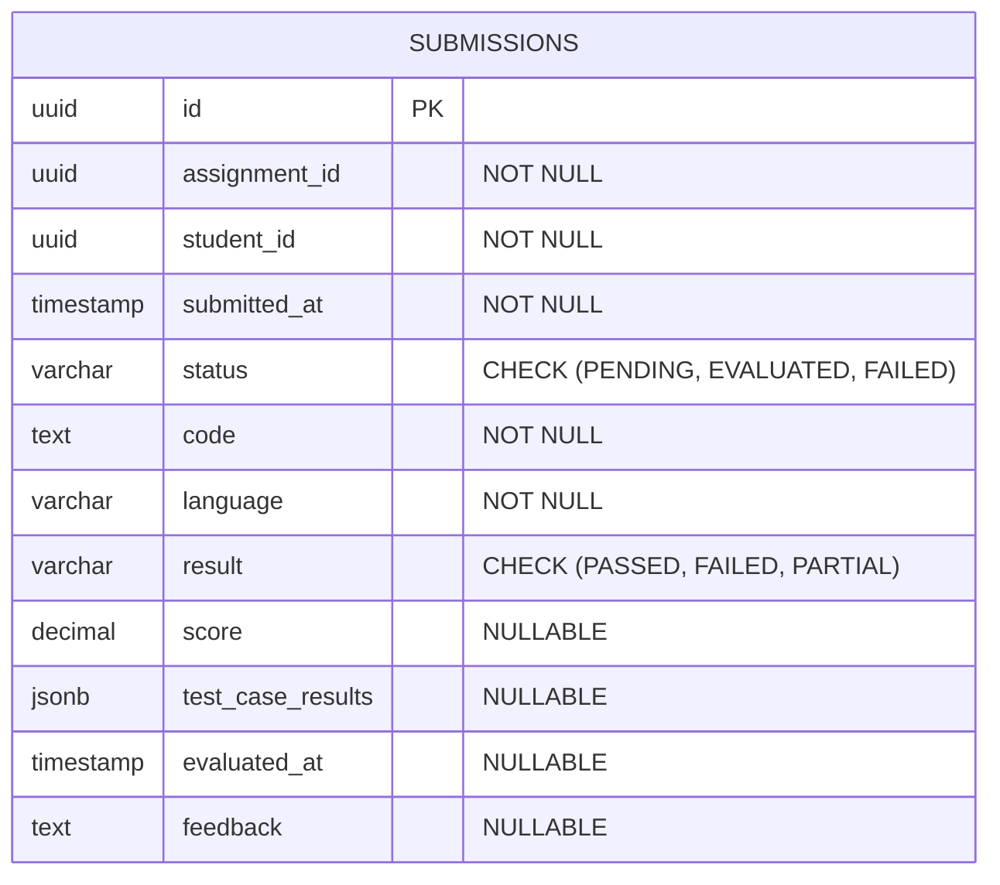
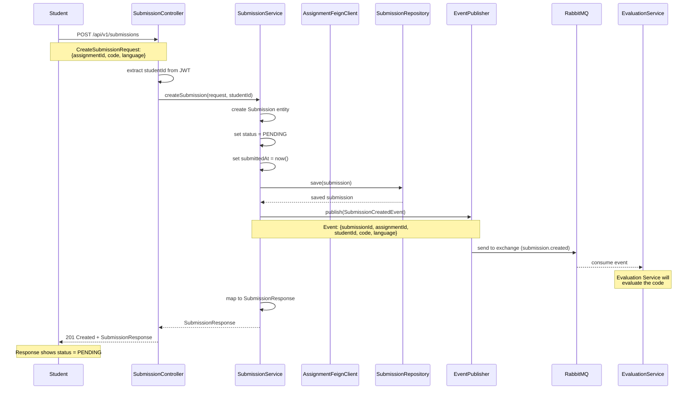
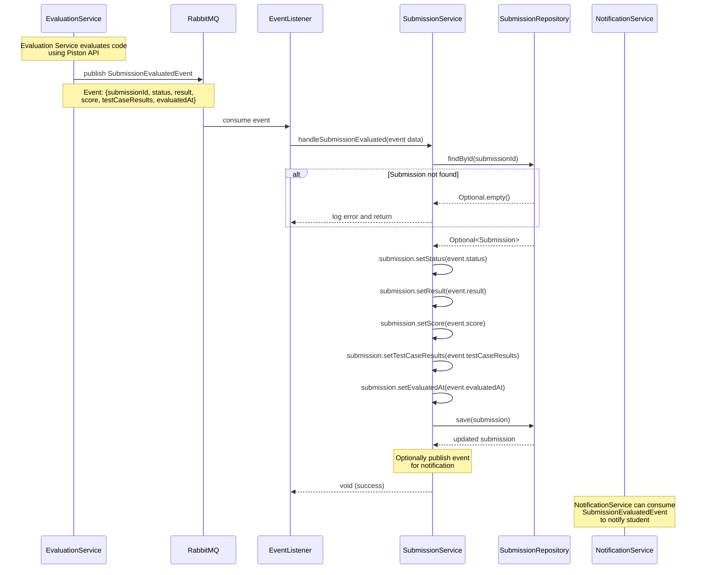
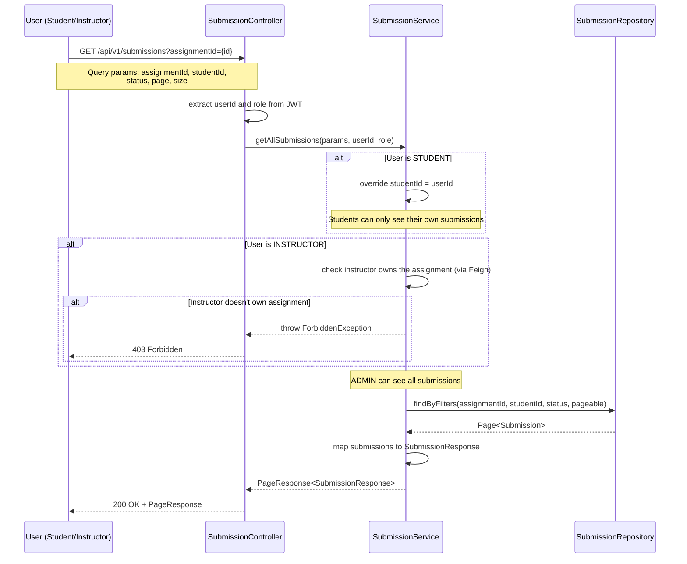
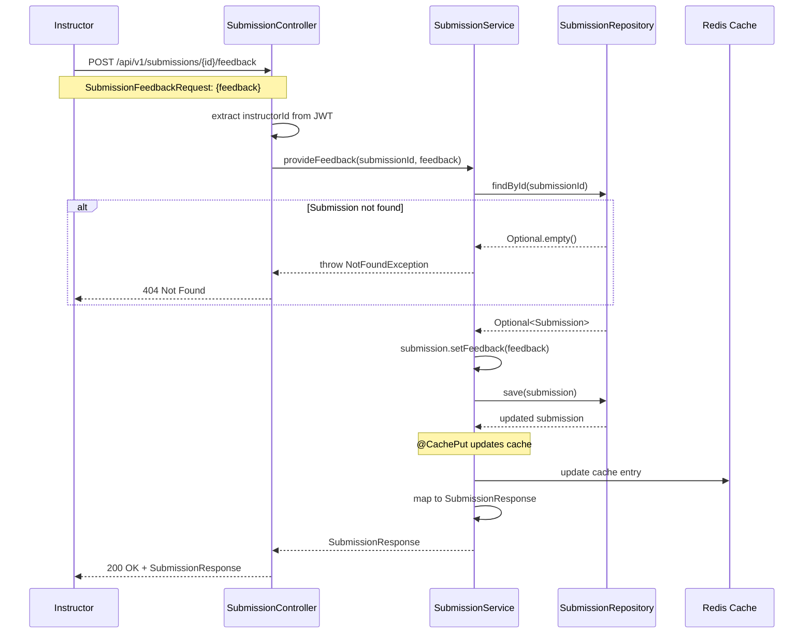
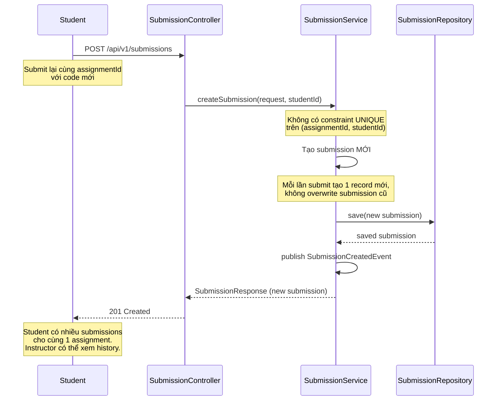

# Tài liệu Submission Service

## 1. Tổng quan

### 1.1. Mô tả
Submission Service là microservice quản lý việc nộp bài (submissions) của sinh viên trong hệ thống APSAS. Service này nhận code submissions từ sinh viên, lưu trữ thông tin, phát sự kiện để kích hoạt quá trình đánh giá tự động, và cập nhật kết quả đánh giá sau khi nhận được từ Evaluation Service.

### 1.2. Vai trò trong hệ thống
- **Quản lý submissions**: Lưu trữ và quản lý tất cả code submissions của sinh viên
- **Event Producer**: Phát sự kiện SubmissionCreatedEvent khi có submission mới
- **Event Consumer**: Lắng nghe SubmissionEvaluatedEvent từ Evaluation Service để cập nhật kết quả
- **API nội bộ**: Cung cấp thông tin submission cho các service khác
- **Feedback management**: Cho phép instructor cung cấp feedback bổ sung cho submissions

### 1.3. Công nghệ sử dụng
- **Framework**: Spring Boot 3.5.6
- **Database**: PostgreSQL 17 (schema: `submission`)
- **Messaging**: RabbitMQ (event-driven communication)
- **Service Discovery**: Netflix Eureka Client
- **Security**: JWT-based authentication
- **Cache**: Redis (distributed caching for submissions)
- **Port**: 8084

## 2. Kiến trúc

### 2.1. Kiến trúc tổng thể
```
┌─────────────────────────────────────────────────────────────┐
│                   Submission Service                         │
│                                                              │
│  ┌──────────────┐    ┌──────────────┐    ┌──────────────┐  │
│  │              │    │              │    │              │  │
│  │ Controllers  │───▶│   Services   │───▶│ Repositories │  │
│  │              │    │              │    │              │  │
│  └──────────────┘    └──────────────┘    └──────────────┘  │
│         │                    │                    │         │
│         │                    │                    ▼         │
│         │                    │            ┌──────────────┐  │
│         │                    │            │              │  │
│         │                    │            │  PostgreSQL  │  │
│         │                    │            │   Database   │  │
│         │                    │            └──────────────┘  │
│         │                    │                    │         │
│         │                    │                    ▼         │
│         │                    │            ┌──────────────┐  │
│         │                    │            │              │  │
│         │                    │            │    Redis     │  │
│         │                    │            │    Cache     │  │
│         │                    │            └──────────────┘  │
│         │                    ▼                              │
│         │            ┌──────────────┐                       │
│         │            │              │                       │
│         │            │   Mappers    │                       │
│         │            │              │                       │
│         │            └──────────────┘                       │
│         │                    │                              │
│         ▼                    ▼                              │
│  ┌──────────────┐    ┌──────────────┐                      │
│  │              │    │              │                      │
│  │   Security   │    │  RabbitMQ    │                      │
│  │   (JWT)      │    │ Pub/Sub      │                      │
│  │              │    │              │                      │
│  └──────────────┘    └──────────────┘                      │
│                              │                              │
│                      ┌───────┴───────┐                      │
│              ┌───────▼───┐   ┌───────▼────┐                │
│              │           │   │            │                │
│              │ Publisher │   │  Listener  │                │
│              │           │   │            │                │
│              └───────────┘   └────────────┘                │
└─────────────────────────────────────────────────────────────┘
```

### 2.2. Các thành phần chính

#### Controllers
- **SubmissionController**: CRUD operations cho submissions (STUDENT, INSTRUCTOR)
- **InternalSubmissionController**: API nội bộ cho các service khác (Feign)

#### Services
- **SubmissionService**: Logic nghiệp vụ cho submissions
  - Tạo submission và phát event
  - Xử lý kết quả đánh giá từ Evaluation Service
  - Quản lý feedback từ instructor

#### Repositories
- **SubmissionRepository**: JPA repository với custom queries

#### Event Components
- **EventPublisher**: Phát SubmissionCreatedEvent khi có submission mới
- **EventListener**: Lắng nghe SubmissionEvaluatedEvent từ Evaluation Service

#### Cache
- **Redis**: Cache submissions với TTL 10 phút để giảm tải database

## 3. Thiết kế cơ sở dữ liệu

### 3.1. Entity Relationship Diagram (ERD)



### 3.2. Mô tả bảng `submissions`

Lưu trữ tất cả code submissions của sinh viên.

| Cột | Kiểu dữ liệu | Ràng buộc | Mô tả |
|-----|-------------|----------|-------|
| id | UUID | PRIMARY KEY | Định danh submission |
| assignment_id | UUID | NOT NULL | ID của assignment (từ Content Service) |
| student_id | UUID | NOT NULL | ID của sinh viên (từ Identity Service) |
| submitted_at | TIMESTAMP | NOT NULL, DEFAULT now() | Thời điểm nộp bài |
| status | VARCHAR(50) | NOT NULL, CHECK | PENDING, EVALUATED, FAILED |
| code | TEXT | NOT NULL | Source code của sinh viên |
| language | VARCHAR(100) | NOT NULL | Ngôn ngữ lập trình (java, python, cpp, etc.) |
| result | VARCHAR(50) | NULLABLE, CHECK | PASSED, FAILED, PARTIAL (sau khi đánh giá) |
| score | DECIMAL(5,2) | NULLABLE | Điểm số (0.00 - 100.00) |
| test_case_results | JSONB | NULLABLE | Kết quả chi tiết từng test case |
| evaluated_at | TIMESTAMP | NULLABLE | Thời điểm hoàn thành đánh giá |
| feedback | TEXT | NULLABLE | Feedback bổ sung từ instructor |

**JSONB Structure - test_case_results**:
```json
[
  {
    "name": "Test Case 1",
    "input": "5",
    "expectedOutput": "120",
    "actualOutput": "120",
    "passed": true,
    "executionTime": 45,
    "memoryUsed": 2048
  },
  {
    "name": "Test Case 2",
    "input": "10",
    "expectedOutput": "3628800",
    "actualOutput": "3628800",
    "passed": true,
    "executionTime": 52,
    "memoryUsed": 2560
  }
]
```

**Indexes**:
- `idx_submissions_assignment_id` trên `assignment_id`
- `idx_submissions_student_id` trên `student_id`
- `idx_submissions_status` trên `status`
- `idx_submissions_submitted_at` trên `submitted_at`
- `idx_submissions_assignment_student` trên `(assignment_id, student_id)` - composite index

### 3.3. Redis Caching Strategy

**Cache Name**: `submissions` (prefix: `apsas:submission:`)

**TTL**: 10 phút (cấu hình trong `CacheConfig.java`)

**Cache Operations**:

1. **@Cacheable** - Read Operations:
```java
@Cacheable(value = CacheConfig.SUBMISSIONS_CACHE, key = "#id", unless = "#result == null")
public SubmissionResponse getSubmissionById(UUID id, UUID studentId, boolean isInstructor)
```
- Key pattern: `apsas:submission:submissions::<uuid>`
- Cache hit: Trả về từ Redis (~5ms)
- Cache miss: Query PostgreSQL, cache kết quả (~50ms)

2. **@CacheEvict** - Invalidation on Evaluation:
```java
@CacheEvict(value = CacheConfig.SUBMISSIONS_CACHE, key = "#submissionId")
public void handleSubmissionEvaluated(...)
```
- Xóa cache khi submission được đánh giá (kết quả thay đổi)
- Ensure next read gets latest evaluated data

3. **@CachePut** - Write-Through on Feedback:
```java
@CachePut(value = CacheConfig.SUBMISSIONS_CACHE, key = "#submissionId")
public SubmissionResponse provideFeedback(UUID submissionId, String feedback)
```
- Cập nhật cache sau khi instructor thêm feedback
- Avoid cache invalidation, keep data fresh

**Performance Impact**:
- Cache hit rate: ~70-80% cho read operations
- Latency reduction: 90% (50ms → 5ms)
- Database load reduction: ~75%

**Cache Key Example**:
```
apsas:submission:submissions::a1b2c3d4-e5f6-7890-abcd-ef1234567890
```

## 4. Thiết kế Class

### 4.1. Class Diagram

```mermaid
classDiagram
    %% Entities
    class Submission {
        -UUID id
        -UUID assignmentId
        -UUID studentId
        -LocalDateTime submittedAt
        -SubmissionStatus status
        -String code
        -String language
        -SubmissionResult result
        -BigDecimal score
        -List~TestCaseResult~ testCaseResults
        -LocalDateTime evaluatedAt
        -String feedback
        +onCreate() void
    }

    class SubmissionStatus {
        <<enumeration>>
        PENDING
        EVALUATED
        FAILED
    }

    class SubmissionResult {
        <<enumeration>>
        PASSED
        FAILED
        PARTIAL
    }

    class TestCaseResult {
        -String name
        -String input
        -String expectedOutput
        -String actualOutput
        -Boolean passed
        -Integer executionTime
        -Long memoryUsed
    }

    %% Controllers
    class SubmissionController {
        -SubmissionService submissionService
        +getAllSubmissions(params) ResponseEntity~PageResponse~
        +getSubmissionById(UUID) ResponseEntity~SubmissionResponse~
        +createSubmission(CreateSubmissionRequest) ResponseEntity~SubmissionResponse~
        +provideFeedback(UUID, SubmissionFeedbackRequest) ResponseEntity~SubmissionResponse~
    }

    class InternalSubmissionController {
        -SubmissionService submissionService
        +getSubmissionById(UUID) ResponseEntity~FeignSubmissionDto~
    }

    %% Services
    class SubmissionService {
        -SubmissionRepository submissionRepository
        -SubmissionMapper submissionMapper
        -SubmissionEventMapper submissionEventMapper
        -EventPublisher eventPublisher
        +getAllSubmissions(params) Page~SubmissionResponse~
        +getSubmissionById(UUID, UUID, boolean) SubmissionResponse
        +createSubmission(CreateSubmissionRequest, UUID) SubmissionResponse
        +handleSubmissionEvaluated(params) void
        +provideFeedback(UUID, String) SubmissionResponse
    }

    %% Repositories
    class SubmissionRepository {
        <<interface>>
        +findByAssignmentId(UUID, Pageable) Page~Submission~
        +findByStudentId(UUID, Pageable) Page~Submission~
        +findByAssignmentIdAndStudentId(UUID, UUID, Pageable) Page~Submission~
        +findByStatus(SubmissionStatus, Pageable) Page~Submission~
    }

    %% Event Components
    class EventPublisher {
        -RabbitTemplate rabbitTemplate
        +publish(BaseEvent) void
    }

    class EventListener {
        -SubmissionService submissionService
        +handleSubmissionEvaluated(SubmissionEvaluatedEvent) void
    }

    %% Mappers
    class SubmissionMapper {
        <<interface>>
        +toResponse(Submission) SubmissionResponse
        +toFeignDto(Submission) FeignSubmissionDto
        +toEntity(CreateSubmissionRequest) Submission
    }

    class SubmissionEventMapper {
        <<interface>>
        +toEvent(Submission) SubmissionCreatedEvent
    }

    %% DTOs
    class CreateSubmissionRequest {
        +UUID assignmentId
        +String code
        +String language
    }

    class SubmissionResponse {
        +UUID id
        +UUID assignmentId
        +UUID studentId
        +LocalDateTime submittedAt
        +SubmissionStatus status
        +String code
        +String language
        +SubmissionResult result
        +BigDecimal score
        +List~TestCaseResult~ testCaseResults
        +LocalDateTime evaluatedAt
        +String feedback
    }

    class SubmissionFeedbackRequest {
        +String feedback
    }

    %% Events
    class SubmissionCreatedEvent {
        +UUID submissionId
        +UUID assignmentId
        +UUID studentId
        +String code
        +String language
    }

    class SubmissionEvaluatedEvent {
        +UUID submissionId
        +SubmissionStatus status
        +SubmissionResult result
        +BigDecimal score
        +List~TestCaseResultDto~ testCaseResults
        +LocalDateTime evaluatedAt
    }

    %% Relationships
    Submission "1" -- "0..*" TestCaseResult : contains
    Submission -- SubmissionStatus : has
    Submission -- SubmissionResult : has

    SubmissionController ..> SubmissionService : uses
    InternalSubmissionController ..> SubmissionService : uses

    SubmissionService ..> SubmissionRepository : uses
    SubmissionService ..> SubmissionMapper : uses
    SubmissionService ..> SubmissionEventMapper : uses
    SubmissionService ..> EventPublisher : uses

    EventListener ..> SubmissionService : uses
    EventPublisher ..> SubmissionCreatedEvent : publishes

    SubmissionController ..> CreateSubmissionRequest : receives
    SubmissionController ..> SubmissionResponse : returns
    EventListener ..> SubmissionEvaluatedEvent : consumes
```



### 4.2. Mô tả các class chính

#### Entity Classes

**Submission**
- Entity chính đại diện cho một lần nộp bài
- Lưu trữ source code và kết quả đánh giá
- Lifecycle: PENDING → EVALUATED hoặc FAILED
- TestCaseResults được lưu dưới dạng JSONB (embedded list)

**SubmissionStatus (Enum)**
- `PENDING`: Submission mới tạo, chờ đánh giá
- `EVALUATED`: Đã được đánh giá thành công
- `FAILED`: Quá trình đánh giá thất bại (compile error, runtime error, timeout)

**SubmissionResult (Enum)**
- `PASSED`: Pass tất cả test cases
- `FAILED`: Fail ít nhất 1 test case
- `PARTIAL`: Pass một số test cases (có thể dùng để tính điểm phần)

**TestCaseResult (Embedded)**
- Không phải entity độc lập, lưu trong JSONB
- Chứa kết quả chi tiết của từng test case
- Fields quan trọng:
  - `passed`: Boolean - test case có pass không
  - `actualOutput`: Output thực tế từ code của sinh viên
  - `executionTime`: Thời gian thực thi (milliseconds)
  - `memoryUsed`: Memory sử dụng (bytes)

#### Service Classes

**SubmissionService**
- Phương thức chính:
  - `createSubmission()`: Tạo submission mới, phát event
  - `getSubmissionById()`: Lấy thông tin submission (với authorization check)
  - `getAllSubmissions()`: Lấy danh sách submissions với filters
  - `handleSubmissionEvaluated()`: Xử lý event từ Evaluation Service, cập nhật kết quả
  - `provideFeedback()`: Instructor cung cấp feedback bổ sung

#### Controller Classes

**SubmissionController**
- REST endpoints cho submissions
- Authorization:
  - STUDENT: Chỉ xem được submissions của mình
  - INSTRUCTOR: Xem được tất cả submissions của assignment mà mình tạo
  - ADMIN: Xem được tất cả
- Ánh xạ `/api/v1/submissions/*`

**InternalSubmissionController**
- API nội bộ cho các service khác
- Ánh xạ `/internal/submissions/*`

#### Event Components

**EventPublisher**
- Component dùng chung để phát events lên RabbitMQ
- Sử dụng RabbitTemplate

**EventListener**
- Lắng nghe SubmissionEvaluatedEvent từ Evaluation Service
- Gọi SubmissionService để cập nhật kết quả

## 5. Luồng hoạt động chi tiết

### 5.1. Luồng submit code (Student)



**Chi tiết các bước:**

1. **Student gửi request** với:
   - assignmentId: ID của bài tập cần nộp
   - code: Source code
   - language: Ngôn ngữ lập trình (java, python, cpp, etc.)

2. **Controller** trích xuất studentId từ JWT token

3. **Tạo Submission entity**:
   - status = PENDING
   - submittedAt = now()
   - result, score, testCaseResults = null (chờ đánh giá)

4. **Save vào database**

5. **Phát event SubmissionCreatedEvent**:
   - Routing key: `submission.created`
   - Payload: submissionId, assignmentId, studentId, code, language
   - Consumer: Evaluation Service

6. **Trả về SubmissionResponse** (201 Created)
   - Status = PENDING
   - Student có thể poll để check kết quả sau

### 5.2. Luồng đánh giá submission (Event-Driven)



**Chi tiết các bước:**

1. **Evaluation Service** hoàn thành đánh giá code và phát event SubmissionEvaluatedEvent

2. **EventListener** (trong Submission Service) consume event

3. **Service tìm submission** theo submissionId

4. **Cập nhật kết quả đánh giá**:
   - status: EVALUATED hoặc FAILED
   - result: PASSED, FAILED, hoặc PARTIAL
   - score: Điểm số tính toán (dựa trên test case weights)
   - testCaseResults: Array chứa kết quả từng test case
   - evaluatedAt: Timestamp

5. **Save vào database**

6. **NotificationService** (nếu có) sẽ thông báo kết quả cho sinh viên

### 5.3. Luồng xem submissions (với authorization)



**Chi tiết authorization logic:**

**STUDENT**:
- Chỉ xem được submissions của chính mình
- System tự động gán `studentId = userId` (không cho phép query submissions của người khác)

**INSTRUCTOR**:
- Xem được tất cả submissions của các assignments mà mình tạo
- Service phải verify instructor owns assignment (gọi Content Service)
- Nếu không phải creator → ForbiddenException

**ADMIN**:
- Xem được tất cả submissions không có ràng buộc

### 5.4. Luồng provide feedback (Instructor)



**Chi tiết các bước:**

1. **Instructor gửi feedback** cho submission

2. **Service tìm submission** theo ID

3. **Cập nhật feedback** và save vào database

4. **Cache update**: `@CachePut` tự động cập nhật cache entry (write-through)

5. **Trả về SubmissionResponse** với feedback đã cập nhật

**Lưu ý Authorization**: Authorization được xử lý tại API Gateway hoặc controller level, service không cần verify instructor ownership

### 5.5. Luồng re-submit (Student submit lại)



**Lưu ý về re-submission:**
- Mỗi lần submit tạo một submission record mới
- Không overwrite submission cũ (giữ history)
- Instructor có thể xem tất cả attempts
- Có thể cần logic để tính điểm cuối cùng (best score, latest score, average, etc.) - tùy business logic

## 6. API Endpoints

### 6.1. Submission Endpoints

| Method | Endpoint | Role Required | Description | Response |
|--------|----------|---------------|-------------|----------|
| GET | `/api/v1/submissions` | All authenticated | Lấy danh sách submissions (filtered) | 200 + PageResponse |
| GET | `/api/v1/submissions/{id}` | All authenticated | Lấy chi tiết submission | 200 + SubmissionResponse |
| POST | `/api/v1/submissions` | STUDENT | Submit code cho assignment | 201 + SubmissionResponse |
| PUT | `/api/v1/submissions/{id}/feedback` | INSTRUCTOR (creator), ADMIN | Cung cấp feedback | 200 + SubmissionResponse |

**Query Parameters cho GET /submissions:**
- `assignmentId` (UUID): Filter theo assignment
- `studentId` (UUID): Filter theo student (INSTRUCTOR, ADMIN only)
- `status` (SubmissionStatus): Filter theo status
- `page`, `size`, `sort`: Pagination parameters

### 6.2. Internal Endpoints

| Method | Endpoint | Description | Response |
|--------|----------|-------------|----------|
| GET | `/internal/submissions/{id}` | Lấy submission cho Feign | 200 + FeignSubmissionDto |

## 7. Events và Messaging

### 7.1. Published Events

#### SubmissionCreatedEvent
**Routing Key**: `submission.created`

**Payload**:
```json
{
  "submissionId": "uuid",
  "assignmentId": "uuid",
  "studentId": "uuid",
  "code": "public class Main { ... }",
  "language": "java"
}
```

**Consumers**: Evaluation Service (đánh giá code)

### 7.2. Consumed Events

#### SubmissionEvaluatedEvent
**Routing Key**: `submission.evaluated`

**Payload**:
```json
{
  "submissionId": "uuid",
  "status": "EVALUATED",
  "result": "PASSED",
  "score": 95.50,
  "testCaseResults": [
    {
      "name": "Test Case 1",
      "input": "5",
      "expectedOutput": "120",
      "actualOutput": "120",
      "passed": true,
      "executionTime": 45,
      "memoryUsed": 2048
    }
  ],
  "evaluatedAt": "2024-01-15T10:30:00Z"
}
```

**Producer**: Evaluation Service  
**Handler**: EventListener → SubmissionService.handleSubmissionEvaluated()

### 7.3. RabbitMQ Configuration

```java
// MessagingConfig.java
@Bean
public Queue submissionCreatedQueue() {
    return new Queue("submission.created.queue", true);
}

@Bean
public Binding submissionCreatedBinding(Queue submissionCreatedQueue, TopicExchange exchange) {
    return BindingBuilder.bind(submissionCreatedQueue)
            .to(exchange)
            .with("submission.created");
}

@Bean
public Queue submissionEvaluatedQueue() {
    return new Queue("submission.evaluated.queue", true);
}

@Bean
public Binding submissionEvaluatedBinding(Queue submissionEvaluatedQueue, TopicExchange exchange) {
    return BindingBuilder.bind(submissionEvaluatedQueue)
            .to(exchange)
            .with("submission.evaluated");
}
```

## 8. Security

### 8.1. Role-Based Authorization

**STUDENT**:
- Tạo submissions cho assignments
- Chỉ xem được submissions của chính mình
- Không thể xóa submissions

**INSTRUCTOR**:
- Xem được submissions của assignments mà mình tạo
- Cung cấp feedback cho submissions
- Không thể submit (role conflict)

**ADMIN**:
- Xem được tất cả submissions
- Cung cấp feedback
- Full permissions

### 8.2. Resource-Level Authorization

**Get submission by ID**:
- STUDENT: Chỉ lấy được submission của mình
- INSTRUCTOR: Chỉ lấy được submissions của assignments mình tạo
- ADMIN: Không ràng buộc

**List submissions**:
- STUDENT: Tự động filter `studentId = userId`
- INSTRUCTOR: Verify ownership của assignment
- ADMIN: Không filter

## 9. Error Handling

### 9.1. Common Errors

| Error | HTTP Status | Scenario |
|-------|-------------|----------|
| BadRequestException | 400 | Invalid request data, validation errors |
| UnauthorizedException | 401 | JWT token invalid/expired |
| ForbiddenException | 403 | Student trying to see others' submissions |
| NotFoundException | 404 | Submission not found |

### 9.2. Validation Errors

**CreateSubmissionRequest validations**:
- `assignmentId`: Not null, valid UUID format
- `code`: Not blank
- `language`: Not blank

## 10. Cấu hình

### 10.1. Application Properties

**Bootstrap** (`resources/application.yaml`):
```yaml
spring:
  application:
    name: submission-service
  config:
    import: "configserver:"
  cloud:
    config:
      uri: http://localhost:8888
```

**Remote Config** (`config/submission-service.yaml`):
```yaml
server:
  port: 8084

spring:
  config:
    import:
      - file:./config/fragments/database.yaml
      - file:./config/fragments/springdoc.yaml
      - file:./config/fragments/rabbitmq.yaml
      - file:./config/fragments/eureka-client.yaml
      - file:./config/fragments/redis.yaml

database:
  schema: submission
  jpa:
    hibernate:
      ddl-auto: none
```

## 11. Testing

### 11.1. Test Strategy

**Unit Tests**:
- SubmissionService methods với mocked repositories và Feign clients
- Authorization logic

**Integration Tests**:
- Repository queries với testcontainers PostgreSQL
- Event publishing và consuming

**Controller Tests**:
- MockMvc với mocked services
- Test authorization scenarios

### 11.2. Important Test Cases

**SubmissionService Tests**:
- Create submission với valid assignment → success
- Create submission với invalid assignment → exception
- Create submission với unsupported language → exception
- Handle submission evaluated event → update database
- Get submission với STUDENT role → only own submissions
- Get submission với INSTRUCTOR role → only owned assignments
- Provide feedback với correct instructor → success
- Provide feedback với wrong instructor → exception

## 12. Deployment

### 12.1. Dependencies

Trước khi start Submission Service:
1. **Service Registry** (Eureka) - port 8761
2. **Config Server** - port 8888
3. **PostgreSQL** với schema `submission`
4. **RabbitMQ** - port 5672
5. **Redis** - port 6379 (for caching)

### 12.2. Build và Run

```bash
# Build
./gradlew :sources:services:submission:build

# Run
./gradlew :sources:services:submission:bootRun
```

## 13. Best Practices và Lưu ý

### 13.1. Data Management

1. **Submission history**: Giữ tất cả submissions (không xóa) để tracking progress
2. **Score calculation**: Implement logic để tính điểm cuối cùng từ multiple submissions
3. **Large code files**: Cân nhắc giới hạn kích thước code (ví dụ: max 10KB)

### 13.2. Performance Optimization

1. **Pagination**: Always sử dụng pagination cho list endpoints
2. **Indexes**: Đã có composite index trên (assignment_id, student_id)
3. **Async processing**: Submission evaluation là async (event-driven)
4. **Redis caching**:
   - Cache individual submissions (10 min TTL)
   - Invalidate on evaluation results update
   - Write-through on feedback updates
   - Monitor cache hit rate (target: >70%)

### 13.3. Error Recovery

1. **Event replay**: Nếu EventListener fails, message sẽ được retry (RabbitMQ retry mechanism)
2. **Dead letter queue**: Configure DLQ cho messages fail nhiều lần
3. **Idempotency**: handleSubmissionEvaluated() phải idempotent (có thể nhận duplicate events)

### 13.4. Business Rules

1. **Multiple submissions**: Cho phép student submit nhiều lần cho cùng assignment
2. **No assignment validation**: Service không validate assignmentId với Content Service (trust Gateway/Frontend validation)
3. **Late submission**: Cân nhắc check due_date và apply penalty (future enhancement)
4. **Plagiarism detection**: Có thể integrate plagiarism checker (future enhancement)

---

**Phiên bản tài liệu**: 1.0  
**Ngày cập nhật**: 2024-01-15  
**Người viết**: APSAS Development Team
