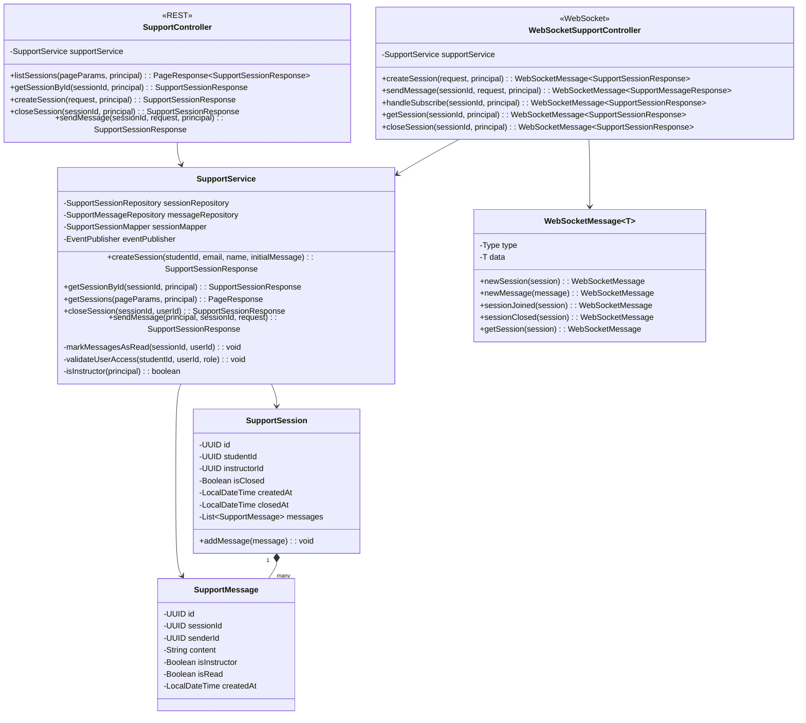
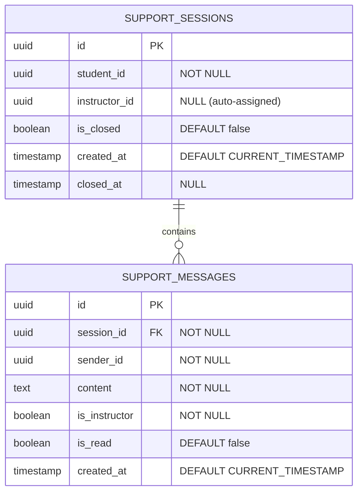
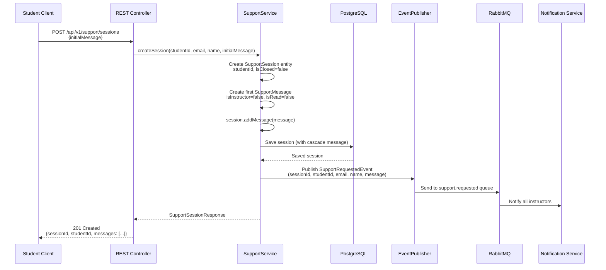
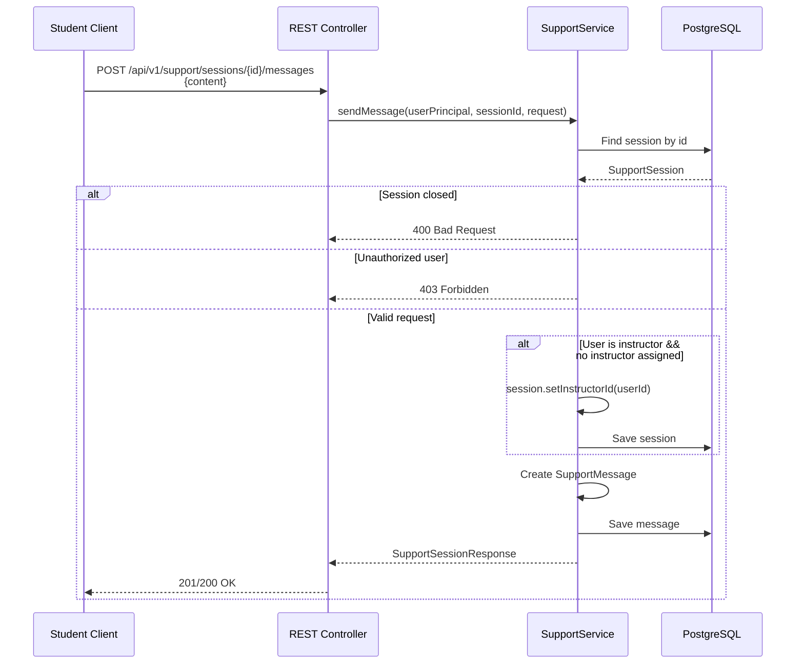
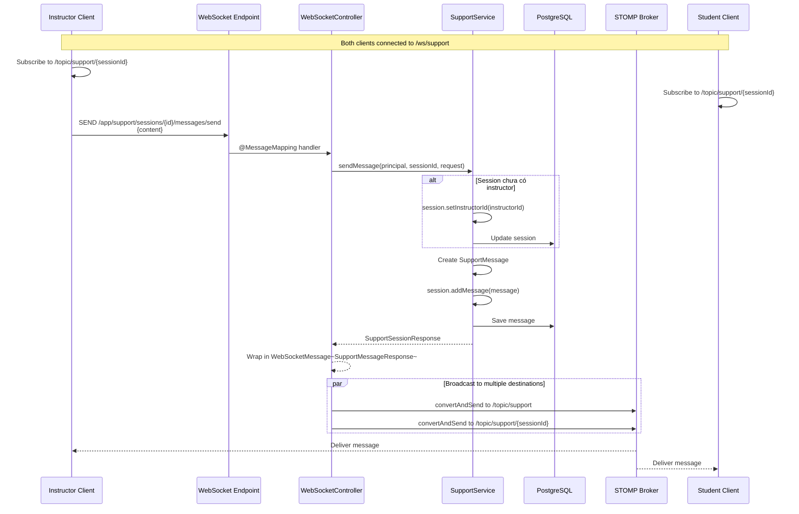

# Support Service - Tài Liệu Chi Tiết

## 1. Tổng Quan

### 1.1. Mô Tả
Support Service cung cấp hệ thống **real-time chat** giữa students và instructors qua **WebSocket (STOMP protocol)**. Service quản lý support sessions, messages, instructor assignment tự động, và publish events đến Notification Service.

**Đặc điểm:**
- **Dual Protocol**: REST API (session management) + WebSocket (real-time chat)
- **Auto-assignment**: Instructor được assign khi gửi message đầu tiên vào session
- **Session lifecycle**: Create → Open → Instructor assigned → Closed (chỉ student close được)
- **Event publishing**: `SupportRequestedEvent` gửi đến Notification Service
- **Message Wrapper**: WebSocket messages được wrap trong `WebSocketMessage<T>` với type enum

### 1.2. Thông Tin Kỹ Thuật
- **Port**: 8086
- **Database Schema**: `support` (2 tables: `support_sessions`, `support_messages`)
- **WebSocket**: STOMP protocol, endpoint `/ws/support` (không sử dụng SockJS)
- **Message Broker**: In-memory SimpleBroker (`/topic`)
- **RabbitMQ**: Publish `support.requested` event (không consume)
- **REST API**: Phục vụ HTTP requests cho session management

### 1.3. Use Cases Chính
1. **Student tạo session**: POST `/api/v1/support/sessions` → Publish event → Instructors nhận notification
2. **REST gửi message**: POST `/api/v1/support/sessions/{id}/messages` → Gửi message qua HTTP
3. **WebSocket real-time**: `/app/support/sessions/{sessionId}/messages/send` → Broadcast `/topic/support/{sessionId}`
4. **WebSocket subscribe**: `SUBSCRIBE /topic/support/{sessionId}` → Nhận real-time updates
5. **Close session**: POST `/api/v1/support/sessions/{id}/close` → Only student can close

---

## 2. Kiến Trúc

### 2.1. Class Diagram



### 2.2. WebSocket + REST Architecture

```mermaid
graph TB
    subgraph "Client Layer"
        SC[Student Client]
        IC[Instructor Client]
    end
    
    subgraph "HTTP Layer"
        RC[REST Controller]
    end
    
    subgraph "WebSocket Layer"
        STOMP[STOMP Broker]
        EP[/ws/support<br/>STOMP Endpoint]
    end
    
    subgraph "Application Layer"
        RC --> SS[SupportService]
        WSC[WebSocketSupportController] --> SS
        APP[/app/support/*<br/>Message Mapping]
    end
    
    subgraph "Destinations"
        TOPIC[/topic/support/{sessionId}]
        GLOBAL_TOPIC[/topic/support]
    end
    
    subgraph "Database"
        DB[(PostgreSQL)]
    end
    
    subgraph "Messaging"
        RMQ[RabbitMQ]
    end
    
    SC -->|HTTP REST| RC
    IC -->|HTTP REST| RC
    SC -->|Connect STOMP| EP
    IC -->|Connect STOMP| EP
    EP --> STOMP
    
    SC -->|Send| APP
    IC -->|Send| APP
    APP --> WSC
    
    SS --> DB
    SS -->|Publish event| RMQ
    WSC -->|Convert| TOPIC
    WSC -->|Broadcast| GLOBAL_TOPIC
    TOPIC -->|Subscribe| SC
    TOPIC -->|Subscribe| IC
```

---

## 3. Database Schema

### 3.1. ERD



### 3.2. Table Details

**`support.support_sessions`**:
- `student_id`: User tạo session (role = STUDENT)
- `instructor_id`: NULL ban đầu, assigned khi instructor gửi message đầu tiên
- `is_closed`: Chỉ student có thể close session
- `closed_at`: Timestamp khi session được close

**`support.support_messages`**:
- `session_id`: FK với CASCADE DELETE
- `sender_id`: UUID của user (student hoặc instructor)
- `is_instructor`: Flag để identify message type
- `is_read`: Track read status, update khi user xem tin nhắn từ người khác

**Indexes**:
```sql
CREATE INDEX idx_support_sessions_student_id ON support_sessions(student_id);
CREATE INDEX idx_support_sessions_instructor_id ON support_sessions(instructor_id);
CREATE INDEX idx_support_sessions_is_closed ON support_sessions(is_closed);
CREATE INDEX idx_support_messages_session_id ON support_messages(session_id);
CREATE INDEX idx_support_messages_created_at ON support_messages(created_at);
```

---

## 4. Luồng Hoạt Động Chi Tiết

### 4.1. Create Support Session



**Business Rules**:
- Chỉ STUDENT role có thể tạo session
- `initialMessage` là required và trở thành message đầu tiên
- Event được publish ngay lập tức để notify instructors
- `instructorId` = NULL ban đầu
- Session được lưu trữ với cascade save cho messages

### 4.2. REST API Send Message



**Business Rules**:
- Được gọi từ REST endpoint hoặc WebSocket
- Auto-assign instructor khi gửi message đầu tiên
- Cập nhật session message list (cascade)
- Messages là read=false khi được tạo

### 4.3. WebSocket Real-time Chat



**WebSocket Message Flow**:
- Client gửi tới `/app/support/sessions/{id}/messages/send`
- Server xử lý via WebSocketSupportController
- Response wrap trong `WebSocketMessage<T>` với type enum
- Broadcast tới `/topic/support` (global) và `/topic/support/{sessionId}` (session-specific)
- Tự động mark messages as read khi fetch session

---

## 5. REST API Endpoints

### 5.1. Session Management

#### POST `/api/v1/support/sessions`
Tạo support session mới (Student only).

**Request Body**:
```json
{
  "initialMessage": "Tôi cần giúp đỡ về bài tập Assignment 1"
}
```

**Response**: 201 Created
```json
{
  "id": "uuid",
  "studentId": "uuid",
  "instructorId": null,
  "isClosed": false,
  "createdAt": "2024-01-15T10:30:00",
  "closedAt": null,
  "messages": [
    {
      "id": "uuid",
      "sessionId": "uuid",
      "senderId": "uuid",
      "content": "Tôi cần giúp đỡ về bài tập Assignment 1",
      "isInstructor": false,
      "isRead": false,
      "createdAt": "2024-01-15T10:30:00"
    }
  ]
}
```

#### GET `/api/v1/support/sessions`
List sessions với phân trang.

**Query Params**:
- `page` (default: 0)
- `size` (default: 20)
- `sort` (default: createdAt,desc)

**Authorization**:
- **STUDENT**: Chỉ xem sessions của mình
- **INSTRUCTOR**: Xem tất cả sessions

**Response**: 200 OK
```json
{
  "content": [...],
  "page": 0,
  "size": 20,
  "totalElements": 45,
  "totalPages": 3,
  "last": false
}
```

#### GET `/api/v1/support/sessions/{sessionId}`
Lấy chi tiết session.

**Authorization**:
- **STUDENT**: Chỉ xem session của mình
- **INSTRUCTOR**: Xem bất kỳ session nào

**Response**: 200 OK (same as POST response)

**Side effects**:
- Tự động mark messages as read cho user hiện tại

#### POST `/api/v1/support/sessions/{sessionId}/close`
Đóng session (Student only).

**Response**: 200 OK
```json
{
  "id": "uuid",
  "studentId": "uuid",
  "instructorId": "uuid",
  "isClosed": true,
  "createdAt": "2024-01-15T10:30:00",
  "closedAt": "2024-01-15T11:00:00",
  "messages": [...]
}
```

#### POST `/api/v1/support/sessions/{sessionId}/messages`
Gửi tin nhắn trong phiên hỗ trợ (REST API).

**Request Body**:
```json
{
  "content": "Tôi đã cố gắng nhưng vẫn không hiểu"
}
```

**Response**: 201 Created
```json
{
  "id": "uuid",
  "studentId": "uuid",
  "instructorId": "uuid",
  "isClosed": false,
  "createdAt": "2024-01-15T10:30:00",
  "closedAt": null,
  "messages": [...]
}
```

**Side effects**:
- Nếu là instructor và session chưa có instructorId → auto-assign
- Tự động mark messages as read cho user hiện tại

---

## 6. WebSocket Protocol (STOMP)

### 6.1. Connection Setup

**Client-side (JavaScript)**:
```javascript
import SockJS from 'sockjs-client';
import Stomp from 'stompjs';

// Không dùng SockJS trong codebase hiện tại, kết nối trực tiếp qua STOMP
const socket = new WebSocket('ws://localhost:8086/ws/support');
const stompClient = Stomp.over(socket);

stompClient.connect(
  {
    'Authorization': 'Bearer ' + jwtToken
  },
  (frame) => {
    console.log('Connected:', frame);
    
    // Subscribe to session updates
    stompClient.subscribe(`/topic/support/${sessionId}`, (message) => {
      const wsMessage = JSON.parse(message.body);
      console.log('Message type:', wsMessage.type);
      console.log('Data:', wsMessage.data);
    });
    
    // Subscribe to global support channel
    stompClient.subscribe('/topic/support', (message) => {
      const wsMessage = JSON.parse(message.body);
      console.log('Global update:', wsMessage);
    });
  },
  (error) => {
    console.error('Connection error:', error);
  }
);
```

### 6.2. Create Session (WebSocket)

**Client → Server**:
```javascript
stompClient.send(
  '/app/support/sessions/create',
  {},
  JSON.stringify({
    initialMessage: 'Cần giúp đỡ về bài tập'
  })
);
```

**Server broadcasts to**: `/topic/support` and `/topic/support/{sessionId}`

**Broadcast payload** (WebSocketMessage wrapper):
```json
{
  "type": "NEW_SESSION",
  "data": {
    "id": "uuid",
    "studentId": "uuid",
    "instructorId": null,
    "isClosed": false,
    "createdAt": "2024-01-15T10:30:00",
    "closedAt": null,
    "messages": [...]
  }
}
```

### 6.3. Send Message (WebSocket)

**Client → Server**:
```javascript
stompClient.send(
  `/app/support/sessions/${sessionId}/messages/send`,
  {},
  JSON.stringify({
    content: 'Tôi không hiểu phần này'
  })
);
```

**Server broadcasts to**: `/topic/support` and `/topic/support/{sessionId}`

**Broadcast payload**:
```json
{
  "type": "NEW_MESSAGE",
  "data": {
    "id": "uuid",
    "sessionId": "uuid",
    "senderId": "uuid",
    "content": "Tôi không hiểu phần này",
    "isInstructor": false,
    "isRead": false,
    "createdAt": "2024-01-15T10:35:00"
  }
}
```

### 6.4. Subscribe to Session (WebSocket)

**Client subscribes**:
```javascript
stompClient.subscribe(`/topic/support/${sessionId}`, (message) => {
  const wsMessage = JSON.parse(message.body);
  if (wsMessage.type === 'SESSION_JOINED') {
    console.log('New user joined:', wsMessage.data);
  }
});
```

**Server sends** (subscription handler):
```json
{
  "type": "SESSION_JOINED",
  "data": {
    "id": "uuid",
    "studentId": "uuid",
    "instructorId": "uuid",
    "isClosed": false,
    "createdAt": "2024-01-15T10:30:00",
    "closedAt": null,
    "messages": [...]
  }
}
```

### 6.5. Get Session (WebSocket)

**Client → Server**:
```javascript
stompClient.send(
  `/app/support/sessions/${sessionId}`,
  {},
  {}
);
```

**Server sends to user**:
```json
{
  "type": "GET_SESSION",
  "data": { ... }
}
```

### 6.6. Close Session (WebSocket)

**Client → Server**:
```javascript
stompClient.send(
  `/app/support/sessions/${sessionId}/close`,
  {},
  {}
);
```

**Server broadcasts to**: `/topic/support/{sessionId}` and `/topic/support`

**Broadcast payload**:
```json
{
  "type": "SESSION_CLOSED",
  "data": { ... }
}
```

### 6.7. WebSocketMessage Type Enum

```java
public enum Type {
    NEW_SESSION,      // Session mới được tạo
    NEW_MESSAGE,      // Tin nhắn mới
    SESSION_JOINED,   // User subscribe/join session
    SESSION_CLOSED,   // Session đã đóng
    GET_SESSION       // Response cho GET_SESSION request
}
```

---

## 7. WebSocket Configuration

### 7.1. WebSocketConfig.java

```java
@Configuration
@EnableWebSocketMessageBroker
public class WebSocketConfig implements WebSocketMessageBrokerConfigurer {

  @Override
  public void configureMessageBroker(MessageBrokerRegistry config) {
    // In-memory broker for /topic only
    config.enableSimpleBroker("/topic");
    // Application destination prefix for incoming messages
    config.setApplicationDestinationPrefixes("/app");
  }

  @Override
  public void registerStompEndpoints(StompEndpointRegistry registry) {
    // Không sử dụng SockJS - kết nối trực tiếp STOMP
    registry.addEndpoint("/ws/support")
        .setAllowedOriginPatterns("*");  // Dev: Allow all origins
  }
}
```

**Khác biệt từ docs cũ**:
- ❌ Không dùng `.withSockJS()` 
- ✅ Chỉ sử dụng `/topic` (không dùng `/queue`)
- ✅ Direct STOMP connection

### 7.2. WebSocketSupportController.java

```java
@Controller
@RequiredArgsConstructor
public class WebSocketSupportController {
  private final SupportService supportService;

  @MessageMapping("/support/sessions/create")
  @SendTo("/topic/support")
  public WebSocketMessage<SupportSessionResponse> createSession(
      @Payload CreateSupportSessionRequest request,
      @AuthenticationPrincipal UserPrincipal userPrincipal
  ) {
    var studentName = userPrincipal.firstName() + " " + userPrincipal.lastName();
    var session = supportService.createSession(
        userPrincipal.userId(),
        userPrincipal.email(),
        studentName,
        request.initialMessage()
    );
    return WebSocketMessage.newSession(session);
  }

  @MessageMapping("/support/sessions/{sessionId}/messages/send")
  @SendTo({"/topic/support", "/topic/support/{sessionId}"})
  public WebSocketMessage<SupportMessageResponse> sendMessage(
      @DestinationVariable UUID sessionId,
      @Payload SendMessageRequest request,
      @AuthenticationPrincipal UserPrincipal userPrincipal
  ) {
    var session = supportService.sendMessage(userPrincipal, sessionId, request);
    return WebSocketMessage.newMessage(session.messages().getLast());
  }

  @SubscribeMapping("/support/sessions/{sessionId}")
  @SendTo({"/topic/support/{sessionId}", "/topic/support"})
  public WebSocketMessage<SupportSessionResponse> handleSubscribe(
      @DestinationVariable UUID sessionId,
      @AuthenticationPrincipal UserPrincipal userPrincipal
  ) {
    var session = supportService.getSessionById(sessionId, userPrincipal);
    return WebSocketMessage.sessionJoined(session);
  }

  @MessageMapping("/support/sessions/{sessionId}")
  @SendToUser("/topic/support")
  public WebSocketMessage<SupportSessionResponse> getSession(
      @DestinationVariable UUID sessionId,
      @AuthenticationPrincipal UserPrincipal userPrincipal
  ) {
    var session = supportService.getSessionById(sessionId, userPrincipal);
    return WebSocketMessage.getSession(session);
  }

  @MessageMapping("/support/sessions/{sessionId}/close")
  @SendTo({"/topic/support/{sessionId}", "/topic/support"})
  public WebSocketMessage<SupportSessionResponse> closeSession(
      @DestinationVariable UUID sessionId,
      @AuthenticationPrincipal UserPrincipal userPrincipal
  ) {
    var session = supportService.closeSession(sessionId, userPrincipal.userId());
    return WebSocketMessage.sessionClosed(session);
  }
}
```

**Key points**:
- `@SendTo` broadcasts đến multiple destinations
- `@SendToUser` gửi chỉ tới user hiện tại
- `@SubscribeMapping` xử lý subscription events
- Tất cả responses wrap trong `WebSocketMessage<T>`

---

## 8. Event Publishing

### 8.1. SupportRequestedEvent

**Published khi**: Student tạo session mới

**Event Model** (từ `shared/messaging`):
```java
public record SupportRequestedEvent(
    UUID sessionId,
    UUID studentId,
    String studentEmail,
    String studentName,
    String initialMessage
) {}
```

**Publishing Code** (trong `SupportService.createSession`):
```java
SupportRequestedEvent event = new SupportRequestedEvent(
    savedSession.getId(),
    studentId,
    studentEmail,
    studentName,
    initialMessage
);
eventPublisher.publish(RabbitMqConfig.SUPPORT_REQUESTED_ROUTING_KEY, event);
```

**Routing Key**: `support.requested`

**Consumer**: Notification Service → `SupportEventListener` → Gửi email + push cho tất cả instructors

---

## 9. Security

### 9.1. REST Endpoints Authentication

**All endpoints require**:
- JWT Bearer token in Authorization header
- User must be authenticated (STUDENT, INSTRUCTOR, or ADMIN role)

**Access Control**:
```java
// SupportService methods use @PreAuthorize annotations
@PreAuthorize("hasRole('STUDENT')")           // createSession
@PreAuthorize("hasAnyRole('STUDENT', 'INSTRUCTOR')")  // getSessionById, getSessions, sendMessage
```

**List access patterns**:
- **STUDENT**: Chỉ xem sessions của mình (WHERE studentId = userId)
- **INSTRUCTOR**: Xem tất cả sessions (no filtering)
- **ADMIN**: Tương tự INSTRUCTOR

### 9.2. WebSocket Security

**JWT verification in STOMP**:
- Client gửi JWT token trong CONNECT frame headers
- Spring Security interceptor validate token trước khi allow message processing
- Failed authentication → disconnect WebSocket

**Configuration** (trong `SecurityConfig`):
```java
@EnableWebSocketSecurity
public class SecurityConfig {
  // Automatically handles WebSocket message authentication
}
```

**Headers in WebSocket connect**:
```javascript
stompClient.connect(
  {
    'Authorization': 'Bearer ' + jwtToken
  },
  onConnected,
  onError
);
```

**Endpoints protection**:
- `@AuthenticationPrincipal` captures authenticated user
- `UserPrincipal` contains userId, email, firstName, lastName, role
- Message processing only allowed for authenticated users

---

## 10. Testing

### 10.1. Integration Tests

**SupportControllerIntegrationTest.kt**:
- `CreateSessionTests`: Test creating support sessions
- `ListSessionsTests`: Test pagination and access control
- `GetSessionByIdTests`: Test retrieving session details
- `SendMessageTests`: Test sending messages via REST
- `CloseSessionTests`: Test closing sessions
- `AccessControlTests`: Test authorization rules
- `ResponseFormatTests`: Test response format and structure

**Test Coverage**:
```kotlin
@SpringBootTest
@AutoConfigureMockMvc
class SupportControllerIntegrationTest {
    
    @Test
    @WithMockUser(roles = ["STUDENT"])
    fun createSession_Success() {
        // Test: Student successfully creates session
        // Verify: Session created with correct data
        // Verify: Event published
    }
    
    @Test
    @WithMockUser(roles = ["INSTRUCTOR"])
    fun listSessions_InstructorSeesAll() {
        // Test: Instructor sees all sessions
        // Verify: No filtering applied
    }
    
    @Test
    @WithMockUser(roles = ["STUDENT"])
    fun listSessions_StudentSeesOnlyOwn() {
        // Test: Student sees only their sessions
        // Verify: Filtering applied correctly
    }
    
    @Test
    @WithMockUser(roles = ["STUDENT"])
    fun closeSession_OnlyOwnerCanClose() {
        // Test: Student closes own session
        // Test: Another student cannot close
        // Verify: 403 Forbidden for non-owner
    }
}
```

### 10.2. WebSocket Integration Tests

**Manual testing with STOMP client**:
```kotlin
// Test fixture: StompClient helper
private fun createStompClient(jwtToken: String): WebSocketStompClient {
    val webSocketClient = StandardWebSocketClient()
    val stompClient = WebSocketStompClient(webSocketClient)
    stompClient.setMessageConverter(MappingJackson2MessageConverter())
    
    val session = stompClient.connectAsync(
        "ws://localhost:8086/ws/support",
        StompSessionHandler(listOf("Authorization" to "Bearer $jwtToken"))
    ).get(5, TimeUnit.SECONDS)
    
    return session
}

// Test: WebSocket create session
@Test
fun websocketCreateSession() {
    val session = createStompClient(studentToken)
    session.send("/app/support/sessions/create", 
        CreateSupportSessionRequest("Help needed"))
    
    // Verify broadcast to /topic/support
    val message = receivedMessages.poll(5, TimeUnit.SECONDS)
    assertThat(message.type).isEqualTo(Type.NEW_SESSION)
}

// Test: WebSocket send message
@Test
fun websocketSendMessage() {
    val session = createStompClient(instructorToken)
    session.subscribe("/topic/support/$sessionId") { message ->
        receivedMessages.add(parseMessage(message))
    }
    
    session.send("/app/support/sessions/$sessionId/messages/send",
        SendMessageRequest("Giải thích chi tiết nhé"))
    
    // Verify broadcast to both destinations
    val msg = receivedMessages.poll(5, TimeUnit.SECONDS)
    assertThat(msg.type).isEqualTo(Type.NEW_MESSAGE)
}
```

### 10.3. Troubleshooting Tests

**Common issues**:

**WebSocket connection timeout**:
```
Error: Timeout waiting for CONNECTED frame
Fix: Ensure server is running on port 8086
```

**JWT validation fails**:
```
Error: 401 Unauthorized on WebSocket
Fix: Include valid Bearer token in CONNECT headers
```

**Message not received**:
```
Error: No message received in test
Fix: Verify subscription path matches @SendTo destination
```

---

## 11. Configuration

### 11.1. application.yaml

```yaml
spring:
  application:
    name: support-service
  
  datasource:
    url: jdbc:postgresql://localhost:5432/apsas?currentSchema=support
    username: apsas_user
    password: secret
  
  jpa:
    hibernate:
      ddl-auto: validate  # Schema managed by schema.sql
    properties:
      hibernate:
        dialect: org.hibernate.dialect.PostgreSQLDialect

server:
  port: 8086
  servlet:
    context-path: /

# Security
security:
  jwt:
    secret: ${JWT_SECRET}
    expiration: 86400000

# Service Discovery (Eureka)
eureka:
  client:
    service-url:
      defaultZone: http://localhost:8761/eureka/

# RabbitMQ for event publishing
spring:
  rabbitmq:
    host: localhost
    port: 5672
    username: guest
    password: guest
```

### 11.2. WebSocket STOMP Configuration

**Key settings**:
- Message broker: SimpleBroker (/topic only)
- Application prefix: /app
- No SockJS fallback (direct WebSocket)
- Allow all origins in dev (restrict in prod)

```yaml
# Implicit configuration in WebSocketConfig class
# No YAML needed - configured via @Configuration
```

### 11.3. Security Configuration

**JWT validation**:
- All endpoints require Authorization header
- Token format: `Bearer <jwt-token>`
- WebSocket STOMP connection validates JWT before handshake

```yaml
# Implicit in Spring Security configuration
```

### 11.4. Production Considerations

**Scaling WebSocket**:
- Current: In-memory SimpleBroker (single instance only)
- Scale: Use external message broker (Redis/RabbitMQ)
  - Config: `config.enableStompBrokerRelay("/topic", "/queue")`

**CORS**:
```java
// Current (dev): setAllowedOriginPatterns("*")
// Production: Specify actual origins
registry.addEndpoint("/ws/support")
    .setAllowedOriginPatterns("https://app.example.com", "https://admin.example.com");
```

**SSL/TLS**:
```yaml
server:
  ssl:
    key-store: classpath:keystore.jks
    key-store-password: ${KEYSTORE_PASSWORD}
    protocol: TLSv1.2
  
  # WebSocket will use wss:// (secure WebSocket)
```

---

## 12. Troubleshooting

### 12.1. WebSocket Connection Failed

**Symptoms**: Client cannot establish WebSocket connection

**Diagnostics**:
```bash
# Check server is running
curl -i http://localhost:8086/ws/support

# Check WebSocket upgrade headers
curl -i -N \
  -H "Connection: Upgrade" \
  -H "Upgrade: websocket" \
  -H "Sec-WebSocket-Key: x3JJHMbDL1EzLkh9GBhXDw==" \
  -H "Sec-WebSocket-Version: 13" \
  http://localhost:8086/ws/support
```

**Solutions**:
- ✅ Verify port 8086 is accessible
- ✅ Check firewall allows WebSocket connections
- ✅ Ensure server logs show WebSocket endpoint registered:
  ```
  INFO: Registering WebSocket endpoints: /ws/support
  ```
- ✅ Browser console check for CORS errors
- ✅ Verify JWT token is valid (if auth fails silently)

### 12.2. Authentication Fails on WebSocket

**Symptoms**: `403 Forbidden` or immediate disconnect after connect

**Diagnostics**:
```javascript
stompClient.debug = function(msg) {
  console.log(msg);  // See all STOMP frames
};
```

**Solutions**:
- ✅ Include valid Bearer token in CONNECT frame
- ✅ Token must not be expired
- ✅ Token must contain valid user ID and roles
- ✅ Check server logs for JWT parsing errors:
  ```
  WARN: JWT validation failed: ...
  ```

### 12.3. Messages Not Received

**Symptoms**: Send message but no broadcast received

**Diagnostics**:
```javascript
// Check subscription is active
const subscription = stompClient.subscribe(
  `/topic/support/${sessionId}`,
  (message) => console.log('Received:', message),
  (error) => console.error('Subscription error:', error)
);

// Verify subscription ID
console.log('Subscription ID:', subscription.id);
```

**Solutions**:
- ✅ Verify subscription path matches `@SendTo` destination
- ✅ Check session ID is correct (not null/undefined)
- ✅ Ensure both sender and receiver are subscribed BEFORE sending
- ✅ Check server logs for message routing:
  ```
  DEBUG: Broadcasting to /topic/support/{sessionId}
  ```
- ✅ Verify message mapper is working (not returning null)

### 12.4. Instructor Not Auto-assigned

**Symptoms**: Instructor sends message but `session.instructorId` remains null

**Diagnostics**:
```sql
-- Check database directly
SELECT id, instructor_id FROM support.support_sessions WHERE id = 'uuid';
```

**Solutions**:
- ✅ Verify `isInstructor` flag is true in sendMessage call
- ✅ Check instructor sends message (not receives it first)
- ✅ Check database transaction completes (`@Transactional`)
- ✅ Verify database update query executes:
  ```
  DEBUG: UPDATE support_sessions SET instructor_id = ? WHERE id = ?
  ```

### 12.5. Messages Not Marked as Read

**Symptoms**: `is_read` column stays `false` after viewing session

**Solutions**:
- ✅ Verify `getSessionById()` is called (calls `markMessagesAsRead()`)
- ✅ Check batch update executes for multiple messages:
  ```sql
  UPDATE support.support_messages 
  SET is_read = true 
  WHERE session_id = ? AND sender_id != ?
  ```
- ✅ Ensure `@Transactional` allows lazy loading of messages

### 12.6. Event Not Published to RabbitMQ

**Symptoms**: Notification Service doesn't receive SupportRequestedEvent

**Diagnostics**:
```bash
# Check RabbitMQ management UI
curl -i http://localhost:15672/api/queues

# Check message queue
curl -i http://localhost:15672/api/queues/%2F/support.requested
```

**Solutions**:
- ✅ Verify RabbitMQ is running and accessible
- ✅ Check routing key matches: `support.requested`
- ✅ Verify exchange configured: `apsas.exchange`
- ✅ Check EventPublisher bean is injected (not null)
- ✅ Verify `createSession()` completes successfully before event check

### 12.7. Database Connection Errors

**Error**: `org.postgresql.util.PSQLException: Connection refused`

**Solutions**:
- ✅ PostgreSQL running on port 5432
- ✅ Database `apsas` exists
- ✅ Schema `support` created (from schema.sql)
- ✅ Tables created (check with `\d support.support_sessions`)
- ✅ Credentials correct in application.yaml

### 12.8. Duplicate Message Issue

**Symptoms**: Message appears twice in session

**Solutions**:
- ✅ Both REST and WebSocket sending same message
- ✅ Message mapper duplicate (MapStruct issue)
- ✅ Cascade save issue - message saved twice

### 12.9. Performance Issues

**Slow queries**:
- ✅ Add indexes (already in schema.sql)
- ✅ Check N+1 queries: Use eager loading for messages
- ✅ Pagination: Always use paging for list sessions

**High CPU usage**:
- ✅ Too many broadcast subscribers
- ✅ Message processing loop issue
- ✅ Consider external message broker for scaling

---

## 13. Best Practices

### 13.1. Session Management

- ✅ **Never reopen closed sessions**: Once `isClosed=true`, don't allow further messages
- ✅ **Soft delete not used**: Deleted sessions are actually deleted (not soft-deleted)
- ✅ **Index on frequently queried fields**: `student_id`, `instructor_id`, `is_closed`

### 13.2. Message Handling

- ✅ **Immutable messages**: Once created, messages cannot be edited
- ✅ **Mark as read automatically**: When viewing session, all unread messages marked as read
- ✅ **Message ordering**: DB `created_at` ASC ensures chronological order
- ✅ **Cascade delete**: When session deleted, all messages deleted automatically

### 13.3. WebSocket Best Practices

- ✅ **Subscribe BEFORE sending**: Client should subscribe to topic before sending messages
- ✅ **Multiple destinations**: Use `@SendTo({...})` array to broadcast to multiple topics
- ✅ **Wrap responses**: All WebSocket responses use `WebSocketMessage<T>` with type enum
- ✅ **Error handling**: Catch exceptions in `@MessageMapping` to prevent disconnect

### 13.4. Security

- ✅ **Always validate user access**: Check `studentId` and user role before operations
- ✅ **JWT on every WebSocket message**: Spring Security validates on each frame
- ✅ **No password in logs**: Sensitive data masked in debug logs
- ✅ **CORS restricted in production**: Whitelist specific origins, not "*"

### 13.5. Event Publishing

- ✅ **Publish synchronously for now**: Blocking publish ensures event sent before response
- ✅ **Retry mechanism**: RabbitMQ handles retries on failed delivery
- ✅ **Event idempotency**: Notification Service should handle duplicate events gracefully

### 13.6. Performance

- ✅ **Pagination for list endpoints**: Always use page/size to limit results
- ✅ **Lazy loading issues**: Use `@OneToMany(fetch = FetchType.EAGER)` for messages
- ✅ **Connection pooling**: HikariCP manages DB connection pool
- ✅ **WebSocket scaling**: In-memory broker suitable only for single instance

### 13.7. Testing

- ✅ **Mock external dependencies**: Mock RabbitMQ, DB in unit tests
- ✅ **Use `@SpringBootTest` for integration tests**: Full context loading
- ✅ **`@WithMockUser` for REST tests**: Simulate authenticated requests
- ✅ **WebSocket client for integration**: Use `WebSocketStompClient` in tests

### 13.8. Code Organization

- ✅ **Mapper layer**: Use MapStruct for entity ↔ DTO conversion
- ✅ **Service layer**: Business logic stays in `SupportService`
- ✅ **Controllers**: REST and WebSocket separated (different controller classes)
- ✅ **DTOs**: Separate DTOs for requests (e.g., `CreateSupportSessionRequest`)

### 13.9. Monitoring

- ✅ **Logging levels**: Use DEBUG for message tracing, INFO for key events
- ✅ **Metrics**: Track session count, message throughput
- ✅ **Alerts**: Monitor WebSocket connection failures, event publishing failures
- ✅ **Health checks**: Expose `/actuator/health` for service availability
