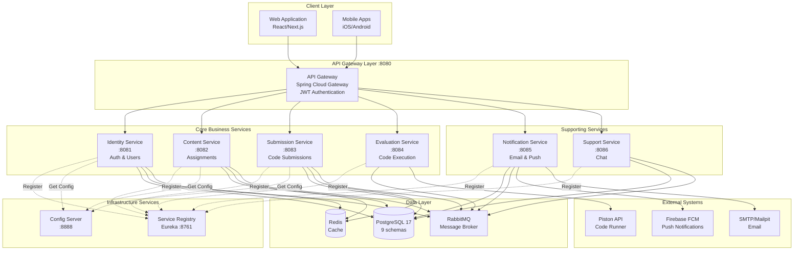
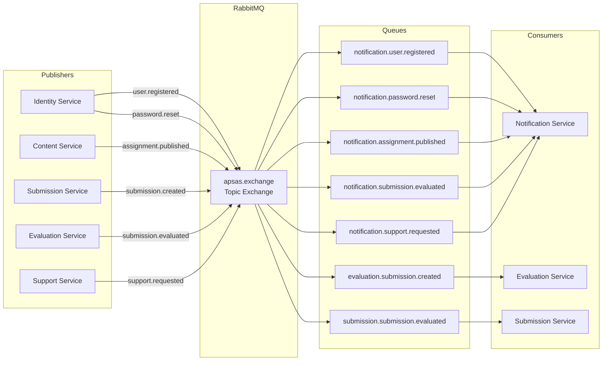
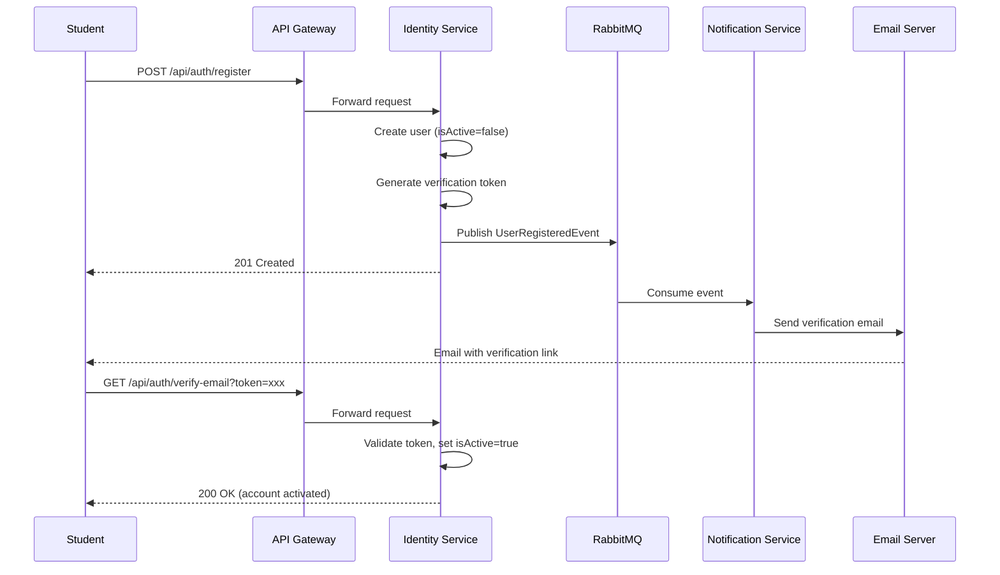
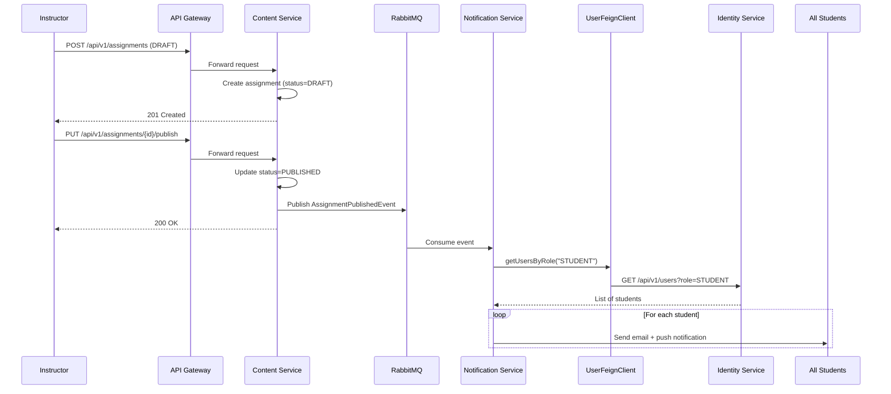
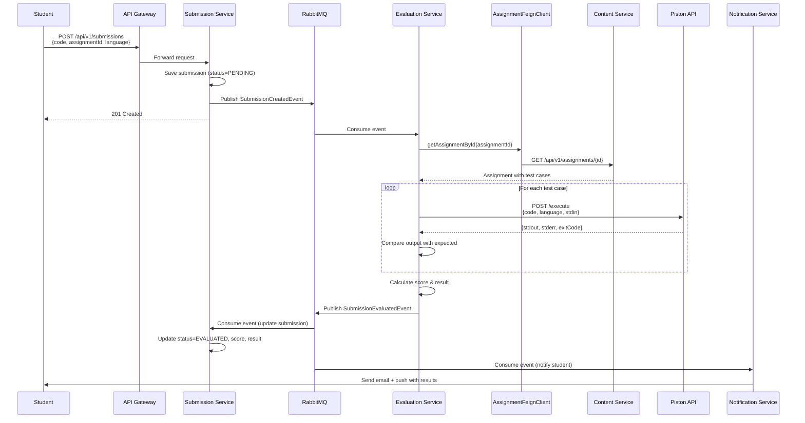
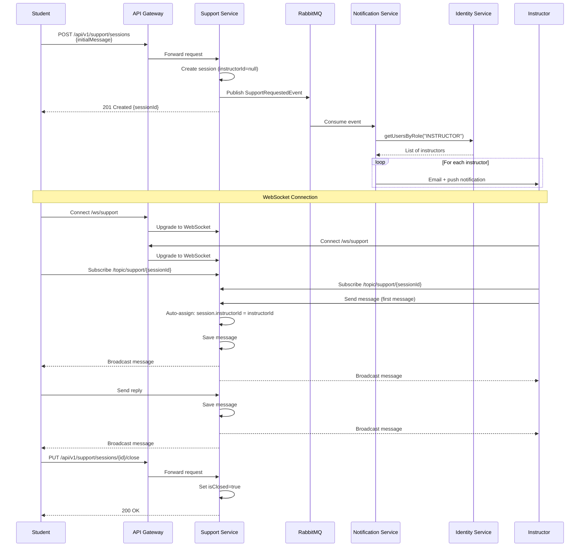

# APSAS - System Design Overview

## 1. Tổng Quan Hệ Thống

### 1.1. Giới Thiệu
**APSAS (Automated Programming Skills Assessment System)** là hệ thống đánh giá kỹ năng lập trình tự động, sử dụng kiến trúc **microservices** với event-driven communication. Hệ thống tự động chấm bài, đánh giá code submissions của students và cung cấp feedback real-time.

### 1.2. Core Services (8 services)

| Service | Port | Mô Tả | Database | Events |
|---------|------|-------|----------|--------|
| **API Gateway** | 8080 | Single entry point, JWT auth, routing | None | None |
| **Service Registry** | 8761 | Eureka server, service discovery | None | None |
| **Config Server** | 8888 | Centralized configuration | None | None |
| **Identity Service** | 8081 | Authentication, user management | `identity` schema | Publish 2 events |
| **Content Service** | 8082 | Assignments, tutorials, skills | `content` schema | Publish 2 events |
| **Submission Service** | 8083 | Code submissions, results | `submission` schema | Publish 1 event |
| **Evaluation Service** | 8084 | Code execution via Piston API | Stateless | Publish 1 event |
| **Notification Service** | 8085 | Email + Push notifications | `notification` schema | Consume 6 events |
| **Support Service** | 8086 | Real-time chat (WebSocket) | `support` schema | Publish 1 event |

### 1.3. Technology Stack

**Core**:
- Java 21 (virtual threads enabled)
- Spring Boot 3.5.6, Spring Cloud 2025.0.0
- Amper Build System (not Gradle/Maven)

**Data**:
- PostgreSQL 17 (single DB, schema-per-service)
- Redis (distributed cache)

**Messaging**:
- RabbitMQ 4.1 (topic exchange)

**External**:
- Piston API (code execution)
- Firebase FCM (push notifications)
- Mailpit (dev email testing)

---

## 2. Kiến Trúc Tổng Thể

### 2.1. High-Level Architecture



### 2.2. Service Interaction Patterns

#### Pattern 1: Synchronous (REST via Feign Client)
```
Notification Service → (Feign) → Identity Service (get user info)
Notification Service → (Feign) → Content Service (get assignment details)
Evaluation Service → (Feign) → Content Service (get test cases)
```

#### Pattern 2: Asynchronous (RabbitMQ Events)
```
Identity Service → RabbitMQ → Notification Service (user registered)
Content Service → RabbitMQ → Notification Service (assignment published)
Submission Service → RabbitMQ → Evaluation Service (submission created)
Evaluation Service → RabbitMQ → Submission Service (evaluation complete)
Support Service → RabbitMQ → Notification Service (support requested)
```

#### Pattern 3: API Gateway Routing
```
Client → API Gateway → [Load Balancer] → Backend Service
```

#### Pattern 4: WebSocket (Support Service)
```
Client ← WebSocket (STOMP) → API Gateway → Support Service
```

---

## 3. Event-Driven Architecture

### 3.1. RabbitMQ Topology

**Exchange**: `apsas.exchange` (Topic Exchange)

**Event Flow Map**:



### 3.2. Event Catalog

| Event | Publisher | Consumer(s) | Routing Key | Payload |
|-------|-----------|-------------|-------------|---------|
| UserRegisteredEvent | Identity | Notification | `user.registered` | userId, email, firstName, lastName, verificationToken |
| PasswordResetRequestedEvent | Identity | Notification | `password.reset` | userId, email, firstName, resetToken, expiresAt |
| AssignmentPublishedEvent | Content | Notification | `assignment.published` | assignmentId, creatorId |
| AssignmentScheduleUpdatedEvent | Content | Notification | `assignment.schedule.updated` | assignmentId, startDate, dueDate |
| SubmissionCreatedEvent | Submission | Evaluation | `submission.created` | submissionId, assignmentId, studentId, code, language |
| SubmissionEvaluatedEvent | Evaluation | Submission, Notification | `submission.evaluated` | submissionId, score, testCaseResults, evaluatedAt |
| SupportRequestedEvent | Support | Notification | `support.requested` | sessionId, studentId, studentEmail, studentName, initialMessage |

---

## 4. Database Architecture

### 4.1. Schema Isolation Strategy

**Single PostgreSQL database** với **schema-per-service isolation**:

```sql
-- Each service owns its schema
CREATE SCHEMA IF NOT EXISTS identity;
CREATE SCHEMA IF NOT EXISTS content;
CREATE SCHEMA IF NOT EXISTS submission;
CREATE SCHEMA IF NOT EXISTS notification;
CREATE SCHEMA IF NOT EXISTS support;
```

**JDBC URLs**:
```
jdbc:postgresql://localhost:5432/apsas?currentSchema=identity
jdbc:postgresql://localhost:5432/apsas?currentSchema=content
jdbc:postgresql://localhost:5432/apsas?currentSchema=submission
```

### 4.2. Schema Overview

#### Identity Schema (3 tables)
```
identity.users
identity.email_verification_tokens
identity.password_reset_tokens
```

#### Content Schema (5 tables)
```
content.skills
content.assignments (JSONB: languages, test_cases)
content.tutorials
content.assignment_skills (junction)
content.assignment_tutorials (junction)
```

#### Submission Schema (1 table)
```
submission.submissions (JSONB: test_case_results)
```

#### Notification Schema (2 tables)
```
notification.preferences
notification.device_tokens
```

#### Support Schema (2 tables)
```
support.support_sessions
support.support_messages
```

### 4.3. Data Relationships Across Services

**No direct foreign keys across schemas** - Services communicate via:
1. **Events**: RabbitMQ messaging
2. **Feign Clients**: REST API calls
3. **UUID references**: Store UUIDs from other services

**Example**: Submission service stores `assignmentId` và `studentId` as UUIDs, nhưng không có FK constraint.

---

## 5. Complete User Journeys

### 5.1. Student Registration & Verification



### 5.2. Assignment Creation & Publication



### 5.3. Code Submission & Evaluation



### 5.4. Support Request & Chat



---

## 6. Cross-Cutting Concerns

### 6.1. Security

**Authentication**:
- JWT tokens issued by Identity Service
- API Gateway validates all requests
- UserPrincipal injected via headers (`X-User-Id`, `X-User-Role`)

**Authorization**:
- Each service implements role-based access control
- Students: Own resources only
- Instructors: Read/write access to student data
- Admins: Full access

**Security Headers** (injected by Gateway):
```
X-User-Id: uuid
X-User-Email: email
X-User-Role: STUDENT|INSTRUCTOR|ADMIN
X-User-Is-Active: true|false
```

### 6.2. Caching Strategy (Redis)

| Cache | Service | TTL | Invalidation |
|-------|---------|-----|--------------|
| `users` | Identity | 30m | User update |
| `usersByRole` | Identity | 15m | Role change |
| `assignments` | Content | 20m | Assignment update |
| `skills` | Content | 1h | Skill update |
| `submissions` | Submission | 10m | Evaluation complete, feedback added |
| `tutorials` | Content | 1h | Tutorial update |
| `runtimes` | Evaluation | 1h | Manual refresh |

**Cache Key Pattern**: `apsas:{service}:{cacheName}::{entityId}`

Example: `apsas:submission:submissions::uuid-123-456`

### 6.3. Configuration Management

**Two-tier config**:
1. **Bootstrap** (`resources/application.yaml`): Connects to Config Server
2. **Remote config** (`config/*.yaml`): Service-specific, imported from Config Server

**Shared fragments** (`config/fragments/`):
- `database.yaml`, `database-dev.yaml`
- `jwt.yaml`, `jwt-dev.yaml`
- `rabbitmq.yaml`, `rabbitmq-dev.yaml`
- `redis.yaml`, `redis-dev.yaml`
- `eureka-client.yaml`

**Example service config**:
```yaml
# config/submission-service.yaml
spring:
  config:
    import:
      - file:./config/fragments/jwt.yaml
      - file:./config/fragments/database.yaml
      - file:./config/fragments/eureka-client.yaml
      - file:./config/fragments/redis.yaml

database:
  schema: submission

server:
  port: 8083
```

### 6.4. Error Handling

**Global Exception Handler** (trong `shared/exception`):
- `BadRequestException` → 400
- `NotFoundException` → 404
- `UnauthorizedException` → 401
- `ForbiddenException` → 403

**Response format** (RFC 9457):
```json
{
  "type": "about:blank",
  "title": "Not Found",
  "status": 404,
  "detail": "Submission not found with id: uuid-123",
  "instance": "/api/v1/submissions/uuid-123"
}
```

---

## 7. DevOps & Deployment

### 7.1. Development Environment

**Start infrastructure**:
```bash
docker compose -f docker-compose.dev.yaml up -d
# postgres:5432, rabbitmq:5672/15672, redis:6379, mailpit:1025/8025
```

**Service startup order**:
1. Service Registry (Eureka) - :8761
2. Config Server - :8888
3. API Gateway - :8080
4. Backend services (any order)

**Build & Run**:
```bash
./amper build              # Build all
./amper build -m identity  # Build specific service
java -jar sources/services/identity/build/libs/identity-service.jar
```

### 7.2. Docker Compose (Production)

```yaml
version: '3.8'
services:
  postgres:
    image: postgres:17-alpine
    environment:
      POSTGRES_DB: apsas
      POSTGRES_USER: apsas_user
      POSTGRES_PASSWORD: ${DB_PASSWORD}
    volumes:
      - postgres_data:/var/lib/postgresql/data
  
  redis:
    image: redis:7-alpine
    command: redis-server --requirepass ${REDIS_PASSWORD}
  
  rabbitmq:
    image: rabbitmq:4.1-management-alpine
    environment:
      RABBITMQ_DEFAULT_USER: ${RABBITMQ_USER}
      RABBITMQ_DEFAULT_PASS: ${RABBITMQ_PASSWORD}
  
  eureka:
    image: apsas/service-registry:latest
    ports:
      - "8761:8761"
  
  config-server:
    image: apsas/config-server:latest
    ports:
      - "8888:8888"
    environment:
      SPRING_PROFILES_ACTIVE: native
  
  api-gateway:
    image: apsas/api-gateway:latest
    ports:
      - "8080:8080"
    environment:
      JWT_SECRET: ${JWT_SECRET}
      EUREKA_CLIENT_SERVICEURL_DEFAULTZONE: http://eureka:8761/eureka/
    depends_on:
      - eureka
      - config-server
  
  # Add other services...
```

### 7.3. Kubernetes Deployment

**Namespace**:
```yaml
apiVersion: v1
kind: Namespace
metadata:
  name: apsas
```

**Deployment pattern** (example: Identity Service):
```yaml
apiVersion: apps/v1
kind: Deployment
metadata:
  name: identity-service
  namespace: apsas
spec:
  replicas: 2
  selector:
    matchLabels:
      app: identity-service
  template:
    metadata:
      labels:
        app: identity-service
    spec:
      containers:
      - name: identity
        image: apsas/identity-service:latest
        ports:
        - containerPort: 8081
        env:
        - name: SPRING_DATASOURCE_URL
          value: jdbc:postgresql://postgres:5432/apsas?currentSchema=identity
        - name: SPRING_DATASOURCE_PASSWORD
          valueFrom:
            secretKeyRef:
              name: db-secret
              key: password
        - name: JWT_SECRET
          valueFrom:
            secretKeyRef:
              name: jwt-secret
              key: secret
        livenessProbe:
          httpGet:
            path: /actuator/health/liveness
            port: 8081
          initialDelaySeconds: 60
          periodSeconds: 10
        readinessProbe:
          httpGet:
            path: /actuator/health/readiness
            port: 8081
          initialDelaySeconds: 30
          periodSeconds: 5
        resources:
          requests:
            memory: "512Mi"
            cpu: "500m"
          limits:
            memory: "1Gi"
            cpu: "1000m"
---
apiVersion: v1
kind: Service
metadata:
  name: identity-service
  namespace: apsas
spec:
  selector:
    app: identity-service
  ports:
  - port: 8081
    targetPort: 8081
```

---

## 8. Monitoring & Observability

### 8.1. Health Checks

**Endpoints** (via Spring Boot Actuator):
- `/actuator/health` - Overall health
- `/actuator/health/liveness` - Kubernetes liveness probe
- `/actuator/health/readiness` - Kubernetes readiness probe

**Custom health indicators**:
- Database connectivity
- RabbitMQ connection
- Redis connection
- Eureka registration status

### 8.2. Metrics

**Prometheus metrics**:
```yaml
management:
  endpoints:
    web:
      exposure:
        include: health,metrics,prometheus
  metrics:
    export:
      prometheus:
        enabled: true
```

**Key metrics to track**:
- Request rate per service
- Response time (p50, p95, p99)
- Error rate (4xx, 5xx)
- Database connection pool usage
- Cache hit/miss ratio
- RabbitMQ queue depth
- Circuit breaker state

**Grafana Dashboard** (suggested panels):
- Service health overview
- API Gateway traffic
- Database query performance
- Event processing lag (RabbitMQ)
- Cache performance

### 8.3. Distributed Tracing

**Spring Cloud Sleuth + Zipkin**:
```yaml
spring:
  zipkin:
    base-url: http://zipkin:9411
  sleuth:
    sampler:
      probability: 1.0  # 100% sampling for dev, 10% for prod
```

**Trace context propagation**:
- Automatic trace ID injection
- Spans across HTTP calls (Feign)
- Spans across RabbitMQ messages

---

## 9. Scalability Considerations

### 9.1. Horizontal Scaling

**Services có thể scale horizontally**:
- ✅ API Gateway (stateless)
- ✅ Identity Service (với sticky sessions cho JWT refresh)
- ✅ Content Service (stateless với Redis cache)
- ✅ Submission Service (stateless với Redis cache)
- ✅ Evaluation Service (stateless, CPU-intensive)
- ✅ Notification Service (stateless)
- ⚠️ Support Service (cần external message broker cho WebSocket)

**Support Service scaling**:
```yaml
# Replace in-memory broker with RabbitMQ STOMP relay
config.enableStompBrokerRelay("/topic", "/queue")
    .setRelayHost("rabbitmq")
    .setRelayPort(61613);
```

### 9.2. Database Scaling

**Current**: Single PostgreSQL instance

**Scaling options**:
1. **Vertical scaling**: Increase CPU/RAM
2. **Read replicas**: Route read queries to replicas
3. **Connection pooling**: HikariCP configuration
4. **Indexing**: Proper indexes on frequently queried columns

**Example HikariCP config**:
```yaml
spring:
  datasource:
    hikari:
      maximum-pool-size: 20
      minimum-idle: 5
      connection-timeout: 30000
```

### 9.3. Cache Scaling

**Redis**:
- Use Redis Cluster cho high availability
- Separate cache instances per service (optional)

**Cache warming**:
- Pre-populate frequently accessed data on startup
- Scheduled cache refresh for static data (skills, runtimes)

---

## 10. Best Practices Summary

### 10.1. Development
- ✅ Follow schema-per-service isolation
- ✅ Use UUIDs for cross-service references
- ✅ Communicate via events for async operations
- ✅ Use Feign clients for sync queries
- ✅ Implement idempotency for event handlers

### 10.2. Security
- ✅ Store secrets in environment variables / secrets manager
- ✅ Rotate JWT secrets regularly
- ✅ Use HTTPS in production
- ✅ Implement rate limiting on API Gateway
- ✅ Sanitize user input in email templates

### 10.3. Performance
- ✅ Cache frequently accessed data (Redis)
- ✅ Use pagination for list endpoints
- ✅ Optimize database queries with indexes
- ✅ Set appropriate timeouts (Feign, RabbitMQ)
- ✅ Monitor slow queries

### 10.4. Reliability
- ✅ Implement circuit breakers (Resilience4j)
- ✅ Use retry logic with exponential backoff
- ✅ Configure Dead Letter Queues (RabbitMQ)
- ✅ Health checks for all services
- ✅ Graceful shutdown handling

---

## 11. Future Enhancements

### 11.1. Short-term
- [ ] API rate limiting per user
- [ ] Circuit breaker implementation (Resilience4j)
- [ ] Distributed tracing (Sleuth + Zipkin)
- [ ] Centralized logging (ELK stack)

### 11.2. Medium-term
- [ ] Read replicas for PostgreSQL
- [ ] Redis Cluster for high availability
- [ ] GraphQL API layer
- [ ] Real-time code collaboration (WebRTC)

### 11.3. Long-term
- [ ] Multi-tenant architecture
- [ ] AI-powered code review
- [ ] Advanced analytics & reporting
- [ ] Mobile SDK for offline coding

---

## 12. References

### 12.1. Service Documentation
- [Identity Service](./identity-service.md)
- [Content Service](./content-service.md)
- [Submission Service](./submission.md)
- [Evaluation Service](./evaluation-service.md)
- [Notification Service](./notification-service.md)
- [Support Service](./support-service.md)
- [API Gateway](./api-gateway.md)

### 12.2. External Documentation
- [Spring Cloud Gateway](https://spring.io/projects/spring-cloud-gateway)
- [Netflix Eureka](https://github.com/Netflix/eureka/wiki)
- [RabbitMQ](https://www.rabbitmq.com/documentation.html)
- [Piston API](https://github.com/engineer-man/piston)
- [Firebase FCM](https://firebase.google.com/docs/cloud-messaging)

### 12.3. Build & Configuration
- [Amper Build System](https://github.com/JetBrains/amper)
- [Spring Boot 3.5.6](https://spring.io/projects/spring-boot)
- [PostgreSQL 17](https://www.postgresql.org/docs/17/)
